> Would you just take, along with me, 10 seconds to think of the people who have helped you become
> who you are, those who cared about you and wanted what was best for you in life.
> 
> - Fred Rogers

<!--
- I have this exercise that I do sometimes. I'd like to pause whatever moment I find myself in and
  try to think back to all the decisions that I had to make, all the things that had to happen, and
  all the people I needed to have in my life to end up where I am today. It's a humbling experience
  and helps me appreciate the people around me, and be grateful for the things I have.
- As I was reading a book, I came across this quote from Fred Rogers and I thought this fits
  perfectly to our talk. Because we we'll take the rest of the talk to think back to all the people
  without whose contributions we wouldn't be where we are today.
-->

---
dragPos:
  square: 247,129,476,287
---

<!--
- So we are going to start with the question of "How did I get here?"
- We asked this question ourselves and just started tracing our path. Hopefully, we have an accurate
  picture of events.
-->

---
dragPos:
  square: 356,27,167,_,-8
---

<v-drag pos="801,91,167,_,-8">
    
</v-drag>

<v-drag pos="38,342,167,_,-8">
    
</v-drag>

<v-drag pos="562,5,261,_,-15">
    
</v-drag>

<v-drag pos="700,250,261,_,12">
    
</v-drag>

<v-drag pos="43,1,261,_,-15">
    
</v-drag>

<v-drag pos="223,287,261,_,-15">
    
</v-drag>

<v-drag pos="469,236,261,_,-13">
    
</v-drag>

<!--
- It was hard to pick, but we had to pick, so if you don't see some of your favorite people, it's
  not because they don't deserve to be here, it's because we couldn't find a way to include them
  here. But we did include a graph which hopefully includes more people.
-->

---
layout: iframe

# the web page source
url: https://ouestware.gitlab.io/retina/1.0.0-beta.1/#/graph/?url=https%3A%2F%2Fraw.githubusercontent.com%2FFurkanzmc%2Fcppnorth-2024-shoulders-we-stand-on%2Fmaster%2Fpublic%2Fassets%2Fgraph.gexf&c=a&s=r&sa=r&ca=a

# a custom class name to the content
class: my-custom-class
---

<!--
- Imagine this was your dependency graph. You would go mad! But it is because of these connections
  that all the good work in the world were done. Like we say in Turkey, you can't make a wall with
  one stone. And you can advance human knowledge with one person.
-->

---
layout: section
---

# Sparks of Innovation and Inspiration

<!--
- We will start our journey with the people who were the early thinkers and pioneers in the field of
  computing.
-->

---
layout: image-left
image: /assets/people/charles-babbage.jpg
---

# Charles Babbage (1791 - 1871)

> Father of Computers

<!--
- And this journey begins with Charles Babbage.
-->

---
clicks: 2
---

<v-drag pos="601,54,334,_,-6">
    
</v-drag>

<v-drag pos="601,54,300,_,-6">
    
</v-drag>

<!--
## Intro

- Keen interest in mathematics. A number driven person.
- Known as the father of computers.
- Went to good schools, had access to books and tutors. Pivotal moment!
- In university, he helped found Analytical Society. This was a group of students who were
  interested in mathematics and wanted to reform the mathematics curriculum.
- Mathematical tables were list of numbers showing the results of a calculation with varying
  arguments.
- Around that time, In 1812, the French government calculated these tables in a different way. Their
  mathematicians distributed the work to 80 human computers who only knew what work they were doing
  and subtraction and addition. For the first time, mass production was applied to mathematics and
  Babbage thought this work could be taken over by machines entirely.
-->

---
clicks: 3
---

<v-drag pos="237,72,544,_,6">
    
</v-drag>

<v-drag pos="106,-15,813,_,-6">
    
</v-drag>

<v-drag pos="656,61,281,_,-6">
    
</v-drag>

<v-drag pos="656,61,281,_,-6">
    
</v-drag>

<!--
## Difference Engine

- In his later years, he was assigned to a project in the Royal Astronomical Society to compute
  mathematical tables for nautical almanac. That grunt work really helped him understand how error
  prone manual calculations are so he wanted to do something about it.
- That's when he inventd the Difference Engine. It was meant for solving polynomial equations. He
  created this to help with mathematical tables for the nautical almanac. Sadly, it never got built
  because the engineer he was working with demanded too much money.
- It wasn't all bad though, Difference Engine inspired the novel... [The Difference
  Engine](https://en.wikipedia.org/wiki/The_Difference_Engine) Which apparently is an important
  novel in the genre of steam punk.

## Analytical Engine

- Before the construction of the Difference Engine began, he started working on Analytical Engine.
- Difference Engine was meant for a mechanized computation. But Analytical Engine could handle any
  computation, making it a general purpose computer.
- It was programmed using punch cards. It allowed for sequential control, looping, and branching.
  So, pretty much like a modern computer.
- You know you are an important figure when they out your brain in a jar. Science Museum, London

- Despite the importance of his work, the analytical engine was unknown to the builders of the
  electromechanical and electronic computing machines in 1930s and 1940s. J. Presper Eckert and John
  W. Mauchly similarly were not aware of the details of Babbage's analytical engine work prior to
  the completion of their design for the first electronic general-purpose computer, the ENIAC.
- Vannevar Bush's paper Instrumental Analysis (1936) included several references to Babbage's work.
  In the same year he started the Rapid Arithmetical Machine project to investigate the problems of
  constructing an electronic digital computer.
-->

---
layout: image-left
image: /assets/people/lady-ada-lovelace.png
---

# Lady Ada Lovelace

<!--
- The first computer needs a first programmer, and that is Lady Ada Lovelace
- Around the time Babbage was working on Analytical Engine, Lady Ada Lovelace took notice and had
  multiple interactions with Babbage.
- You probably know her as the first computer programmer, but I learned something about her that I
  think makes her even more impressive.
-->

---
layout: center
---

<!--
## Intro

- Lady Ada Lovelace was the daughter of the famous poet Lord Byron, although she never had a
  relationship with him due to her parents' separation when she was just a month old.
- Her mother, Lady Byron, was a skilled mathematician and encouraged Ada's interest in mathematics
  and logic as a way to steer her away from her father's artistic temperament.
-->

---
clicks: 1
---

```mermaid
graph LR
    Lovelace -- 🕊️🎶♥️🦌🌎 --> Babbage
    Babbage -- 01001101 01100001 01110100 01101000 --> Lovelace
```

> Supposing, for instance, that the fundamental relations of pitched sounds in the science of
> harmony and of musical composition were susceptible of such expression and adaptations, the engine
> might compose elaborate and scientific pieces of music of any degree of complexity or extent.

<!--
- Through her brilliance and social connections, her path crossed with Charles Babbage. In her
  notes, she wrote the first algorithm intended for implementation on Charles Babbage's Analytical
  Engine. But in her notes, she mentioned something else.
- Charles Babbage considered the Analytical Engine to be a merely a calculation machine. But Ada
  Lovelace saw a potential for representing natural objects with numbers. She saw the potential for
  computers way before even one of them was built. And these days, everything we do with computers
  is manipulating symbols.
-->

---
layout: image-left
image: /assets/people/alan-turing.jpg
---

# Alan Turing

<!--
- Fast forward a few decades, and we get to a time when a lot was happening in the world. Especially
  the world of wars...
- Alan Turing, who I'm sure you already know, was a very influential figure of his time.
- He was a mathematician, logician, and computer scientist who played a pivotal role in the
  development of theoretical computer science and artificial intelligence.
-->

---
clicks: 2
---

<v-drag pos="601,54,300,_,-6">
    
</v-drag>

<!--
## Intro

- He had great interest in math and science from an early age.
- In public school, his great skills were not appreciated because the school placed more emphasis on
  classics.
- Developed a friendship with Christopher Morcom, who shared his interest in science and
  mathematics. Sadly, he died early from TB that he got from drinking contaminated milk.
- Turing coped with this grief by working even harder. What would have happened if Turing was the
  one who died?
- In his university years, he developed the concept of the Turing Machine, a fundamental model of
  computation that underpins much of computer science theory.
- Von Neumann, who is already a genius in his own right, said that Turing's created the central
  concept of the modern computer.
-->

---
clicks: 2
---

<v-drag pos="601,54,300,_,-6">
    
</v-drag>

<!--
- He was Walton Athletic Club's best runner, a fact discovered when he passed the group while
  running alone.
> I have such a stressful job that the only way I can get it out of my mind is by running hard; it's
> the only way I can get some release.
- During World War II, Turing worked at Bletchley Park, the UK's codebreaking center.
- He played a pivotal role in cracking the German Enigma code, significantly contributing to the
  Allied victory.
- Turing's contributions extended beyond codebreaking; he proposed the concept of artificial
  intelligence and the famous Turing Test to evaluate a machine's ability to exhibit intelligent
  behavior equivalent to that of a human.
- Unfortunately, I won't be doing any justice to all his contributions in this talk, but thankfully
  I don't have to convince you on this one.
-->

---
layout: image-left
image: /assets/people/vannevar-bush.jpg
---

# Vannevar Bush

<!--
- Next up is Vannevar Bush, who was a very influential figure in the 20th century.
- He did more than science and influenced a lot of the policies surrounding science. He also starred
  in the movie Oppenheimer. :)
-->

---
clicks: 2
---

<v-drag-arrow two-way pos="618,288,-263,23" />

<v-drag pos="595,105,240,_,-6">
<small>Hypertext Editing System</small>
    
</v-drag>

<v-drag pos="620,289,211,_,-6">
<small>Memex Artist Illustration from The Atlantic</small>
    
</v-drag>

<!--
- Much like most of the bright minds of the time, he spent a lot of time in military research. But
  he was always concerned about what would happen to science and scientists after the war.
- He did a lot of work in analog computers and apparently didn't have much interest in digital
  computing.
- He lead the Office of Scientific Research and Development during World War II. He was responsible
  for the development of radar and the proximity fuze.

- In an article called "As We May Think", he talks about how the spreading of scientific knowledge
  is an important task.
- In As We May Think, he talks about how the spreading of scientific knowledge is an important task.
  He says in the past, Mendel's research on laws of genetics was lost for generations because it
  didn't make it into the hands of people who could expand on it.
- In his article he describes memex, and an imaginary account of probably the world's first wiki
  rabbit hole.
- His Memex machine was also heavily influenced by Emanuel Goldberg's "Statistical Machine" from 1928.
- Ted Nelson was inspired by his ideas and in a paper where he coined the term "hypertext" he
  referenced Bush a lot. He then created Hypertext Editing System along with Andries van Dam in 1967
- It seems that he didn't show that much of an interest in digital computing.
  https://www.encyclopedia.com/science/encyclopedias-almanacs-transcripts-and-maps/vannevar-bush
- In order for the memex to work though, a lot more things needed to be invented. Let's see the next
  person who helped with that.
-->

---
layout: image-left
image: /assets/people/john-von-neumann.webp
---

# John von Neumann

> Most mathematicians prove what they can, von Neumann proves what he wants

<!--
- He was also pretty social and liked to tell jokes in multiple languages.
-->

---
layout: center
clicks: 5
---

 -1">

<v-drag pos="605,132,300,_,-6">
    
</v-drag>

<v-drag pos="263,49,300,_,-6">
    
</v-drag>

<v-drag pos="3,356,248,_,-7">
    
</v-drag>

<!--
- He formalized game theory which gave us a fantastic movie called "A Beautiful Mind".
- Game theory helped us understand how people make decisions in competitive situations and how
  decisions affect outcomes.
- This is the paper that introduced the concept of stored-program computers which later was known as
  von Neumann architecture. It was 101 pages.
- He was among the first people to talk about the time complexity of algorithms.
- He invented the merge sort algorithm because there was a need to efficiently sort data on
  computers during World War II.
- Just going by all these contributions, his impact on our lives are probably immeasurable.
- He was the first person to also create a mathematical foundations for Quantum Mechanics, in his
  book called... "Mathematical Foundations of Quantum Mechanics"
-->

---
layout: image-left
image: /assets/people/j-c-r-licklider.webp
---

# Joseph Carl Robnett Licklider

<!--
- He contributed with ideas and funding to many projects that led to the development of the internet
  and modern computing.
-->

---
clicks: 1
---

 -1">

> ... most of the significant advances in computer technology—including the work that my group did at
> Xerox PARC—were simply extrapolations of Lick's vision. They were not really new visions of their
> own. So he was really the father of it all" - Robert Taylor

 -1">

<v-drag pos="460,10,55,_,-6">
    
</v-drag>

<v-drag pos="394,6,77,_,-6">
    
</v-drag>

<v-drag pos="685,141,62,_,15">
    
</v-drag>

<v-drag pos="695,184,77,_,-6">
    
</v-drag>

<v-drag pos="148,61,62,_,15">
    
</v-drag>

<v-drag pos="201,36,77,_,-6">
    
</v-drag>

<v-drag pos="38,364,261,_,15">
    
</v-drag>

<v-drag pos="34,171,45,_,-6">
    
</v-drag>

<v-drag pos="431,295,67,_,15">
    
</v-drag>

<!--
- ARPA = Advanced Research Projects Agency
- He believed that computers or AI should enhance human intelligence, not replace it.
- He funded Project MAC, which was a research project that led to the development of Multics, a
  time-sharing operating system. It was the first time-sharing operating system that was developed.
- He helped fund projects that contributed to GUIs, the mouse, and the internet. His contributions
  were mostly in form of ideas and funding.
- Ken Thompson, who co-created Unix, was a researcher on the Multics project.
- His paper "The Computer as a Communication Device" was the first to talk about the idea of
  computers as communication tools. He envisioned a world where people could communicate with each
  other through computers. He was talking about Facetime, MSN Messenger, Zoom, Slack, Twitter,
  Reddit, Alias, Wikipedia, and Sketchpad.
- Remember how I said he helped fund projects that contributed to GUI, the mouse? Now let's see how
  those came about.
-->

---
layout: image-left
image: /assets/people/douglas-engelbart.jpg
---

# Douglas Engelbart

<!--
- Douglas Engelbart is among my favorites to talk about. He and his team not only invented the
  mouse, but essentially DEMOED everything that we use in modern computing today.
-->

---
clicks: 4
---

# What did he, along with his team at SRI, do?...

 0">

<v-drag pos="451,42,445,_,15">
    
</v-drag>

 1">

<v-drag pos="59,44,403,_,-7">
    
</v-drag>

 2">

<v-drag pos="450,295,451,_">
    
</v-drag>

 3">

<v-drag pos="89,299,403,_,7">
    
</v-drag>

<!--
- All of this is in 1968.
- They invented the mouse!
- Video conferencing!
- Hyper text, which remember Vannevar Bush also talked about.
- They invented collaborative editing. About 50 years before we had one...
- He called the device a mouse because the tail came out from behind. His group called the cursor a
  bug, but that didn't catch on.
- All these gifs are from the demo that they did in 1968. It was called "The Mother of All Demos".
  I highly recommend giving it a watch in its entirety. Everything there will look primitive, but
  it's very impressive to see how they managed to do so much with what they had.
-->

---
layout: image-left
image: /assets/people/ivan-sutherland.jpg
---

# Ivan Sutherland

<!--
- He is another pioneer around the same time as Engelbart. He created the first graphical user
  interface and the first virtual reality head-mounted display.
- His pioneering work in computer graphics laid the foundation for modern computer graphics and
  inspired computer scientists.
-->

---
clicks: 4
---

# Showing What's Possible...

# First Head Mounted Display

<v-drag pos="68,137,329,_">
The Sword of Damocles
    
</v-drag>

 1">

# Sketchpad

<v-drag pos="55,107,324,_">
    
</v-drag>

 2">

<v-drag pos="318,224,326,_">
    
</v-drag>

 3">

<v-drag pos="585,63,326,_">
    
</v-drag>

<!--
- He created the first head mounted display. It was called the Sword of Damocles because it was
  hanging from the ceiling. And the image they see in the display was adjusted according to the data
  coming from the sensor.
- He broke new new ground in 3D computer modeling and visual simulation. He was able to design
  things with geometric constraints and ask Sketchpad to draw them or fix the shapes.
- Sketchpad had objects and instances. You could create a master object and then create instances of
  it. This is the basis of object-oriented programming.
- First CAD application.
- Sketchpad didn't do anything useful other than to demonstrate the potential of computer graphics.
-->

---

<!--
- Sutherland's work in sketchpad was a direct influence for object oriented programming.
- His students also went on to do great work in their fields.
- From 1968 to 1974, Sutherland was a professor at the University of Utah. Among his students there
  were Alan Kay, inventor of the Smalltalk language, Gordon W. Romney (computer and cybersecurity
  scientist), who rendered the first 3D images at U of U, Henri Gouraud, who devised the Gouraud
  shading technique, Frank Crow, who went on to develop antialiasing methods, Jim Clark, founder of
  Silicon Graphics, Henry Fuchs, and Edwin Catmull, co-founder of Pixar and now president of Walt
  Disney and Pixar Animation Studios.
-->
