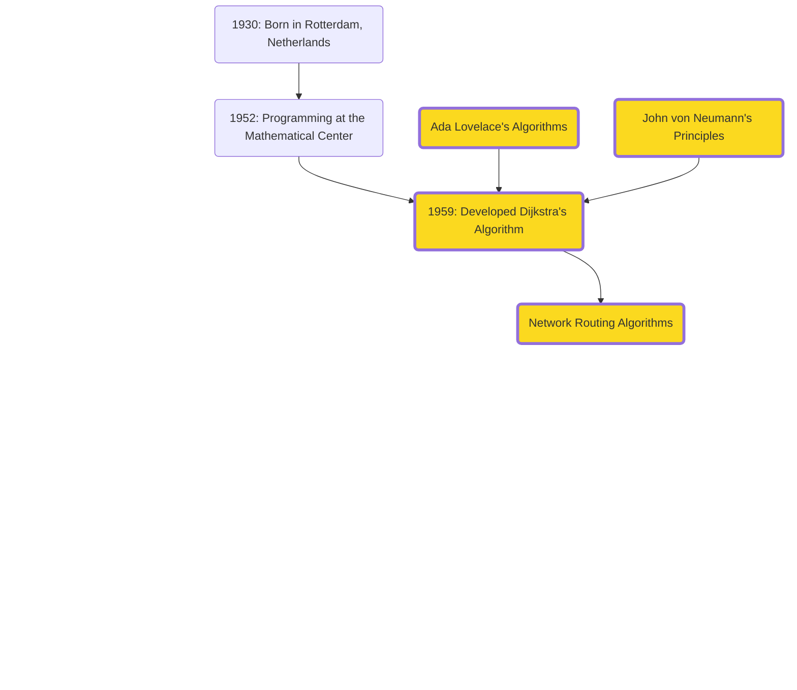
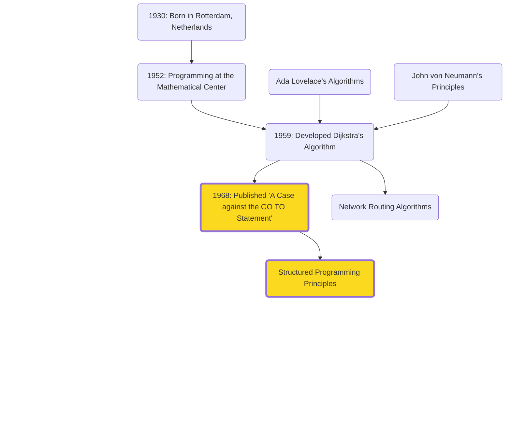
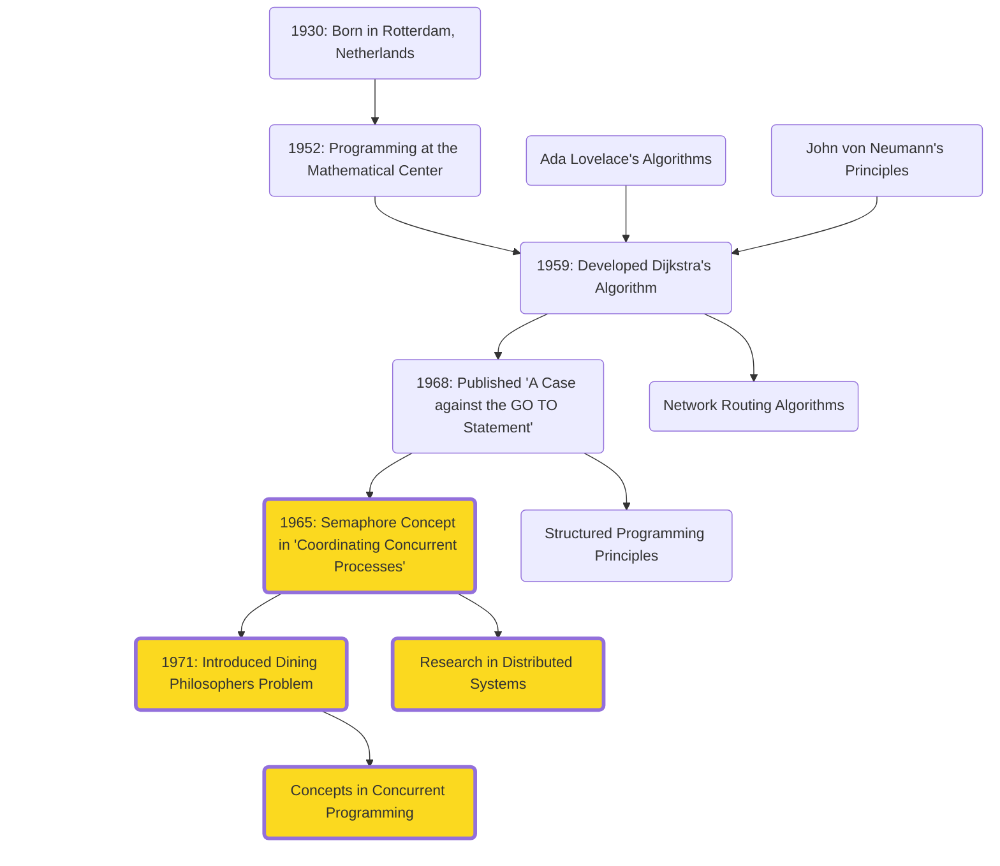
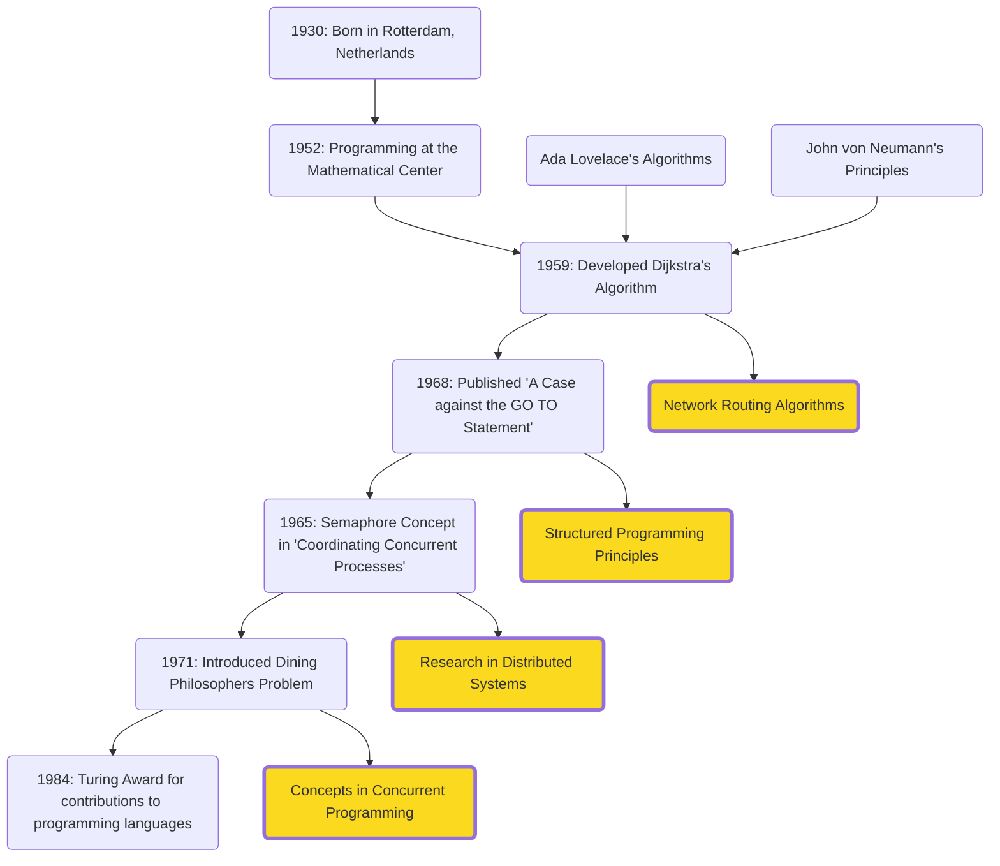

# Act 2: The Theoretical Foundations

Establishing the core principles and theories that underpin modern technology, building upon the visionaries' ideas from Act 1.

---
layout: image-right
image: assets/people/john-mccarthy.avif
class: mcarthy-profile-class
---

# John McCarthy (1927-2011)

- <span v-mark.underline.pink>**Time-sharing**</span>: Innovated the concept of sharing computing resources among multiple users.
- <span v-mark.underline.pink>**Lisp (1958)**</span>: One of the earliest high-level programming languages, influencing modern languages and AI research.
- <span v-mark.underline.pink>**Artificial Intelligence**</span>: Coined the term "AI" in 1955
<br>  
"AI is the science and engineering of making intelligent machines, especially intelligent computer programs. Intelligence is the computational part of the ability to achieve goals in the world."

<!-- Building on Alan Turing's theoretical foundations of computation, McCarthy's contributions have driven the development of intelligent systems that impact industries such as healthcare, finance, and autonomous vehicles.  -->

---

# Lisp (List Processing Language)

```lisp {monaco}
;; Define a macro to create a knock-knock joke
(defmacro knock-knock (who &rest response)
  `(progn
     (format t "Knock, knock.~%")
     (format t "Who's there?~%")
     (format t ,(format nil "~a." who) ~%)
     (format t ,(format nil "~a who?" who) ~%)
     (format t ,@response)))

;; Use the macro to create an AI-themed joke
(knock-knock "AI"
  "AI who?"
  "AI think, therefore AI am!")

;; Run the jokes
(format t "~%AI-themed knock-knock joke examples:~%")
(knock-knock "Bot"
  "Bot who?"
  "Botter not forget to laugh at my jokes!")
```

<!-- Explanation:
1. Homoiconicity:
Lisp code and data share the same structure. The knock-knock macro treats joke components as data, generating code dynamically.
Impact: Enabled metaprogramming and influenced languages like Python and JavaScript.

2. Macros:
Create new syntactic constructs for more expressive and concise code.
Impact: Influenced languages with powerful macro systems like Clojure and Rust.

3. Code Generation:
Generate and transform code to improve efficiency and reduce redundancy. The macro generates format calls, eliminating manual repetition.
Impact: Advanced compiler design and optimization techniques.

4. Syntactic Abstraction:
Provide high-level abstractions for better readability and maintainability.
Impact: Influenced the development of higher-level languages.

5. Domain-Specific Languages (DSLs):
Facilitate creation of specialized, intuitive language constructs. The macro acts as a mini-DSL for jokes.
Impact: Inspired DSLs in web development, data analysis, and more.

[Impact of Lisp's Design Choices]:
a. Influenced languages like Haskell and Scala.
b. Inspired expressive and efficient coding practices in contemporary languages.
c. Ideal for AI research, impacting natural language processing and machine learning.
-->

---

# 11.Edsger W. Dijkstra (1930-2002)

- **Dijkstra's Algorithm (Shortest Path)**
- **Structured Programming**
- **Distributed Programming**

<!-- 
- **Dijkstra's Algorithm**: Introduced for shortest paths, fundamental in network routing, GIS, and optimization.
- **Structured Programming**: Advocated for principles leading to reliable and maintainable software.
  - “A Case against the GO TO Statement” (EWD215)
  - Coined: “2 or more, use a for”
- **Distributed Programming**: Early pioneer with contributions like self-stabilizing systems and semaphores. -->

---

# Dijkstra's Formative Influences



<!--
- Building on the programming foundations laid by Ada Lovelace and John von Neumann's computing
  principles, Dijkstra's contributions have been pivotal in developing algorithms and programming
  methodologies
-->

---

# A Case for Structured Programming



<!-- Structured Programming
His advocacy for structured programming has led to more reliable and maintainable software, advancing the field of software engineering.
“A Case against the GO TO Statement” (EWD215), regarded as a major step towards the widespread deprecation of the GOTO statement and its effective replacement by structured control constructs, such as the while loop.
Coined the phrase “2 or more, use a for”, alluding to the fact that when you find yourself processing more than one instance of a data structure, it is time to encapsulate that logic inside a loop. -->
---

# Dining with Philosophers



<div v-if="$slidev.nav.clicks === 1">
  <v-drag pos="662,264,275,_">
      
  </v-drag>
</div>

<!--
Distributed Programming
Early pioneers of the research on distributed computing. His paper “Self-stabilizing Systems in Spite of Distributed Control” started the sub-field of self-stabilization.
Coordinating Concurrent Processes (1965) denotes the first synchronization mechanism for concurrent processes, the semaphore with its two operations, commonly known as P and V.


Semaphores: The Dining Philosophers problem (1971)
The Dining Philosophers Problem is a classic synchronization problem in computer science, introduced by Dijkstra in 1965. 
- Five philosophers sitting around a table, each alternating between thinking and eating. 
- There is a single fork between each pair of philosophers, and to eat, a philosopher needs both adjacent forks. 
- The challenge is to ensure that no philosopher starves while preventing deadlock, where everyone is stuck waiting for a fork.

- Dijkstra’s exploration of this problem was pivotal in understanding and solving issues of concurrency in computing. 
- His work led to the development of synchronization techniques like semaphores and monitors, which are crucial for managing resource allocation in multi-threaded and distributed systems.

Today, the principles from this influence various areas of computer science, including operating systems, database management, and parallel computing. It remains a fundamental example for teaching and demonstrating synchronization and resource sharing in concurrent programming.
-->

---

# Dijkstra's Legacy



<!-- His work has had a lasting impact on software engineering practices, influencing how complex software systems are designed and implemented. Examples include routing algorithms in network communication and optimization algorithms in various fields. -->

---

## For fun...

<div v-if="$slidev.nav.clicks === 2">
  <v-drag pos="662,264,275,_">
      
  </v-drag>
</div>

- **Background**: Originally studied theoretical physics, persuaded to stay in programming.
- **Elegance**: Known for elegant writing and handwriting. Inspired the creation of Dijkstra Regular font.

---
layout: image-left
image: /assets/people/donald-knuth.jpg
class: donald-knuth
---
# Donald Knuth (1938-present)

<div v-if="$slidev.nav.clicks === 2">
  <v-drag pos="662,264,275,_">
      
  </v-drag>
</div>

<div>
- **Impactful Work:**
  - **"The Art of Computer Programming" (1968)**
  - Knuth-Morris-Pratt (KMP) Algorithm
  - TeX typesetting system
</div>
---

# Knuth's Influences and Contributions

```mermaid
mindmap
  root((Donald Knuth))
    Influences
      Lovelace["Ada Lovelace"]
        Lovelace_desc1["Pioneer of programming concepts"]:::influence1
        Lovelace_desc2["Combined mathematical rigor with creativity"]:::influence1
      Neumann["John von Neumann"]
        Neumann_desc1["Structured approach to computing"]:::influence2
        Neumann_desc2["Foundational work in computer science"]:::influence2
    Contributions
      Programming["The Art of Computer Programming"]
        Programming_desc["Comprehensive coverage of fundamental algorithms"]:::contribution1
      TeX["TeX Typesetting System"]
        TeX_desc["Revolutionized digital typesetting and publishing"]:::contribution2
      KMP["Knuth-Morris-Pratt Algorithm"]
        KMP_desc["Efficient string-searching algorithm"]:::contribution3
      Literate["Literate Programming"]
        Literate_desc["Integration of code and documentation"]:::contribution4
      Analysis["Algorithm Analysis"]
        Analysis_desc["Detailed study of algorithms and programming techniques"]:::contribution5
      Software["Software Engineering"]
        Software_desc["Modern software engineering practices"]:::contribution6
      Education["Computer Science Education"]
        Education_desc["Cornerstone of computer science education"]:::contribution7

%% Define the styles for each node and description
classDef influence1 fill:#ffb86c,stroke:#ff79c6,stroke-width:2px;
classDef influence2 fill:#50fa7b,stroke:#bd93f9,stroke-width:2px;
classDef contribution1 fill:#8be9fd,stroke:#ffb86c,stroke-width:2px;
classDef contribution2 fill:#ff79c6,stroke:#ffb86c,stroke-width:2px;
classDef contribution3 fill:#bd93f9,stroke:#ff79c6,stroke-width:2px;
classDef contribution4 fill:#ffb86c,stroke:#50fa7b,stroke-width:2px;
classDef contribution5 fill:#f1fa8c,stroke:#ff79c6,stroke-width:2px;
classDef contribution6 fill:#6272a4,stroke:#bd93f9,stroke-width:2px;
classDef contribution7 fill:#ff5555,stroke:#8be9fd,stroke-width:2px;
```

<div v-if="$slidev.nav.clicks === 1">
  <v-drag pos="662,264,275,_">
      
  </v-drag>
</div>

<!--
1. The Art of Computer Programming (1968):
  - Comprehensive coverage of fundamental algorithms
2. TeX Typesetting System:
  - Revolutionized digital typesetting and publishing
3. Knuth-Morris-Pratt Algorithm:
  - Efficient string-searching algorithm
4. Literate Programming:
  - Integration of code and documentation

Influences
- Ada Lovelace:
  - Ada Lovelace was a pioneer of programming concepts. She combined mathematical rigor with creativity, which greatly inspired Knuth. Her visionary work laid the foundation for what would become modern computer programming.
- John von Neumann:
  - Another major influence on Knuth was John von Neumann. Known for his structured approach to computing, von Neumann's foundational work in computer science shaped Knuth's methodical and analytical approach to algorithms and programming."
Contributions:
- The Art of Computer Programming:
  - Knuth's most famous work is 'The Art of Computer Programming'. This comprehensive coverage of fundamental algorithms is often considered the bible of computer programming. It's an essential resource for anyone studying or working in the field.
- TeX Typesetting System:
  - Knuth revolutionized digital typesetting with the creation of the TeX system. This tool is widely used in academia for producing technical documents, ensuring high-quality typesetting.
- Knuth-Morris-Pratt Algorithm:
  - One of his notable algorithms is the Knuth-Morris-Pratt algorithm, an efficient string-searching algorithm crucial for text processing applications. It helps in finding patterns within strings quickly and effectively.
- Literate Programming:
  - Knuth also introduced the concept of literate programming, which integrates code and documentation. This promotes writing programs that are not only functional but also easy to understand and maintain.
- Algorithm Analysis:
  - His detailed study of algorithms and programming techniques emphasizes the importance of efficient algorithms. This has been instrumental in advancing the field of computer science.
Software Engineering:
  - Knuth's contributions to modern software engineering practices focus on clarity and efficiency in coding. His work has helped establish best practices that are still followed today.
Computer Science Education:
  0 Lastly, Knuth's impact on computer science education cannot be overstated. His work has become a cornerstone of computer science education, educating generations of programmers and computer scientists."

"Despite his immense contributions, Knuth initially experienced imposter syndrome. He once said, 'I certainly felt like an imposter for many years. There were so many other people who seemed so much more capable than I was. I just kept working hard and doing what I loved, hoping that someday I would belong.' This is a reminder that even the most accomplished individuals can have self-doubt. However, his perseverance and dedication have left an indelible mark on the field of computer science."

"Knuth's influences and contributions have profoundly shaped the landscape of computer science, and his work continues to inspire and guide new generations in the field."
-->
---
layout: quote
---

<image>

'I certainly felt like an imposter for many years. There were so many other people who seemed so much more capable than I was. I just kept working hard and doing what I loved, hoping that someday I would belong.'

---

## Welcoming (and Rewarding) Feedback

- **Error Rewards:**
  - Mails you $2.56 (1 hexadecimal dollar) for every mistake found in his book (stopped in 2008)
  - Now sends a cheque-like certificate (and real money if requested)

<div v-if="$slidev.nav.clicks === 2">
  <v-drag pos="662,264,275,_">
      
  </v-drag>
</div>

---

# Niklaus Wirth

- **Pascal Programming Language:**
  - Emphasized structured programming and data structuring
  - Released freely as a "public good," aiding educators and tech companies

- **"Go To Statement Considered Harmful":**
  - Coined the famous phrase as editor of Communications of the ACM

---

## Pascal's Influence

- **Educational Impact:**
  - Pascal became essential for teaching programming
  - Fostered good programming practices and efficient code

- **Practical Applications:**
  - Powered early Apple computers
  - Used in early versions of apps like Skype and Photoshop

---

## Influences

- **Edsger W. Dijkstra:**
  - Structured programming principles
  - Advocate for clarity and simplicity in code

- **Ada Lovelace:**
  - Early programming concepts and innovations
  - Vision of the potential of computing

- **Influence on Modern Languages:**
  - Inspired Modula-2 and Ada

- **1984 Turing Award:**
  - Recognized for developing innovative computer languages


---

# Alan Kay

- **Smalltalk Programming Language:**
  - Pioneered object-oriented programming (OOP)
  - Revolutionized software development with concepts like encapsulation, inheritance, and polymorphism

- **Graphical User Interfaces (GUIs):**
  - Made computers more accessible and user-friendly
  - Influenced modern operating systems and applications
- - **2003 Turing Award:**
  - Recognized for pioneering work in object-oriented programming and GUIs

---

## Impact and Legacy

- **Object-Oriented Programming:**
  - Simplified modeling of complex systems
  - Enhanced code reusability
  - Influenced modern languages like Java and C++

- **GUI Design:**
  - Shaped user interfaces for better usability and efficiency
  - Inspired the design of modern software interfaces

---

## Inspired By

- **Douglas Engelbart:**
  - Work on interactive computing
  - Development of the mouse and graphical interfaces

- **J.C.R. Licklider:**
  - Vision of human-computer symbiosis
  - Emphasis on user-centered computing

---

## Relationship with Bob Taylor and Xerox PARC

- **Bob Taylor:**
  - Leader at Xerox PARC who recruited Kay
  - Fostered a collaborative and innovative environment
  - Key figure in the development of personal computing

- **Xerox PARC:**
  - Hub for groundbreaking computer science research
  - Enabled Kay to develop Smalltalk and GUI concepts
  - Influenced future technologies and computing paradigms

---

## Bob Taylor's Highlights and Contributions

- **Creation of ARPAnet:**
  - Early precursor to the internet

- **Leadership at Xerox PARC:**
  - Recruited top talent, including Alan Kay
  - Facilitated development of groundbreaking technologies

- **Emphasis on Collaboration:**
  - Promoted interdisciplinary teamwork
  - Fostered an environment of innovation and creativity

---

# Karen Spärck Jones - Pioneer of Information Retrieval

- **Information Retrieval:**
  - Pioneered work in search engine algorithms
  - Developed Inverse Document Frequency (IDF), a fundamental component of TF-IDF weighting

- **Natural Language Processing (NLP):**
  - Enabled machines to understand and process human language
  - Advanced research in machine translation, chatbots, and automated summarization

---
dragPos:
  square: 56,120,852,428
---

## IDF Under the Hood

<!--  -->

<!--
- **Inverse Document Frequency (IDF):**
  - Evaluates the importance of a word in a document relative to a collection of documents (corpus)
  - Highlights unique terms specific to a document
  - Reduces the weight of common words

- **Relevance Weighting:**
  - Assigns weights to terms based on their importance in the retrieval process

- **Automatic Thesaurus Generation:**
  - Enhances query expansion using synonyms and related terms
-->

---

## Impact and Applications

- **Search Engines:**
  - Laid the groundwork for modern search engines
  - Improved relevance of search results
  - Widely used in document retrieval and text mining

- **Social Implications of Computing:**
  - Advocated for women in computing
  - Famous quote: "Computing is too important to be left to men"

---

## Influence and Legacy


<!-- 
- **Inspired By:**
  - Alan Turing's foundational work in computing
  - Claude Shannon's work in information theory

- **Impact:**
  - Crucial for the development of search engines like Google
  - Influenced fields of information retrieval, machine learning, and AI
  - IDF remains a fundamental concept in search algorithms
 -->

---
