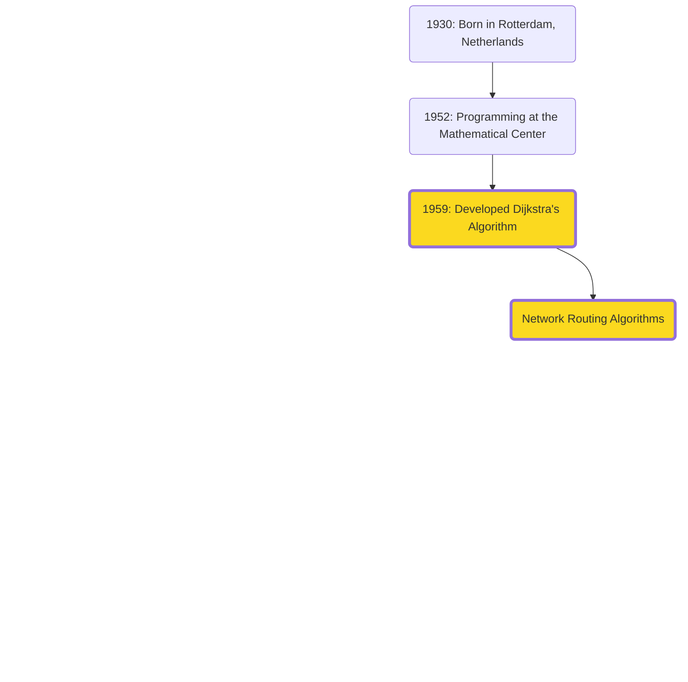
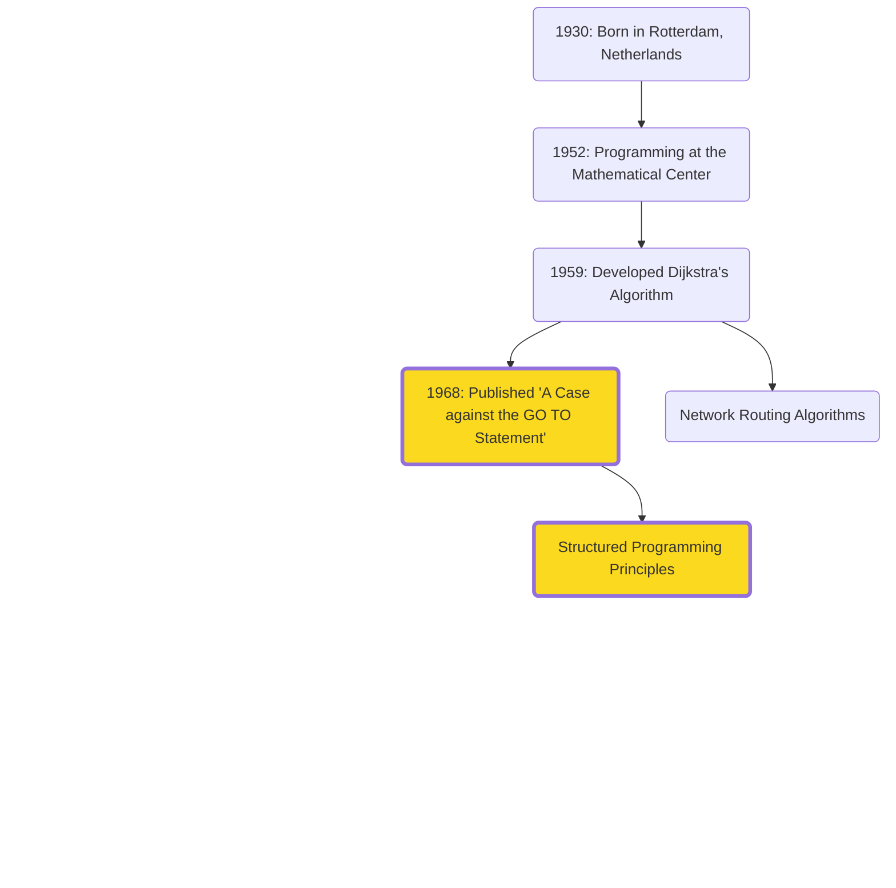
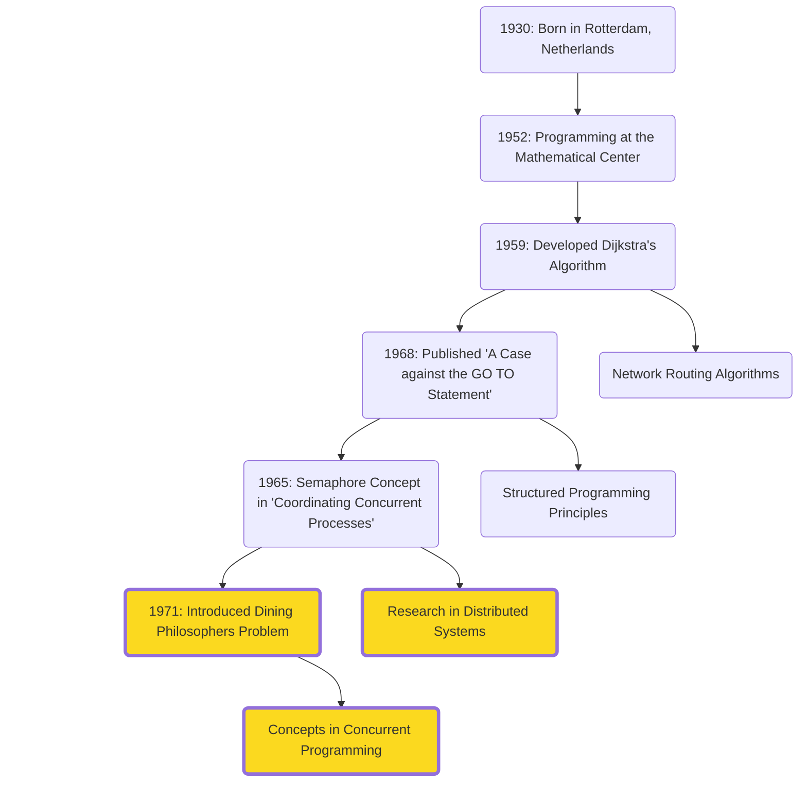
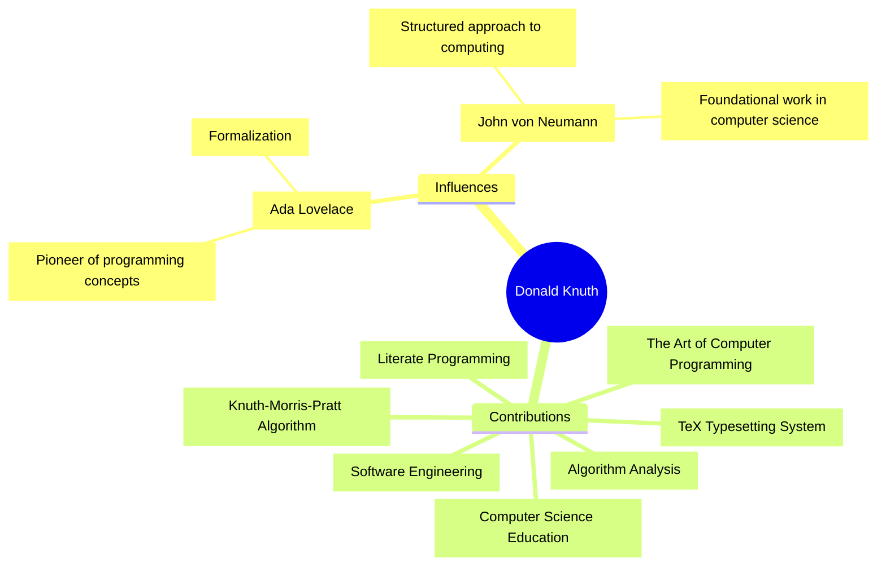
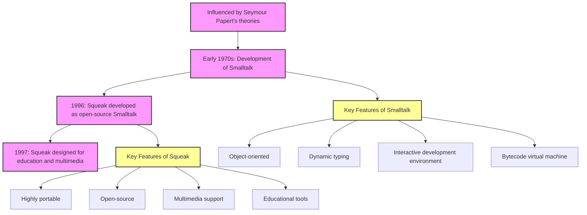

# The Theoretical Foundations


<!-- 
Establishing the core principles and theories that underpin modern technology, building upon the visionaries' ideas from Act 1.
 -->

---
layout: image-right
image: assets/people/john-mccarthy.avif
class: mcarthy-profile-class
---

# John McCarthy (1927-2011)

- **Artificial Intelligence**: Coined the term "AI" in 1955
- **Lisp (1958)**: One of the earliest high-level programming languages, influencing modern languages and AI research.
- **Time-sharing**: Innovated the concept of sharing computing resources among multiple users.

<!-- 
- Inspired by Turing and von Neumann's work in stored-program concept, formalization of computation, game theory, and mathematical rigor, McCarthy made strides in AI and programming languages
- Best known 
  - Coined the term AI while organizing the Dartmouth Round Table in 1956
  - Considered the birth of AI as a field of study. 
  - He believed that machines could be made to simulate any aspect of human intelligence.
- In addition
  - Lisp, a programming language designed for AI research
  - Let's take a quick tour on Lisp’s unique capabilities that makes it a powerful tool for AI development.
 -->

---
clicks: 2
---

# Organizing the First AI Conference

**Dartmouth Summer Research Project (1956)**

<div v-if="$slidev.nav.clicks > 0">

<v-drag pos="393,96,240,_">
    
</v-drag>

</div>

<div v-if="$slidev.nav.clicks > 1">

<v-drag pos="85,138,288,_">
    
</v-drag>

</div>

<!--
- McCarthy and others organized the Dartmouth Summer Research Project of 1956, where the term of AI was coined
- Considered the birth of AI as a field. 
- (click) Invitations sent for the seminar

- Here, leading minds gathered to discuss and develop the foundational ideas of AI. )
- Laid the groundwork for many AI advancements we see today
-->

---
clicks: 2
---

# Coining AI and Beyond

**Dartmouth Summer Research Project (1956)**

<div v-if="$slidev.nav.clicks > 0">

<v-drag pos="567,266,288,_">
    
</v-drag>

</div>

<div v-if="$slidev.nav.clicks > 1">

<v-drag pos="25,149,520,_">
    
</v-drag>

</div>

<!--
- (click) plaque at Dartmouth commemorating the seminal event in AI history
- 
- Middle person in front row, later discovered to be British-Canadian neuroscientist, Peter Milner
- At the time, working on neuropsychology at McGill University
- He’s not generally lumped in with the other AI pioneers because his research interests diverged from theirs.
- He wrote in his 1999 autobiography he wrote
-->

---

# Lisp (List Processing Language)

<v-drag pos="114,216,168,_">
    
</v-drag>

<v-drag pos="306,218,168,_">
    
</v-drag>

<v-drag pos="495,218,168,_">
    
</v-drag>

<!-- 
1. Interactive Programming
  - Modify and test code on the go
  - Interpreter that can evaluate expressions real-time and alter program state
2. Symbolic Computation
  - Excels at symbolic data structs: lists, graphs
3. Powerful Macros
  - Unique aspect: macro system
  - You can define custom syntax and language constructs 
  - Macros allow you to create new abstractions and extend the language as you wish
  - Lets look at an example for this
 -->

---

# Lisp Macros in Action
```lisp
  ;; Define a macro to create a knock-knock joke
  (defmacro knock-knock (who &rest response)
    `(progn
      (format t "Knock, knock.~%")
      (format t "Who's there?~%")
      (format t ,(format nil "~a." who) ~%)
      (format t ,(format nil "~a who?" who) ~%)
      (format t ,@response)))

  ;; Use the macro to create an AI-themed joke
  (knock-knock "AI"
    "AI who?"
    "AI think, therefore AI am!")

  ;; Run the jokes
  (format t "~%AI-themed knock-knock joke examples:~%")
  (knock-knock "Bot"
    "Bot who?"
    "Botter not forget to laugh at my jokes!")
```

<!-- 
In this example: 
- knock-knock macro shows how macros can simplify and enhance code
- This macro provides a template for a knock-knock joke
- Use to generate multiple jokes with diff setups and punchlines
- Powerful flexibility to create new language features
 -->

---
layout: image-left
image: /assets/people/edsger-dijkstra.jpg
---

# Edsger W. Dijkstra (1930-2002)

## Notable Influences

- **Dijkstra's Algorithm (Shortest Path)**
- **Structured Programming**
- **Distributed Programming**

<!-- 
- **Dijkstra's Algorithm**: Introduced for shortest paths, fundamental in network routing, GIS, and optimization.
- **Structured Programming**: Advocated for principles leading to reliable and maintainable software.
  - “A Case against the GO TO Statement” 
  - Coined: “2 or more, use a for”
- **Distributed Programming**: Early pioneer with contributions like self-stabilizing systems and semaphores. -->
---

# Dijkstra's Formative Influences

<v-drag pos="-173,178,1011,399">


</v-drag>

<!--
- Edsger Dijkstra built on Ada Lovelace’s early work on algorithms by advancing the formalization, efficiency, and complexity of algorithm design, and emphasizing the importance of structured programming and algorithmic correctness, which paved the way for modern software engineering practices.

- Building on the programming foundations laid by Ada Lovelace and John von Neumann's computing
  principles, Dijkstra's contributions have been pivotal in developing algorithms and programming
  methodologies
-->

---

# A Case for Structured Programming


<v-drag pos="-173,178,1011,399">


</v-drag>

<!-- Structured Programming
His advocacy for structured programming has led to more reliable and maintainable software, advancing the field of software engineering.
“A Case against the GO TO Statement” (EWD215), regarded as a major step towards the widespread deprecation of the GOTO statement and its effective replacement by structured control constructs, such as the while loop.
Coined the phrase “2 or more, use a for”, alluding to the fact that when you find yourself processing more than one instance of a data structure, it is time to encapsulate that logic inside a loop. -->
---
clicks: 1
---

# Dining with Philosophers

<v-drag pos="30,135,1011,399">


</v-drag>

<div v-if="$slidev.nav.clicks === 1">
  <v-drag pos="662,264,275,_">
      
  </v-drag>
</div>

<!--
Distributed Programming
Early pioneers of the research on distributed computing

The Dining Philosophers Problem is a classic synchronization problem in computer science, introduced by Dijkstra in 1965. 
- Five philosophers sitting around a table, each alternating between thinking and eating. 
- There is a single fork between each pair of philosophers, and to eat, a philosopher needs both adjacent forks. 
- The challenge is to ensure that no philosopher starves while preventing deadlock, where everyone is stuck waiting for a fork.

- Dijkstra’s exploration of this problem was pivotal in understanding and solving issues of concurrency in computing. 
- His work led to the development of synchronization techniques like semaphores and monitors, which are crucial for managing resource allocation in multi-threaded and distributed systems.

Today, the principles from this influence various areas of computer science, including operating systems, database management, and parallel computing. It remains a fundamental example for teaching and demonstrating synchronization and resource sharing in concurrent programming.
-->

---
layout: image-left
image: /assets/dijkstra-writing.png
---

# Eloquence and Elegance

- Known for elegant writing and handwriting
- Inspired the creation of Dijkstra Regular font

---
layout: image-left
image: assets/people/wirth.webp
---

# Niklaus Wirth

**Developed programming languages: Pascal (1970, Modula-2 (1979), and Oberon (1988)**


<!--
Dijkstra’s work on algorithms and structured programming had a significant influence on Niklaus Wirth, 
who designed several influential programming languages, 
such as Pascal, which emphasized simplicity and efficiency in programming
-->
---
clicks: 2
---

# Pascal's Influence

- **Pascal Programming Language:**
  - Emphasized structured programming and data structuring
  - Released freely as a <span v-mark.circle.orange="4">"public good"</span> aiding educators and tech companies

- **Educational Impact:**
  - Pascal became essential for teaching programming
  - Fostered good programming practices and efficient code

<div v-if="$slidev.nav.clicks > 0">

<v-drag pos="577,209,418,_">
    
</v-drag>

</div>

<div v-if="$slidev.nav.clicks > 1">

<v-drag pos="806,38,153,_">
    
</v-drag>

</div>


<!-- 
- As a professor at the ETH Zurich 
- Aime: to design a language that was easy to learn and use for teaching structured programming.
- Developed Pascal 1968 - 1970, key features:
  - Simplicity and Clarity
  - Strong Typing
  - Structured Programming- promotes the use of functions and procedures
- Became popular in academia due to its effectiveness in teaching programming concepts
- Many universities adopted it as the primary language for introductory CS courses.
- Despite being primarily an educational tool, Pascal was used in commercial software development, with Turbo Pascal (fast copmiler) - Also influenced other languages: Modula-2, Ada, and Delphi

- With the rise of other languages, which offered more features and better performance for large-scale software development, Pascal's popularity declined in the late 1980s and 1990s.
- Despite popularity due to better features and performance in late 1980s and 1990s, 
- many of the principles it championed remain foundational
 -->

---
layout: image-left
image: /assets/people/donald-knuth.jpg
class: donald-knuth
---
# Donald Knuth

<!-- 

- Wirth’s contributions to programming language design were complemented by Donald Knuth’s work on the broader art of programming. 
- Knuth’s multi-volume work 'The Art of Computer Programming' is considered a seminal text in the field, 
- encompassing algorithms, data structures, and programming techniques
 -->
---

# Knuth's Influences and Contributions

<div style="text-align: center;">
<div style="auto">



</div>
</div>

<!--
- Ada Lovelace's early work on algorithms inspired his comprehensive study of algorithms and their analysis. 
- Combined with John von Neumann's structured approach to computing, 
- he created his most famous work, "The Art of Computer Programming" in 1968 
- Revered as the definitive guide on algorithms and programming techniques.
- Knuth’s work in algorithm analysis, including the development of "big O" notation (also smt we worry about in interviews), fundamentally changed how programmers understand algorithm efficiency and complexity.
- Additionally, he was frustrated with typesetting quality, Knuth developed the TeX typesetting system in the late 1970s

- Knuth introduced "literate programming," advocating for code that is as readable by humans as it is executable by machines
-->
---
layout: quote
---

'I certainly felt like an imposter for many years. There were so many other people who seemed so much more capable than I was. I just kept working hard and doing what I loved, hoping that someday I would belong.' - Donald Knuth

<!-- 
- Interestingly, despite his immense contributions, 
- Knuth initially experienced imposter syndrome. 
- Undoubtedly so, his perseverance and dedication have left an indelible mark on the field of computer science.
-->
---

## Welcoming (and Rewarding) Feedback

- **Error Rewards:**
  - Mails you $2.56 (1 hexadecimal dollar) for every mistake found in his book (stopped in 2008)
  - Now sends a cheque-like certificate (and real money if requested)

<v-click>
  <v-drag pos="132,186,692,_">
      
  </v-drag>
</v-click>

---
layout: image-right
image: assets/people/alan-kay.jpg
---

# Alan Kay

- One of the Fathers of Object-Oriented Programming
- Imagined a portable user-friendly computer - Dynabook

<!-- 
(holding protoype)
- In late 1960s, Kay imagined a portable, user-friendly computer for everyone, including children. 
- The Dynabook was designed to be as powerful as a mainframe, yet accessible and intuitive, featuring portability and a GUI.
- While the Dynabook itself was never built, its ideas profoundly influenced modern laptops and tablets today
 -->

---

# Smalltalk to Squeak

<v-drag pos="610,62,129,_">
    
</v-drag>

<v-drag pos="421,231,107,_">
    
</v-drag>



<!--
Smalltalk Origins
- Developed in the 1970s at Xerox PARC by Alan Kay and his team.
- Aimed to create a powerful, flexible, and easy-to-use programming language.
- Heavily influenced by the ideas of object-oriented programming and educational theories

Smalltalk Inspirations
- Inspired by Papert’s educational philosophy and ideas on how children learn.
- Emphasized simplicity, direct manipulation, and the concept of “objects” to represent data and methods.

Development of Squeak
- Created in the mid-1990s by Alan Kay and his team as an open-source version of Smalltalk.
- Aimed to provide a modern, portable, and highly capable programming environment.
- Designed for educational purposes, multimedia applications, and as a tool for research in human-computer interaction
-->
---
clicks: 3
---

# Xerox PARC and Robert Taylor

<div v-if="$slidev.nav.clicks > 0">
<v-drag pos="69,311,290,_">

</v-drag>
</div>

<div v-if="$slidev.nav.clicks > 1">
<v-drag pos="70,104,290,_">

</v-drag>
</div>

<div v-if="$slidev.nav.clicks > 2">
<v-drag pos="411,157,499,_">

</v-drag>
</div>

<!--
Kay talks about his experience at Xerox Parc (click), 

- When Alan Kay joined Xerox PARC in 1971, Bob Taylor was leading the Computer Science Laboratory (CSL). (click)
- Taylor had been instrumental in establishing CSL at PARC in 1970. 
- In his role, Taylor was responsible for setting the visionary direction of the lab, 
- fostering a collaborative environment, and overseeing the groundbreaking research and development that would come out of PARC.

Kay notes the protection that Taylor provided for researchers during this time
Vicionary leaders providing researchers and IC with the space to do their best work
-->

---
clicks: 2
---

# A Gold Mine of Wise Words 

<div v-if="$slidev.nav.clicks > 0">

<v-drag pos="67,186,409,_">
    
</v-drag>
  
</div>

<div v-if="$slidev.nav.clicks > 1">

<v-drag pos="487,176,409,_">
    
</v-drag>
  
</div>

---
layout: two-cols
---


::right::


---
layout: image-left
image: /assets/people/karen-jones.webp
---

# Karen Spärck Jones

- Developed the concept of Inverse Document Frequency (IDF)
- Revolutionized information retrieval and search engine algorithms
<!--
- Born in 1935 in the UK, she studied history and philosophy, 
- and was a school teacher for a short time before she started in computer science
- this is where she really got rolling 

- In the 1970s, Spärck Jones developed the concept of Inverse Document Frequency, or IDF. 
- This measure evaluates the importance of a word in a document relative to a collection of documents, 
  - helping distinguish common terms from rare ones. 
- This concept is crucial for search engines, enabling them to rank documents by relevance to a query.

- Beyond her technical achievements, Spärck Jones was a fierce advocate for natural language processing and gender diversity in computer science.
- Highlighted the ethical and societal responsibilities of computer scientists
- Believing that as technology becomes more integrated into daily life, it's essential to consider its broader impacts on society (privacy, access to information, and the potential for technology to perpetuate biases and inequalities)

- Advocated for the involvement of women and other underrepresented groups in computing
  -->
---
layout: quote
---

"Computing is too important to be left to men" - Karen Spärck Jones
