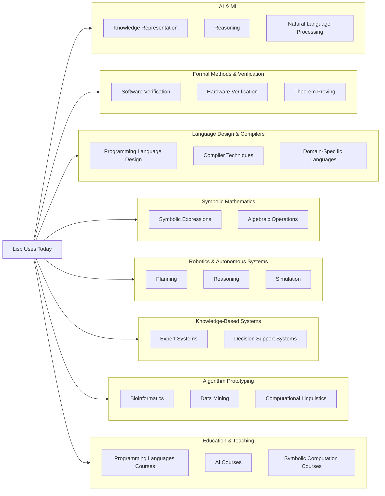
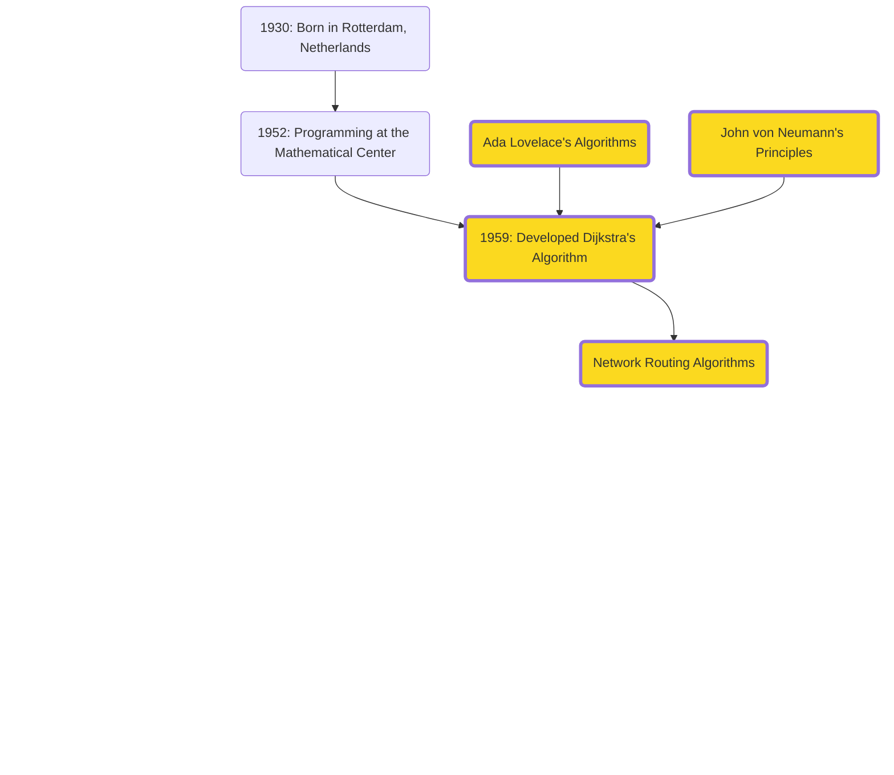
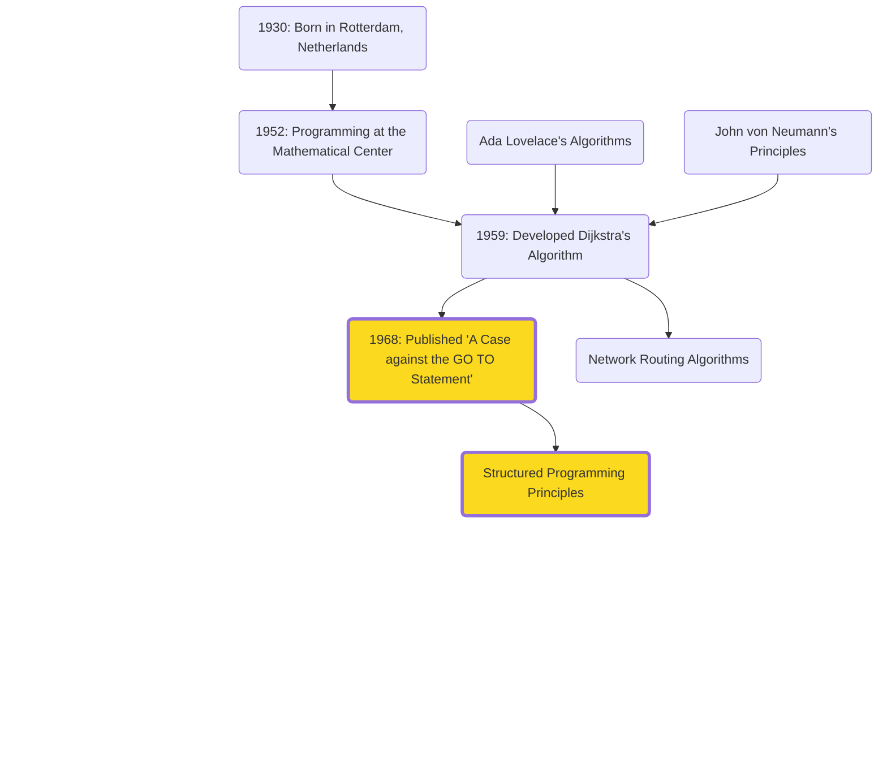
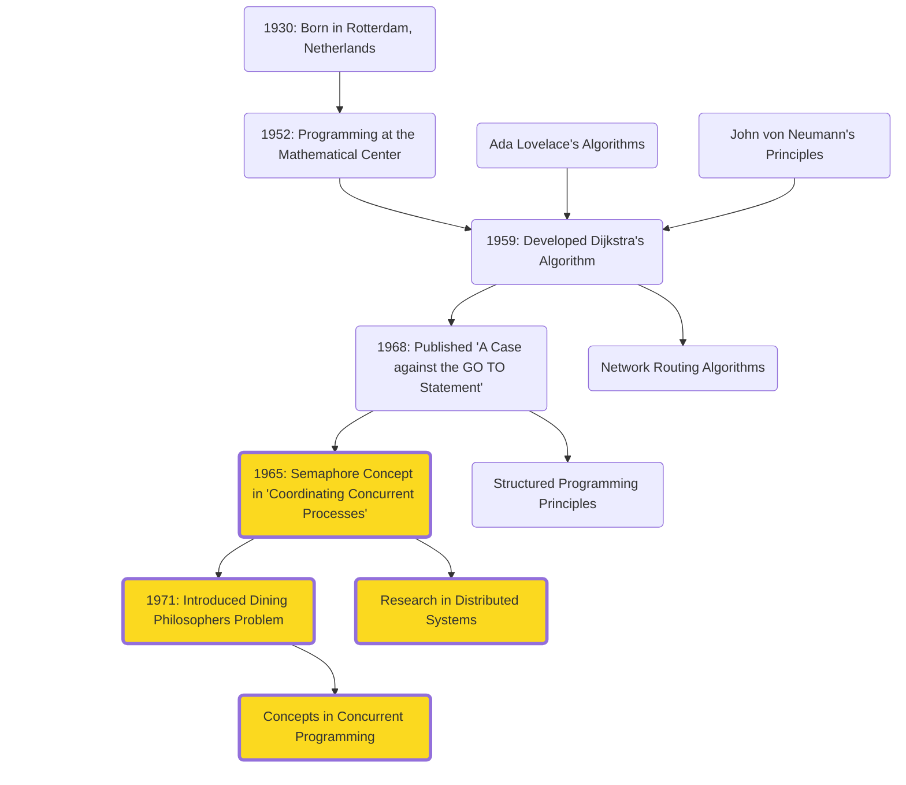
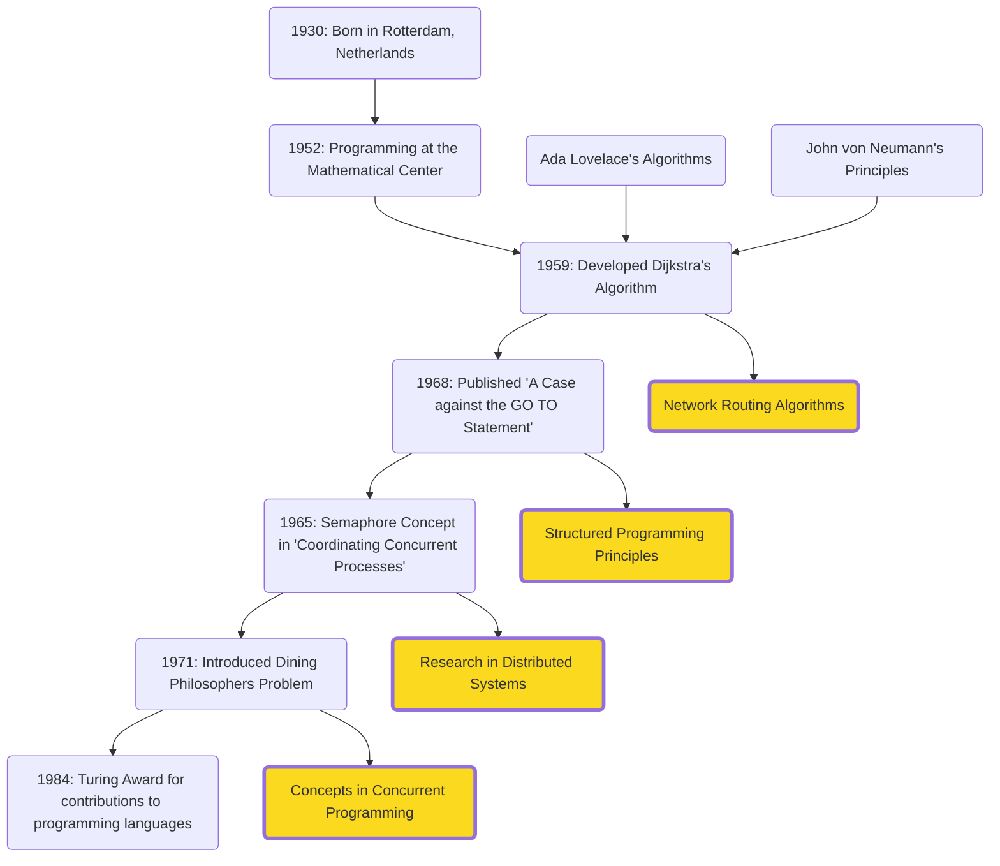
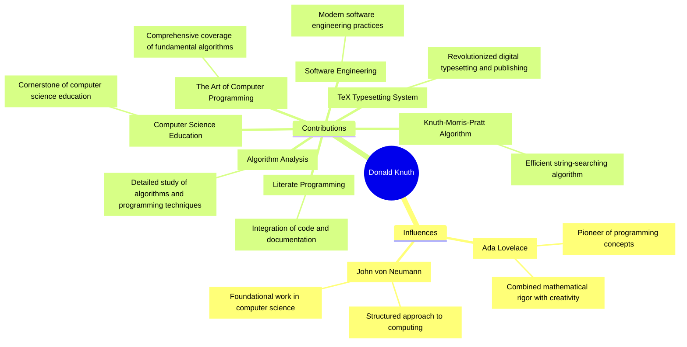
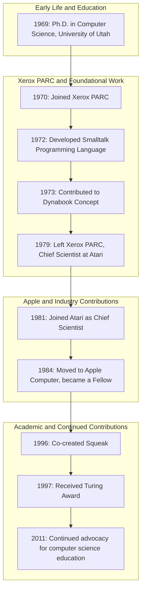
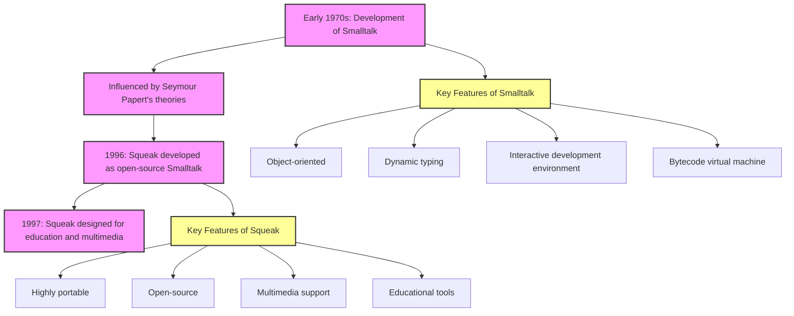

# The Theoretical Foundations

Establishing the core principles and theories that underpin modern technology, building upon the
visionaries' ideas

---
layout: iframe
url: https://ouestware.gitlab.io/retina/1.0.0-beta.1/#/graph/?url=https%3A%2F%2Fgist.githubusercontent.com%2Fqhou%2F7d4319be71ded33d0d7f277f4d33623d%2Fraw%2Fc132ecf1c48ea14e38b0126b68d2cc079dd43047%2Fact2.gexf&r=d&c=a&s=r&sa=r&ca=a
class: act-2
---

# Figures

<!-- 
- With Turing laying the theoretical groundwork for modern computing with his concept of the Turing machine. 
- His work on computational theory and the famous Turing Test set the stage for the development of AI
- Along that, von Neumann's revolution in computer architecture influenced early computer designs and set the stage for practical implementations of Turing’s theoretical ideas.
- Stage was set for futher advancements 
- These early pioneers influenced a new wave of computer scientists who would take these concepts further and apply them to emerging fields like AI
  -->

---
layout: image-right
image: assets/people/john-mccarthy.avif
class: mcarthy-profile-class
---

# John McCarthy (1927-2011)

- <span v-mark.underline.pink>**Artificial Intelligence**</span>: Coined the term "AI" in 1955
- <span v-mark.underline.pink>**Lisp (1958)**</span>: One of the earliest high-level programming languages, influencing modern languages and AI research.
- **Time-sharing**: Innovated the concept of sharing computing resources among multiple users.

<!-- 

- One of the key figures who built on these foundations was John McCarthy. 
- Inspired by Turing and von Neumann's work, McCarthy made strides in AI and programming languages
- Best known 
  - Coined the term AI while organizing the Dartmouth Round Table in 1956
  - Considered the birth of AI as a field of study. 
  - He believed that machines could be made to simulate any aspect of human intelligence.
- In addition
  - Lisp, a programming language designed for AI research
  - Let's take a quick tour on Lisp’s unique capabilities that makes it a powerful tool for AI development.
 -->

---
clicks: 2
---

# Organizing the First AI Conference

**Dartmouth Summer Research Project (1956)**

<div v-if="$slidev.nav.clicks > 0">

<v-drag pos="393,96,240,_">
    
</v-drag>

</div>

<div v-if="$slidev.nav.clicks > 1">

<v-drag pos="85,138,288,_">
    
</v-drag>

</div>

<!--
- McCarthy and others organized the Dartmouth Summer Research Project of 1956, where the term of AI was coined
- Considered the birth of AI as a field. 
- (click) Invitations sent for the seminar

- Here, leading minds gathered to discuss and develop the foundational ideas of AI. )
- Laid the groundwork for many AI advancements we see today
-->

---
clicks: 3
---

# Coining AI and Beyond

**Dartmouth Summer Research Project (1956)**

<div v-if="$slidev.nav.clicks > 0">

<v-drag pos="567,266,288,_">
    
</v-drag>

</div>

<div v-if="$slidev.nav.clicks > 1">

<v-drag pos="25,149,520,_">
    
</v-drag>

</div>

<div v-if="$slidev.nav.clicks > 2">

<v-drag pos="567,82,350,_">
>“I was invited to a meeting of computer scientists and information theorists at Dartmouth College…. 
> Most of the time I had no idea what they were talking about.” - Peter Milner
</v-drag>

</div>

<!--
- (click) plaque at Dartmouth commemorating the seminal event in AI history
- 
- (click) In the back row from left to right are Oliver Selfridge, Nathaniel Rochester, Marvin Minsky, and John McCarthy. 
- In front on the left is Ray Solomonoff; on the right, Claude Shannon.
- All six contributed to AI, computer science, or related fields in the decades following the Dartmouth workshop.

- Middle person in front row, later discovered to be British-Canadian neuroscientist, Peter Milner
- At the time, working on neuropsychology at McGill University
- He’s not generally lumped in with the other AI pioneers because his research interests diverged from theirs.
- He wrote in his 1999 autobiography: “I was invited to a meeting of computer scientists and information theorists at Dartmouth College…. Most of the time I had no idea what they were talking about.”
-->

---
clicks: 3
---

# Lisp (List Processing Language)

<div v-if="$slidev.nav.clicks > 0">

<v-drag pos="114,216,168,_">
    
</v-drag>

</div>

<div v-if="$slidev.nav.clicks > 1">

<v-drag pos="306,218,168,_">
    
</v-drag>

</div>

<div v-if="$slidev.nav.clicks > 2">

<v-drag pos="495,218,168,_">
    
</v-drag>

</div>

<!-- 
1. Interactive Programming
  - Modify and test code on the go
  - Interpreter that can evaluate expressions real-time and alter program state
2. Symbolic Computation
  - Excels at symbolic data structs: lists, graphs
3. Powerful Macros
  - Unique aspect: macro system
  - You can define custom syntax and language constructs 
  - Macros allow you to create new abstractions and extend the language as you wish
  - Lets look at an example for this
 -->

---

# Lisp Macros in Action
```lisp
  ;; Define a macro to create a knock-knock joke
  (defmacro knock-knock (who &rest response)
    `(progn
      (format t "Knock, knock.~%")
      (format t "Who's there?~%")
      (format t ,(format nil "~a." who) ~%)
      (format t ,(format nil "~a who?" who) ~%)
      (format t ,@response)))

  ;; Use the macro to create an AI-themed joke
  (knock-knock "AI"
    "AI who?"
    "AI think, therefore AI am!")

  ;; Run the jokes
  (format t "~%AI-themed knock-knock joke examples:~%")
  (knock-knock "Bot"
    "Bot who?"
    "Botter not forget to laugh at my jokes!")
```

<!-- 
In this example: 
- knock-knock macro shows how macros can simplify and enhance code
- This macro provides a template for a knock-knock joke
- Use to generate multiple jokes with diff setups and punchlines
- Powerful flexibility to create new language features
 -->
  
---

# Lisp (List Processing Language)

<v-drag pos="114,216,168,_">
    
</v-drag>

<v-drag pos="306,218,168,_">
    
</v-drag>

<v-drag pos="495,218,168,_">
    
</v-drag>

<v-click>

<v-drag pos="688,219,161,_">
    
</v-drag>

</v-click>

<!--
Last but not least, its continued relevance in AI and ML research
-->

---

# AI Research Relevance of Lisp

<div style="text-align: center;">
<div style="auto">



</div>
</div>

---
layout: quote
---

Actually... let's really LISP this list

---

# AI Research Relevance of Lisp

```lisp
(defun print-lisp-uses (indent items)
  (dolist (item items)
    (if (listp item)
        (progn
          (format t "~v@{- ~a~%}" indent (first item))
          (print-lisp-uses (+ indent 2) (rest item)))
        (format t "~v@{- ~a~%}" indent item))))

(let ((lisp-uses
       '("Lisp Uses Today"
         ("Artificial Intelligence and Machine Learning"
          "Knowledge Representation"
          "Reasoning"
          "Natural Language Processing")
         ("Formal Methods and Verification"
          "Software Verification"
          "Hardware Verification"
          "Theorem Proving")
         ("Language Design and Compilers"
          "Programming Language Design"
          "Compiler Techniques"
          "Domain-Specific Languages")
         ("Symbolic Mathematics and Computer Algebra Systems"
          "Symbolic Expressions"
          "Algebraic Operations")
         ("Robotics and Autonomous Systems"
          "Planning"
          "Reasoning"
          "Simulation")
         ("Knowledge-Based Systems"
          "Expert Systems"
          "Decision Support Systems")
         ("Algorithm Prototyping and Experimentation"
          "Bioinformatics"
          "Data Mining"
          "Computational Linguistics")
         ("Education and Teaching"
          "Programming Languages Courses"
          "AI Courses"
          "Symbolic Computation Courses"))))
  (print-lisp-uses 0 lisp-uses))
```

<!-- 

- From when McCarthy created Lisp in 1958, 
- continues to be relevant in research areas
- due to its ability to handle complex structures and strength in symbolic computation
- 
 -->
---
layout: image-left
image: /assets/people/edsger-dijkstra.jpg
---

# Edsger W. Dijkstra (1930-2002)

## Notable Influences

- **Dijkstra's Algorithm (Shortest Path)**
- **Structured Programming**
- **Distributed Programming**

<!-- 
- As McCarthy was pioneering the field of artificial intelligence and creating Lisp, 
- Dijkstra was developing fundamental principles for ensuring that algorithms, in general, were efficient and correct. 
- Dijkstra's emphasis on algorithmic efficiency and software reliability provided a strong foundation for various areas of computer science

- **Dijkstra's Algorithm**: Introduced for shortest paths, fundamental in network routing, GIS, and optimization.
- **Structured Programming**: Advocated for principles leading to reliable and maintainable software.
  - “A Case against the GO TO Statement” 
  - Coined: “2 or more, use a for”
- **Distributed Programming**: Early pioneer with contributions like self-stabilizing systems and semaphores. -->
---

# Dijkstra's Formative Influences

<v-drag pos="-173,178,1011,399">

</v-drag>

<!--
- Building on the programming foundations laid by Ada Lovelace and John von Neumann's computing
  principles, Dijkstra's contributions have been pivotal in developing algorithms and programming
  methodologies
-->

---

# A Case for Structured Programming


<v-drag pos="-173,178,1011,399">


</v-drag>

<!-- Structured Programming
His advocacy for structured programming has led to more reliable and maintainable software, advancing the field of software engineering.
“A Case against the GO TO Statement” (EWD215), regarded as a major step towards the widespread deprecation of the GOTO statement and its effective replacement by structured control constructs, such as the while loop.
Coined the phrase “2 or more, use a for”, alluding to the fact that when you find yourself processing more than one instance of a data structure, it is time to encapsulate that logic inside a loop. -->
---
clicks: 1
---

# Dining with Philosophers

<v-drag pos="30,135,1011,399">

</v-drag>

<div v-if="$slidev.nav.clicks === 1">
  <v-drag pos="662,264,275,_">
      
  </v-drag>
</div>

<!--
Distributed Programming
Early pioneers of the research on distributed computing. His paper “Self-stabilizing Systems in Spite of Distributed Control” started the sub-field of self-stabilization.
Coordinating Concurrent Processes (1965) denotes the first synchronization mechanism for concurrent processes, the semaphore with its two operations, commonly known as P and V.


Semaphores: The Dining Philosophers problem (1971)
The Dining Philosophers Problem is a classic synchronization problem in computer science, introduced by Dijkstra in 1965. 
- Five philosophers sitting around a table, each alternating between thinking and eating. 
- There is a single fork between each pair of philosophers, and to eat, a philosopher needs both adjacent forks. 
- The challenge is to ensure that no philosopher starves while preventing deadlock, where everyone is stuck waiting for a fork.

- Dijkstra’s exploration of this problem was pivotal in understanding and solving issues of concurrency in computing. 
- His work led to the development of synchronization techniques like semaphores and monitors, which are crucial for managing resource allocation in multi-threaded and distributed systems.

Today, the principles from this influence various areas of computer science, including operating systems, database management, and parallel computing. It remains a fundamental example for teaching and demonstrating synchronization and resource sharing in concurrent programming.
-->

---

# Dijkstra's Legacy

<v-drag pos="31,117,1011,399">

</v-drag>

<!--
His work has had a lasting impact on software engineering practices, influencing how complex software systems are designed and implemented. Examples include routing algorithms in network communication and optimization algorithms in various fields.
-->

---
layout: image-left
image: /assets/dijkstra-writing.png
---

# Eloquence and Elegance

- Known for elegant writing and handwriting
- Inspired the creation of <span v-mark.circle.orange="4">Dijkstra Regular font</span>

---
layout: image-left
image: assets/people/wirth.webp
clicks: 4
---

# Niklaus Wirth

**Developed programming languages: Pascal (1970, Modula-2 (1979), and Oberon (1988)**


<!--
Dijkstra’s work on algorithms and structured programming had a significant influence on Niklaus Wirth, 
who designed several influential programming languages, 
such as Pascal, which emphasized simplicity and efficiency in programming
-->
---
clicks: 4
---

# Pascal's Influence

- **Pascal Programming Language:**
  - Emphasized structured programming and data structuring
  - Released freely as a <span v-mark.circle.orange="4">"public good"</span> aiding educators and tech companies

- **Educational Impact:**
  - Pascal became essential for teaching programming
  - Fostered good programming practices and efficient code

<div v-if="$slidev.nav.clicks > 0">

<v-drag pos="577,209,418,_">
    
</v-drag>

</div>

<div v-if="$slidev.nav.clicks > 1">

<v-drag pos="806,38,153,_">
    
</v-drag>

</div>

---
layout: quote
---

"Increasingly, people seem to misinterpret complexity as sophistication, which is baffling—the incomprehensible should cause suspicion rather than admiration."
- Niklaus Wirth

---
layout: image-left
image: /assets/people/donald-knuth.jpg
class: donald-knuth
---
# Donald Knuth

## Impactful Work
- "The Art of Computer Programming" (1968)
- Knuth-Morris-Pratt (KMP) Algorithm
- TeX typesetting system

<!-- 
- Wirth’s contributions to programming language design were complemented by Donald Knuth’s work on the broader art of programming. 
- Knuth’s multi-volume work 'The Art of Computer Programming' is considered a seminal text in the field, 
- encompassing algorithms, data structures, and programming techniques
 -->
---

# Knuth's Influences and Contributions

<div style="text-align: center;">
<div style="auto">



</div>
</div>

<!--
Influenced by
- Ada Lovelace:
  - Ada Lovelace was a pioneer of programming concepts. She combined mathematical rigor with creativity, which greatly inspired Knuth. Her visionary work laid the foundation for what would become modern computer programming.
- John von Neumann:
  - Another major influence on Knuth was John von Neumann. Known for his structured approach to computing, von Neumann's foundational work in computer science shaped Knuth's methodical and analytical approach to algorithms and programming."

1. The Art of Computer Programming (1968):
  - This comprehensive coverage of fundamental algorithms is often considered the bible of computer programming.
2. TeX Typesetting System:
  - Revolutionized digital typesetting and publishing
  - Widely used in academia for producing technical documents, ensuring high-quality typesetting.
3. Knuth-Morris-Pratt Algorithm:
  - One of his notable algorithms 
  - Efficient string-searching algorithm
4. Literate Programming:
  - Introduced the concept, integrating code and documentation. 
  - This promotes writing programs that are not only functional but also easy to understand and maintain.
5, Algorithm Analysis + Software Engineering
  - Emphasizes the importance of efficient algorithms
  - His work helped stablish best practices that are still followed today.
1. Computer Science Education:
  - His work has become a cornerstone of computer science education, 
  - educating generations of programmers and computer scientists.
-->
---
layout: quote
---

'I certainly felt like an imposter for many years. There were so many other people who seemed so much more capable than I was. I just kept working hard and doing what I loved, hoping that someday I would belong.' - Donald Knuth

<!-- 
- Interestingly, despite his immense contributions, 
- Knuth initially experienced imposter syndrome. 
- Undoubtedly so, his perseverance and dedication have left an indelible mark on the field of computer science.
-->
---

## Welcoming (and Rewarding) Feedback

- **Error Rewards:**
  - Mails you $2.56 (1 hexadecimal dollar) for every mistake found in his book (stopped in 2008)
  - Now sends a cheque-like certificate (and real money if requested)

<v-click>
  <v-drag pos="132,186,692,_">
      
  </v-drag>
</v-click>

---
layout: image-right
image: assets/people/alan-kay.jpg
---

# Alan Kay

- One of the Fathers of Object-Oriented Programming
  - Coined "Object" and "Class"
  - Smalltalk
  - Squeak
- GUIs
  - Dyanbook (1972): "A personal computer for children of all ages"

---

# Brief Timeline of Contributions 



<!--
- Pivotal figure in the history of computer science
- Known for his groundbreaking work in object-oriented programming and personal computing

- In 1970, Kay joined Xerox PARC, 
- where he developed the Smalltalk programming language in 1972 (brought to life object-oriented programming)

- The following year, he contributed to the Dynabook concept, a visionary idea that anticipated modern laptops and tablets.

- In 1979, he left Xerox Parc to Atari, and from there, to Apple Computer . 
- He continued to influence UI design and multimedia systems as a Fellow.

- In 1996, Kay co-created Squeak, an open-source Smalltalk programming system.
-->

---

# Smalltalk to Squeak

<v-drag pos="610,62,129,_">
    
</v-drag>

<v-drag pos="421,231,107,_">
    
</v-drag>



<!--
Smalltalk Origins
- Developed in the 1970s at Xerox PARC by Alan Kay and his team.
- Aimed to create a powerful, flexible, and easy-to-use programming language.
- Heavily influenced by the ideas of object-oriented programming and educational theories

Smalltalk Inspirations
- Inspired by Papert’s educational philosophy and ideas on how children learn.
- Emphasized simplicity, direct manipulation, and the concept of “objects” to represent data and methods.

Development of Squeak
- Created in the mid-1990s by Alan Kay and his team as an open-source version of Smalltalk.
- Aimed to provide a modern, portable, and highly capable programming environment.
- Designed for educational purposes, multimedia applications, and as a tool for research in human-computer interaction
-->
---
clicks: 3
---

# Xerox PARC and Robert Taylor

<div v-if="$slidev.nav.clicks > 0">
<v-drag pos="69,311,290,_">

</v-drag>
</div>

<div v-if="$slidev.nav.clicks > 1">
<v-drag pos="411,157,499,_">

</v-drag>
</div>

<div v-if="$slidev.nav.clicks > 2">
<v-drag pos="70,104,290,_">

</v-drag>
</div>

<!--
- Bob Taylor
  - Leader at Xerox PARC who recruited Kay
  - Fostered a collaborative and innovative environment
  - Key figure in the development of personal computing

- Xerox Parc
  - Hub for groundbreaking computer science research
  - Enabled Kay to develop Smalltalk and GUI concepts
  - Influenced future technologies and computing paradigms
-->

---
clicks: 2
---

# A Gold Mine 

<div v-if="$slidev.nav.clicks > 0">

<v-drag pos="67,186,409,_">
    
</v-drag>
  
</div>

<div v-if="$slidev.nav.clicks > 1">

<v-drag pos="496,176,439,_">
    
</v-drag>

</div>

---
layout: two-cols
---


::right::


---
layout: image-left
image: /assets/people/karen-jones.webp
---

# Karen Spärck Jones

- **Information Retrieval**
  - Pioneered work in search engine algorithms
  - Developed Inverse Document Frequency (IDF)

- **Natural Language Processing**
  - Enabled machines to understand and process human language
  - Advanced research in machine translation, chatbots, and automated summarization

<!--
- **Inverse Document Frequency (IDF):**
  - Evaluates the importance of a word in a document relative to a collection of documents (corpus)
  - Highlights unique terms specific to a document
  - Reduces the weight of common words

- **Relevance Weighting:**
  - Assigns weights to terms based on their importance in the retrieval process
-->

---

## IDF Under the Hood

<v-drag pos="63,187,490,_">
    
</v-drag>

- Laid the groundwork for modern search engines
- Improved relevance of search results
- Widely used in document retrieval and text mining

---
layout: quote
---

"Computing is too important to be left to men" - Karen Spärck Jones 
