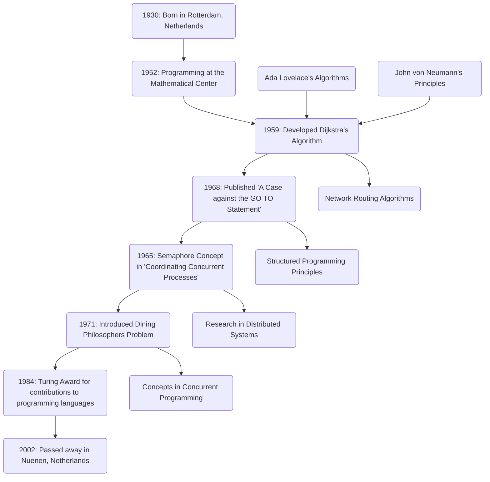

# Act 2: The Theoretical Foundations

Establishing the core principles and theories that underpin modern technology, building upon the visionaries' ideas from Act 1.

---
layout: iframe

# the web page source
url: https://ouestware.gitlab.io/retina/1.0.0-beta.1/#/graph/?url=https%3A%2F%2Fgist.githubusercontent.com%2Fqhou%2F7d4319be71ded33d0d7f277f4d33623d%2Fraw%2F02434f83b34d77bc5d3ce6e8a284a4abbeceb332%2Fact2.gexf&r=d&s=r&sa=r

# a custom class name to the content
class: act-2-class

---

---
title: Act 2: Pioneers of Artificial Intelligence and Structured Programming
theme: default
---

# John McCarthy (1927-2011)

## The Father of Artificial Intelligence

- **Time-sharing**: Innovated the concept of sharing computing resources among multiple users.
- **Lisp (1958)**: One of the earliest high-level programming languages, influencing modern languages and AI research.
- **Artificial Intelligence**: Coined the term "AI" in 1955
   

  "AI is the science and engineering of making intelligent machines, especially intelligent computer programs. Intelligence is the computational part of the ability to achieve goals in the world."

---
layout: image-left

# the image source
image: https://news.stanford.edu/__data/assets/image/0025/81178/Mccarthy_portrait_news.jpeg

# a custom class name to the content
class: mcarthy-profile-class
---

# McCarthy's Impact

- **Foundations of AI**: Laid groundwork for machine learning, natural language processing, and robotics.
- **Industries**: Contributions impact healthcare, finance, autonomous vehicles, and more.
- **Inspiration**: His pioneering efforts continue to inspire research and innovation in AI.

---
title: Act 2: Pioneers of Artificial Intelligence and Structured Programming
theme: default
---

# Edsger W. Dijkstra (1930-2002)

## "A Note on Two Problems in Connexion with Graphs" (1959)

- **Dijkstra's Algorithm**: Introduced for shortest paths, fundamental in network routing, GIS, and optimization.
- **Structured Programming**: Advocated for principles leading to reliable and maintainable software.
  - “A Case against the GO TO Statement” (EWD215)
  - Coined: “2 or more, use a for”
- **Distributed Programming**: Early pioneer with contributions like self-stabilizing systems and semaphores.

---

---
layout: image-right

# the image source
image: https://blogger.googleusercontent.com/img/b/R29vZ2xl/AVvXsEhSPLSXw4JR675YgNB40FgSLIoHqTwk-s80toDXALGZXfH61Q5B_-FJsJinxC514Xm7ulZwNO4XRK-P6yVXxppdsp74OdDVeoSS2kxqE-OnlOnmTZXeNn9jlGapmF1zGy-F3ZR4nOQQE4jG/s1600/dijkstra.jpg

# a custom class name to the content
class: dijkstra-writing-class
---

## Fun Fact

- **Background**: Originally studied theoretical physics, persuaded to stay in programming.
- **Elegance**: Known for elegant writing and handwriting. Inspired the creation of Dijkstra Regular font.
---

# Donald Knuth

## The Art of Computer Programming

---

# Niklaus Wirth

## A Learner's Language, Pascal

---

# Alan Kay

## Usability and efficiency with Smalltalk, OOP, GUI

---

---

# Karen Spärck Jones

## Information retrieval with IDF

---
