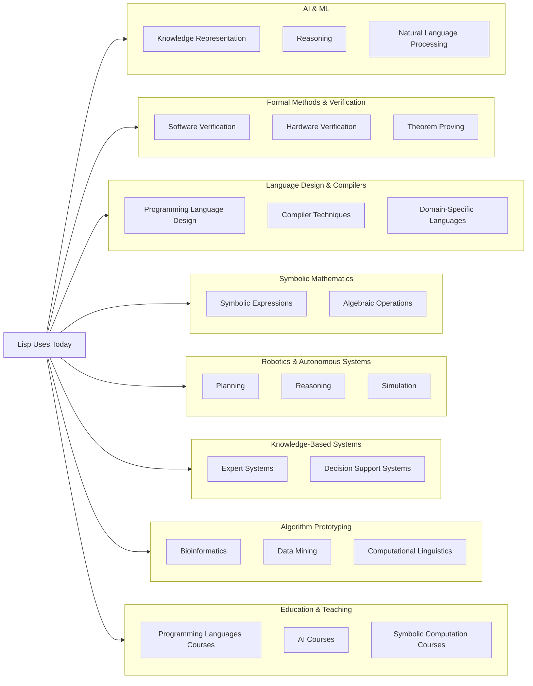
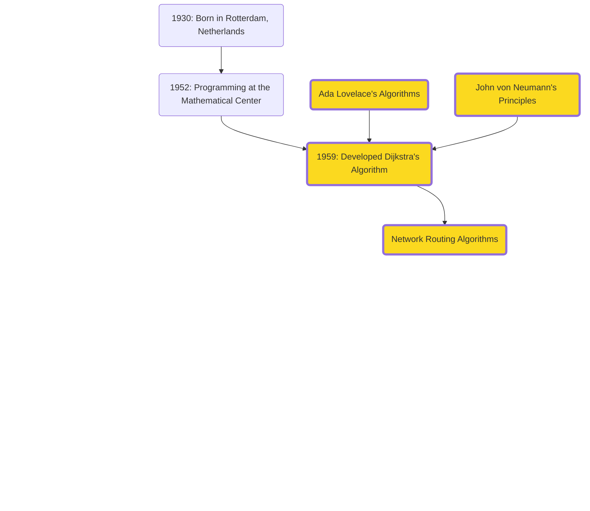
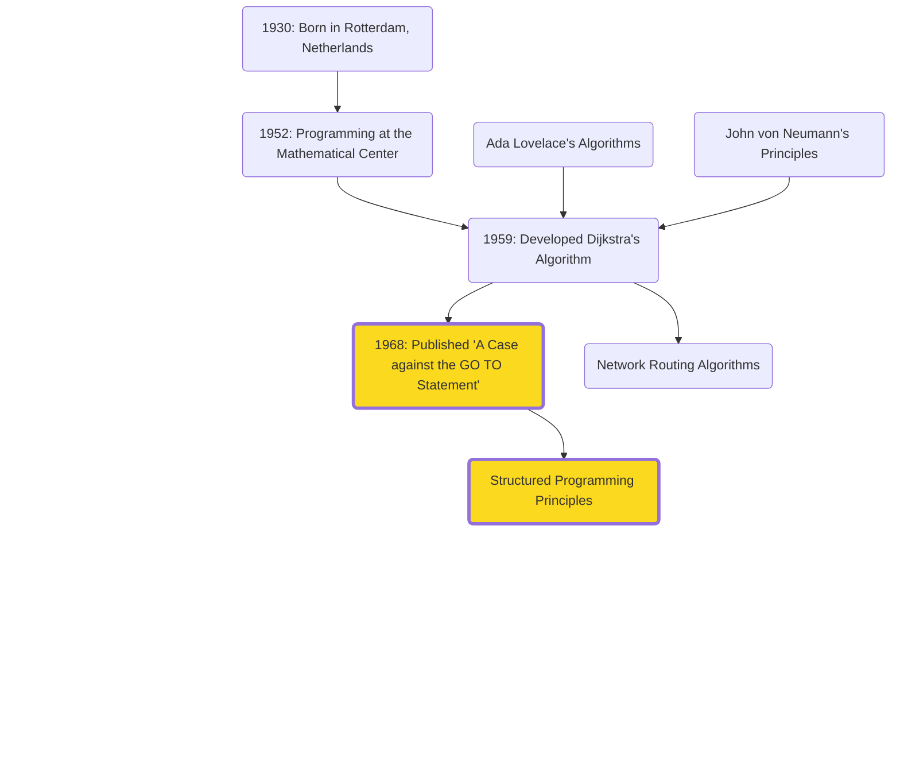
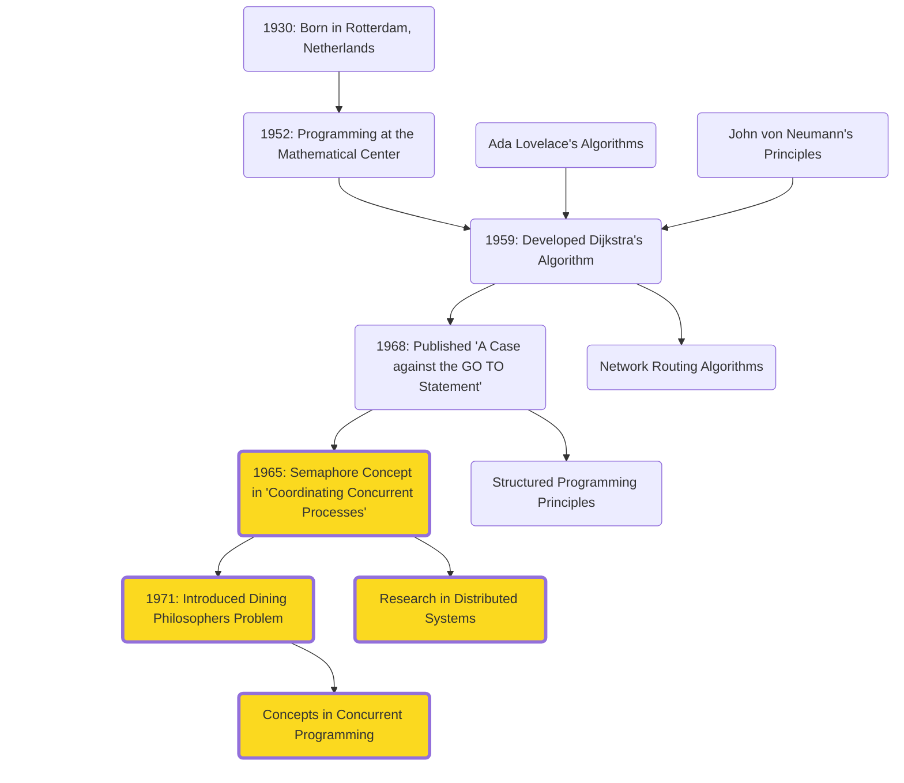
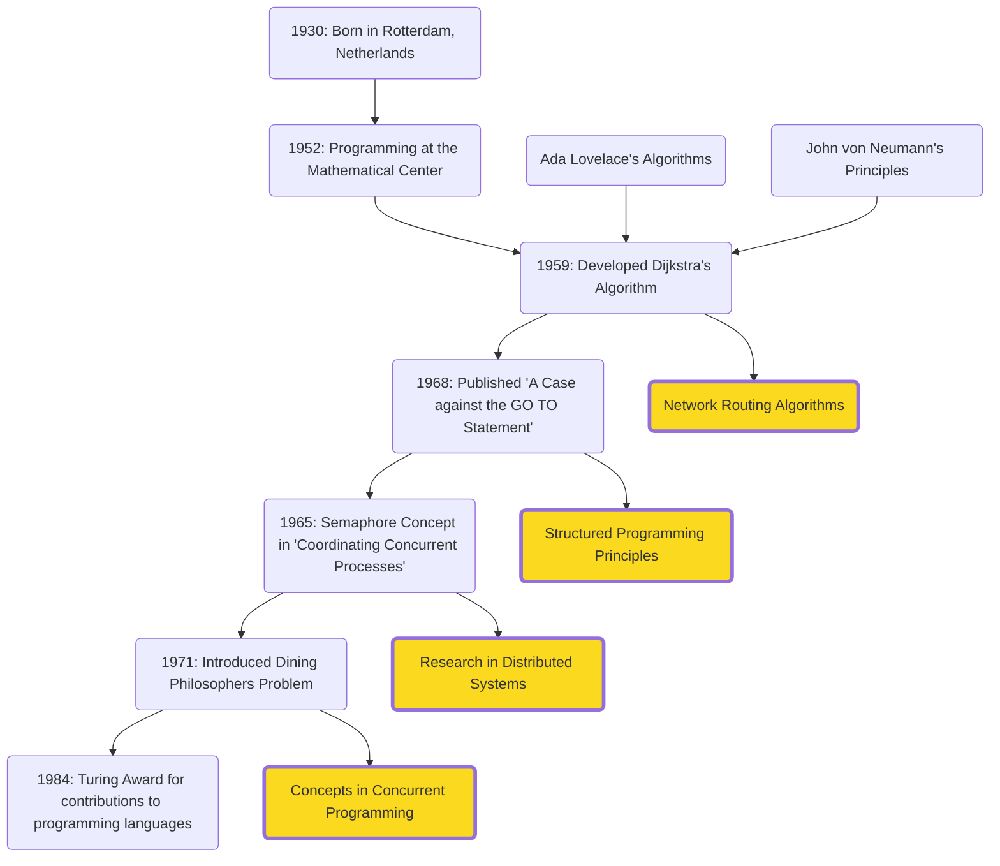
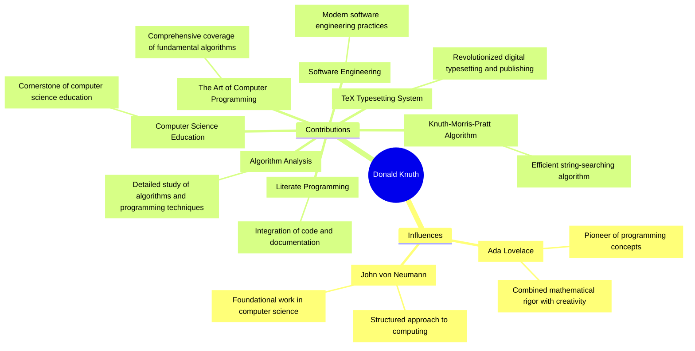

# The Theoretical Foundations

Establishing the core principles and theories that underpin modern technology, building upon the visionaries' ideas from Act 1.

---
layout: iframe
url: https://ouestware.gitlab.io/retina/1.0.0-beta.1/#/graph/?url=https%3A%2F%2Fgist.githubusercontent.com%2Fqhou%2F7d4319be71ded33d0d7f277f4d33623d%2Fraw%2Fc132ecf1c48ea14e38b0126b68d2cc079dd43047%2Fact2.gexf&r=d&c=a&s=r&sa=r&ca=a
class: act-2
---

# Figures

<!-- 
- With Turing laying the theoretical groundwork for modern computing with his concept of the Turing machine. 
- His work on computational theory and the famous Turing Test set the stage for the development of AI
- Along that, von Neumann's revolution in computer architecture influenced early computer designs and set the stage for practical implementations of Turing’s theoretical ideas.
- Stage was set for futher advancements 
- These early pioneers influenced a new wave of computer scientists who would take these concepts further and apply them to emerging fields like AI
  -->

---
layout: image-right
image: assets/people/john-mccarthy.avif
class: mcarthy-profile-class
---

# John McCarthy (1927-2011)

- <span v-mark.underline.pink>**Artificial Intelligence**</span>: Coined the term "AI" in 1955
- <span v-mark.underline.pink>**Lisp (1958)**</span>: One of the earliest high-level programming languages, influencing modern languages and AI research.
- <span v-mark.underline.pink>**Time-sharing**</span>: Innovated the concept of sharing computing resources among multiple users.

<!-- 

- One of the key figures who built on these foundations was John McCarthy. 
- Inspired by Turing and von Neumann's work, McCarthy made strides in AI and programming languages
- Best known 
  - Coined the term AI while organizing the Dartmouth Round Table in 1956
  - Considered the birth of AI as a field of study. 
  - He believed that machines could be made to simulate any aspect of human intelligence.
- In addition
  - Lisp, a programming language designed for AI research
  - Let's take a quick tour on Lisp’s unique capabilities that makes it a powerful tool for AI development.
 -->

---

# Organizing the First AI Conference

**Dartmouth Roundtable (1956)**

<div v-if="$slidev.nav.clicks > 0">

<v-drag pos="114,216,168,_">
    
</v-drag>

</div>

<div v-if="$slidev.nav.clicks > 1">

<v-drag pos="306,218,168,_">
    
</v-drag>

</div>

<div v-if="$slidev.nav.clicks > 2">

<v-drag pos="495,218,168,_">
    
</v-drag>

</div>

<!-- 
- McCarthy and others organized the Dartmouth Roundtable of 1956, where the term of AI was coined
- Considered the birth of AI as a field. 
- (click) Invitations sent for the seminar
- Here, leading minds like McCarthy, Minsky, Shannon, and Newell gathered to discuss and develop the foundational ideas of AI. 
- Laid the groundwork for many AI advancements we see today
- (click) plaque at Dartmouth commemorating the seminal event in AI history 

 -->

---
clicks: 3
---

# Lisp (List Processing Language)

<div v-if="$slidev.nav.clicks > 0">

<v-drag pos="114,216,168,_">
    
</v-drag>

</div>

<div v-if="$slidev.nav.clicks > 1">

<v-drag pos="306,218,168,_">
    
</v-drag>

</div>

<div v-if="$slidev.nav.clicks > 2">

<v-drag pos="495,218,168,_">
    
</v-drag>

</div>

<!-- 
1. Interactive Programming
  - Modify and test code on the go
  - Interpreter that can evaluate expressions real-time and alter program state
2. Symbolic Computation
  - Excels at symbolic data structs: lists, graphs
3. Powerful Macros
  - Unique aspect: macro system
  - You can define custom syntax and language constructs 
  - Macros allow you to create new abstractions and extend the language as you wish
  - Lets look at an example for this
 -->

---

# Lisp Macros in Action
```lisp
  ;; Define a macro to create a knock-knock joke
  (defmacro knock-knock (who &rest response)
    `(progn
      (format t "Knock, knock.~%")
      (format t "Who's there?~%")
      (format t ,(format nil "~a." who) ~%)
      (format t ,(format nil "~a who?" who) ~%)
      (format t ,@response)))

  ;; Use the macro to create an AI-themed joke
  (knock-knock "AI"
    "AI who?"
    "AI think, therefore AI am!")

  ;; Run the jokes
  (format t "~%AI-themed knock-knock joke examples:~%")
  (knock-knock "Bot"
    "Bot who?"
    "Botter not forget to laugh at my jokes!")
```

<!-- 
In this example: 
- knock-knock macro shows how macros can simplify and enhance code
- This macro provides a template for a knock-knock joke
- Use to generate multiple jokes with diff setups and punchlines
- Powerful flexibility to create new language features
 -->
  
---

# Lisp (List Processing Language)

<v-drag pos="114,216,168,_">
    
</v-drag>

<v-drag pos="306,218,168,_">
    
</v-drag>

<v-drag pos="495,218,168,_">
    
</v-drag>

<v-click>

<v-drag pos="688,219,161,_">
    
</v-drag>

</v-click>

<!--
Last but not least, its continued relevance in AI and ML research
-->

---

# AI Research Relevance of Lisp

<div style="text-align: center;">
<div style="auto">



</div>
</div>

---
layout: quote
---

Actually... let's really LISP this list

---

# AI Research Relevance of Lisp

<div style="text-align: center;">
<div style="auto">

```lisp
(defun print-lisp-uses (indent items)
  (dolist (item items)
    (if (listp item)
        (progn
          (format t "~v@{- ~a~%}" indent (first item))
          (print-lisp-uses (+ indent 2) (rest item)))
        (format t "~v@{- ~a~%}" indent item))))

(let ((lisp-uses
       '("Lisp Uses Today"
         ("Artificial Intelligence and Machine Learning"
          "Knowledge Representation"
          "Reasoning"
          "Natural Language Processing")
         ("Formal Methods and Verification"
          "Software Verification"
          "Hardware Verification"
          "Theorem Proving")
         ("Language Design and Compilers"
          "Programming Language Design"
          "Compiler Techniques"
          "Domain-Specific Languages")
         ("Symbolic Mathematics and Computer Algebra Systems"
          "Symbolic Expressions"
          "Algebraic Operations")
         ("Robotics and Autonomous Systems"
          "Planning"
          "Reasoning"
          "Simulation")
         ("Knowledge-Based Systems"
          "Expert Systems"
          "Decision Support Systems")
         ("Algorithm Prototyping and Experimentation"
          "Bioinformatics"
          "Data Mining"
          "Computational Linguistics")
         ("Education and Teaching"
          "Programming Languages Courses"
          "AI Courses"
          "Symbolic Computation Courses"))))
  (print-lisp-uses 0 lisp-uses))
```

</div>
</div>

<!-- 

- From when McCarthy created Lisp in 1958, 
- continues to be relevant in research areas
- due to its ability to handle complex structures and strength in symbolic computation
- 
 -->

---
layout: iframe-left
url: https://ouestware.gitlab.io/retina/1.0.0-beta.1/#/graph/?url=https%3A%2F%2Fgist.githubusercontent.com%2Fqhou%2F7d4319be71ded33d0d7f277f4d33623d%2Fraw%2Fc132ecf1c48ea14e38b0126b68d2cc079dd43047%2Fact2.gexf&r=d&c=a&s=r&sa=r&ca=a
class: act-2
---

<!-- Skip to next slide -->

---
layout: image-left
image: /assets/people/edsger-dijkstra.jpg
---

# Edsger W. Dijkstra (1930-2002)

- **Dijkstra's Algorithm (Shortest Path)**
- **Structured Programming**
- **Distributed Programming**

<!-- 


- **Dijkstra's Algorithm**: Introduced for shortest paths, fundamental in network routing, GIS, and optimization.
- **Structured Programming**: Advocated for principles leading to reliable and maintainable software.
  - “A Case against the GO TO Statement” 
  - Coined: “2 or more, use a for”
- **Distributed Programming**: Early pioneer with contributions like self-stabilizing systems and semaphores. -->

---

# Dijkstra's Formative Influences



<!--
- Building on the programming foundations laid by Ada Lovelace and John von Neumann's computing
  principles, Dijkstra's contributions have been pivotal in developing algorithms and programming
  methodologies
-->

---

# A Case for Structured Programming



<!-- Structured Programming
His advocacy for structured programming has led to more reliable and maintainable software, advancing the field of software engineering.
“A Case against the GO TO Statement” (EWD215), regarded as a major step towards the widespread deprecation of the GOTO statement and its effective replacement by structured control constructs, such as the while loop.
Coined the phrase “2 or more, use a for”, alluding to the fact that when you find yourself processing more than one instance of a data structure, it is time to encapsulate that logic inside a loop. -->
---

# Dining with Philosophers



<div v-if="$slidev.nav.clicks === 1">
  <v-drag pos="662,264,275,_">
      
  </v-drag>
</div>

<!--
Distributed Programming
Early pioneers of the research on distributed computing. His paper “Self-stabilizing Systems in Spite of Distributed Control” started the sub-field of self-stabilization.
Coordinating Concurrent Processes (1965) denotes the first synchronization mechanism for concurrent processes, the semaphore with its two operations, commonly known as P and V.


Semaphores: The Dining Philosophers problem (1971)
The Dining Philosophers Problem is a classic synchronization problem in computer science, introduced by Dijkstra in 1965. 
- Five philosophers sitting around a table, each alternating between thinking and eating. 
- There is a single fork between each pair of philosophers, and to eat, a philosopher needs both adjacent forks. 
- The challenge is to ensure that no philosopher starves while preventing deadlock, where everyone is stuck waiting for a fork.

- Dijkstra’s exploration of this problem was pivotal in understanding and solving issues of concurrency in computing. 
- His work led to the development of synchronization techniques like semaphores and monitors, which are crucial for managing resource allocation in multi-threaded and distributed systems.

Today, the principles from this influence various areas of computer science, including operating systems, database management, and parallel computing. It remains a fundamental example for teaching and demonstrating synchronization and resource sharing in concurrent programming.
-->

---

# Dijkstra's Legacy



<!-- His work has had a lasting impact on software engineering practices, influencing how complex software systems are designed and implemented. Examples include routing algorithms in network communication and optimization algorithms in various fields. -->

---

## For fun...

<div v-if="$slidev.nav.clicks === 2">
  <v-drag pos="662,264,275,_">
      
  </v-drag>
</div>

- **Background**: Originally studied theoretical physics, persuaded to stay in programming.
- **Elegance**: Known for elegant writing and handwriting. Inspired the creation of Dijkstra Regular font.

---
layout: image-left
image: /assets/people/donald-knuth.jpg
class: donald-knuth
---
# Donald Knuth (1938-present)

<div v-if="$slidev.nav.clicks === 2">
  <v-drag pos="662,264,275,_">
      
  </v-drag>
</div>

<div>
- **Impactful Work:**
  - **"The Art of Computer Programming" (1968)**
  - Knuth-Morris-Pratt (KMP) Algorithm
  - TeX typesetting system
</div>
---

# Knuth's Influences and Contributions



<div v-if="$slidev.nav.clicks === 1">
  <v-drag pos="662,264,275,_">
      
  </v-drag>
</div>

<!--
1. The Art of Computer Programming (1968):
  - Comprehensive coverage of fundamental algorithms
2. TeX Typesetting System:
  - Revolutionized digital typesetting and publishing
3. Knuth-Morris-Pratt Algorithm:
  - Efficient string-searching algorithm
4. Literate Programming:
  - Integration of code and documentation

Influences
- Ada Lovelace:
  - Ada Lovelace was a pioneer of programming concepts. She combined mathematical rigor with creativity, which greatly inspired Knuth. Her visionary work laid the foundation for what would become modern computer programming.
- John von Neumann:
  - Another major influence on Knuth was John von Neumann. Known for his structured approach to computing, von Neumann's foundational work in computer science shaped Knuth's methodical and analytical approach to algorithms and programming."
Contributions:
- The Art of Computer Programming:
  - Knuth's most famous work is 'The Art of Computer Programming'. This comprehensive coverage of fundamental algorithms is often considered the bible of computer programming. It's an essential resource for anyone studying or working in the field.
- TeX Typesetting System:
  - Knuth revolutionized digital typesetting with the creation of the TeX system. This tool is widely used in academia for producing technical documents, ensuring high-quality typesetting.
- Knuth-Morris-Pratt Algorithm:
  - One of his notable algorithms is the Knuth-Morris-Pratt algorithm, an efficient string-searching algorithm crucial for text processing applications. It helps in finding patterns within strings quickly and effectively.
- Literate Programming:
  - Knuth also introduced the concept of literate programming, which integrates code and documentation. This promotes writing programs that are not only functional but also easy to understand and maintain.
- Algorithm Analysis:
  - His detailed study of algorithms and programming techniques emphasizes the importance of efficient algorithms. This has been instrumental in advancing the field of computer science.
Software Engineering:
  - Knuth's contributions to modern software engineering practices focus on clarity and efficiency in coding. His work has helped establish best practices that are still followed today.
Computer Science Education:
  0 Lastly, Knuth's impact on computer science education cannot be overstated. His work has become a cornerstone of computer science education, educating generations of programmers and computer scientists."

"Despite his immense contributions, Knuth initially experienced imposter syndrome. He once said, 'I certainly felt like an imposter for many years. There were so many other people who seemed so much more capable than I was. I just kept working hard and doing what I loved, hoping that someday I would belong.' This is a reminder that even the most accomplished individuals can have self-doubt. However, his perseverance and dedication have left an indelible mark on the field of computer science."

"Knuth's influences and contributions have profoundly shaped the landscape of computer science, and his work continues to inspire and guide new generations in the field."
-->
---
layout: quote
---

'I certainly felt like an imposter for many years. There were so many other people who seemed so much more capable than I was. I just kept working hard and doing what I loved, hoping that someday I would belong.'

---

## Welcoming (and Rewarding) Feedback

- **Error Rewards:**
  - Mails you $2.56 (1 hexadecimal dollar) for every mistake found in his book (stopped in 2008)
  - Now sends a cheque-like certificate (and real money if requested)

<div v-if="$slidev.nav.clicks === 2">
  <v-drag pos="662,264,275,_">
      
  </v-drag>
</div>

---
layout: quote
---
"Increasingly, people seem to misinterpret complexity as sophistication, which is baffling—the incomprehensible should cause suspicion rather than admiration."

**Niklaus Wirth**

---
clicks: 2
---
# Niklaus Wirth

- Developed programming languages: <span v-mark.circle.orange="4">Pascal (1970)</span>, Modula-2 (1979), and Oberon (1988).

- **Pascal Programming Language:**
  - Emphasized structured programming and data structuring
  - Released freely as a <span v-mark.circle.orange="4">"public good," </span> aiding educators and tech companies

- **Educational Impact:**
  - Pascal became essential for teaching programming
  - Fostered good programming practices and efficient code

<div v-if="$slidev.nav.clicks === 1">

<v-drag pos="601,54,334,_,-6">
    
</v-drag>

</div>

<div v-if="$slidev.nav.clicks === 2">

<v-drag pos="601,54,334,_,-6">
    
</v-drag>

</div>

---

# Alan Kay

- **Smalltalk Programming Language:**
  - Pioneered object-oriented programming (OOP)
  - Revolutionized software development with concepts like encapsulation, inheritance, and polymorphism
  - Simplified modeling of complex systems
  - Enhanced code reusability
  - Influenced modern languages like Java and C++

- **Graphical User Interfaces (GUIs):**
  - Made computers more accessible and user-friendly
  - Influenced modern operating systems and applications
  - Inspired the design of modern software interfaces


---

## Relationship with Bob Taylor and Xerox PARC

- **Bob Taylor:**
  - Leader at Xerox PARC who recruited Kay
  - Fostered a collaborative and innovative environment
  - Key figure in the development of personal computing

- **Xerox PARC:**
  - Hub for groundbreaking computer science research
  - Enabled Kay to develop Smalltalk and GUI concepts
  - Influenced future technologies and computing paradigms

---

## Bob Taylor's Highlights and Contributions

- **Creation of ARPAnet:**
  - Early precursor to the internet

- **Leadership at Xerox PARC:**
  - Recruited top talent, including Alan Kay
  - Facilitated development of groundbreaking technologies

- **Emphasis on Collaboration:**
  - Promoted interdisciplinary teamwork
  - Fostered an environment of innovation and creativity

---

# Karen Spärck Jones - Pioneer of Information Retrieval

- **Information Retrieval:**
  - Pioneered work in search engine algorithms
  - Developed Inverse Document Frequency (IDF), a fundamental component of TF-IDF weighting

- **Natural Language Processing (NLP):**
  - Enabled machines to understand and process human language
  - Advanced research in machine translation, chatbots, and automated summarization

---
dragPos:
  square: 56,120,852,428
---

## IDF Under the Hood

<!--  -->

<!--
- **Inverse Document Frequency (IDF):**
  - Evaluates the importance of a word in a document relative to a collection of documents (corpus)
  - Highlights unique terms specific to a document
  - Reduces the weight of common words

- **Relevance Weighting:**
  - Assigns weights to terms based on their importance in the retrieval process

- **Automatic Thesaurus Generation:**
  - Enhances query expansion using synonyms and related terms
-->

---

## Impact and Applications

- **Search Engines:**
  - Laid the groundwork for modern search engines
  - Improved relevance of search results
  - Widely used in document retrieval and text mining

- **Social Implications of Computing:**
  - Advocated for women in computing
  - Famous quote: "Computing is too important to be left to men"
