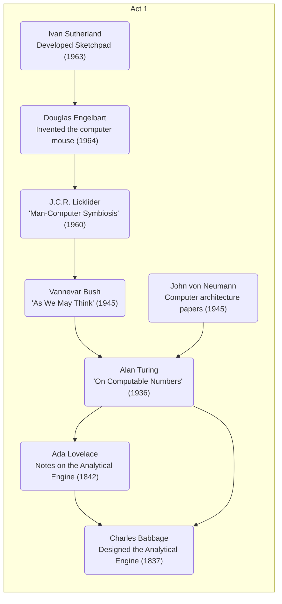
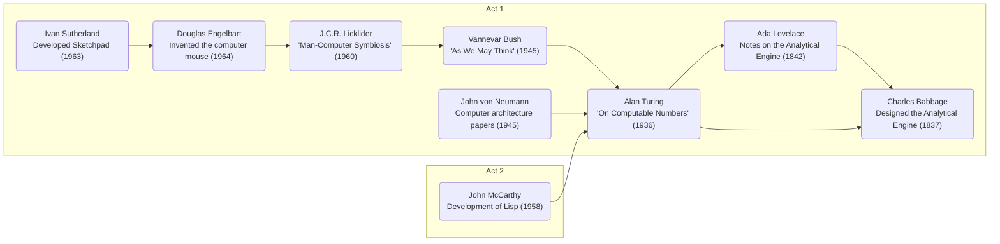
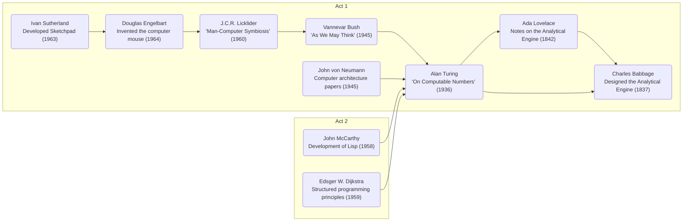
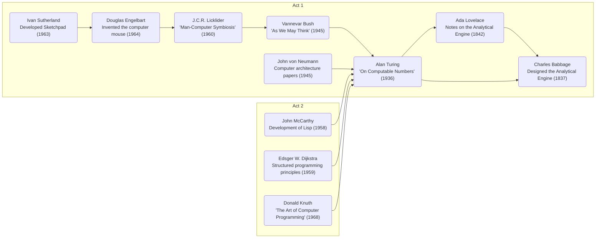
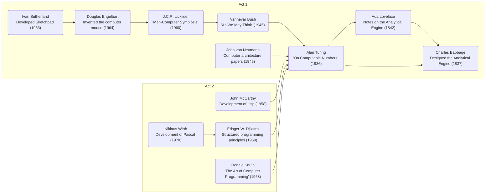
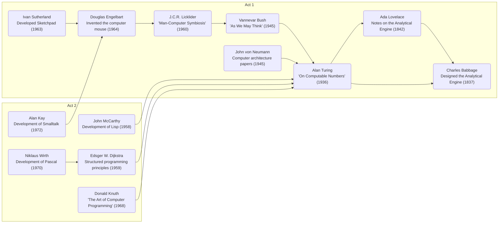
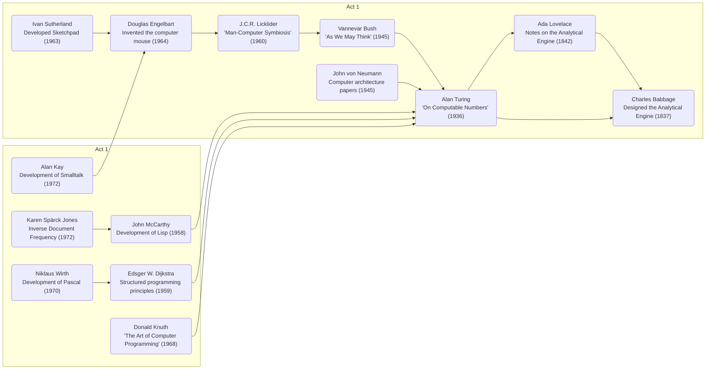

# Act 2: The Theoretical Foundations

Establishing the core principles and theories that underpin modern technology, building upon the visionaries' ideas from Act 1.

---

# John McCarthy

## Coined Artificial Intelligence

## Lisp

---

# Edsger W. Dijkstra

## Finding the Shortest Path

## Intro of Structured and Distributed Programming

---

# Donald Knuth

## The Art of Computer Programming

---

# Niklaus Wirth

## A Learner's Language, Pascal

---

# Alan Kay

## Usability and efficiency with Smalltalk, OOP, GUI

---

---

# Karen Spärck Jones

## Information retrieval with IDF

---

