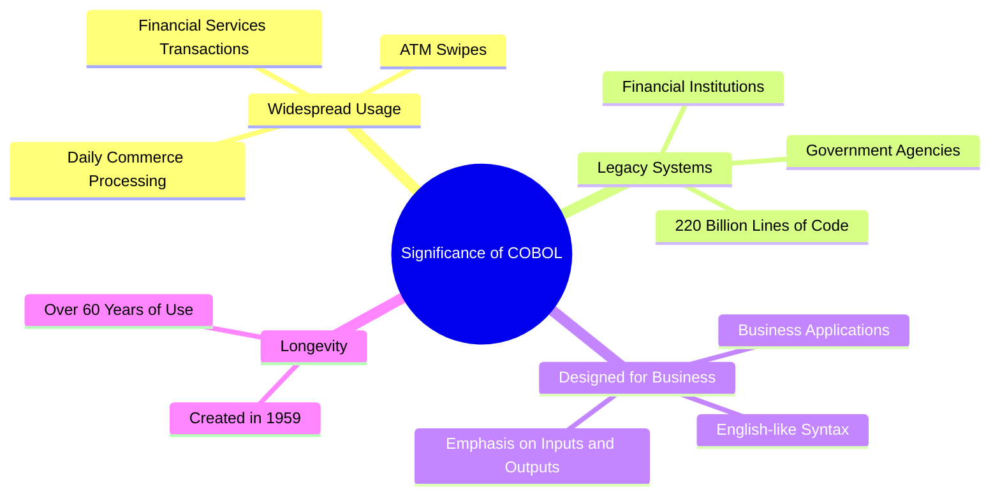
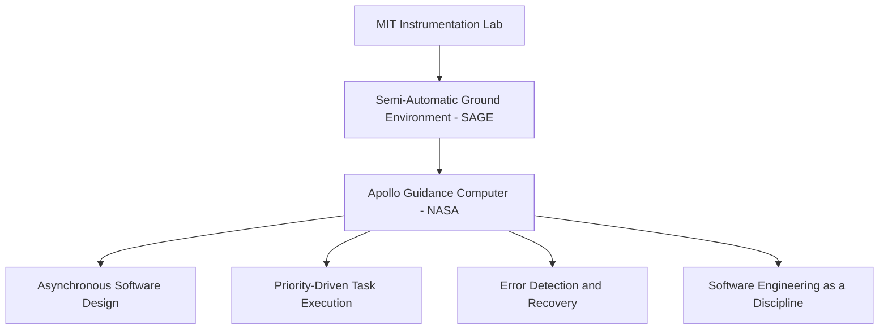
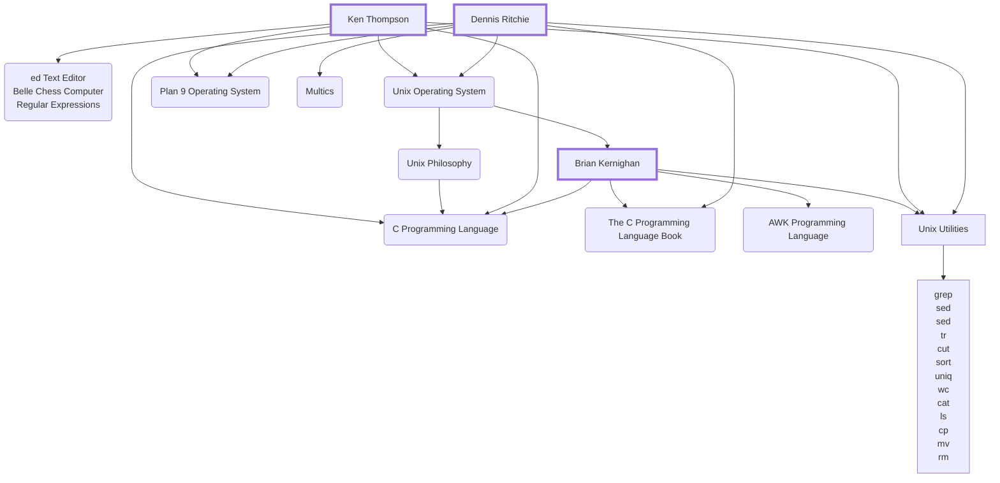
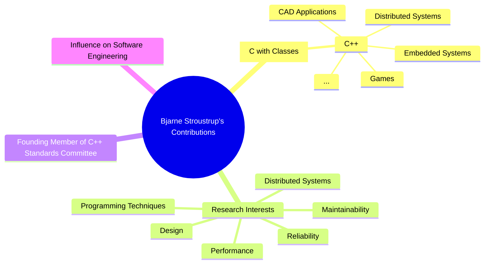
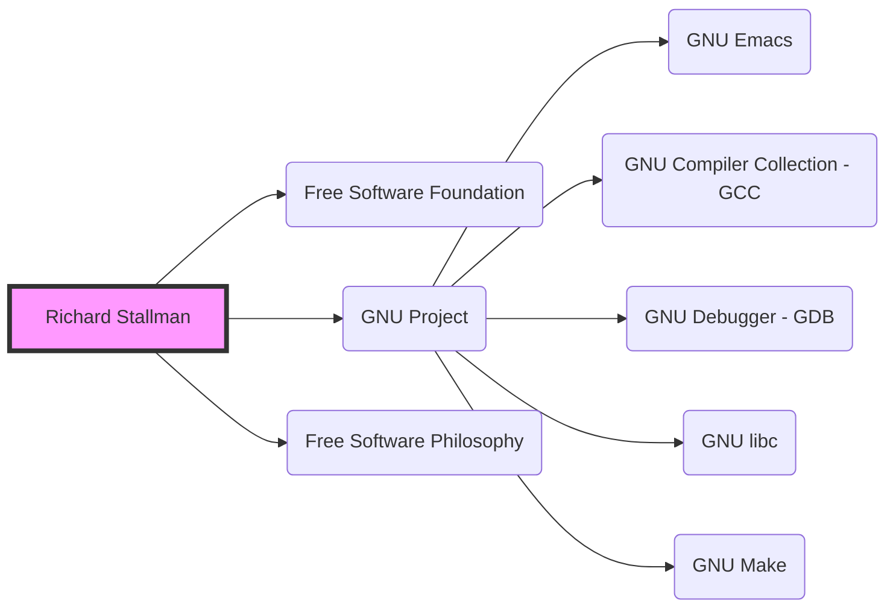
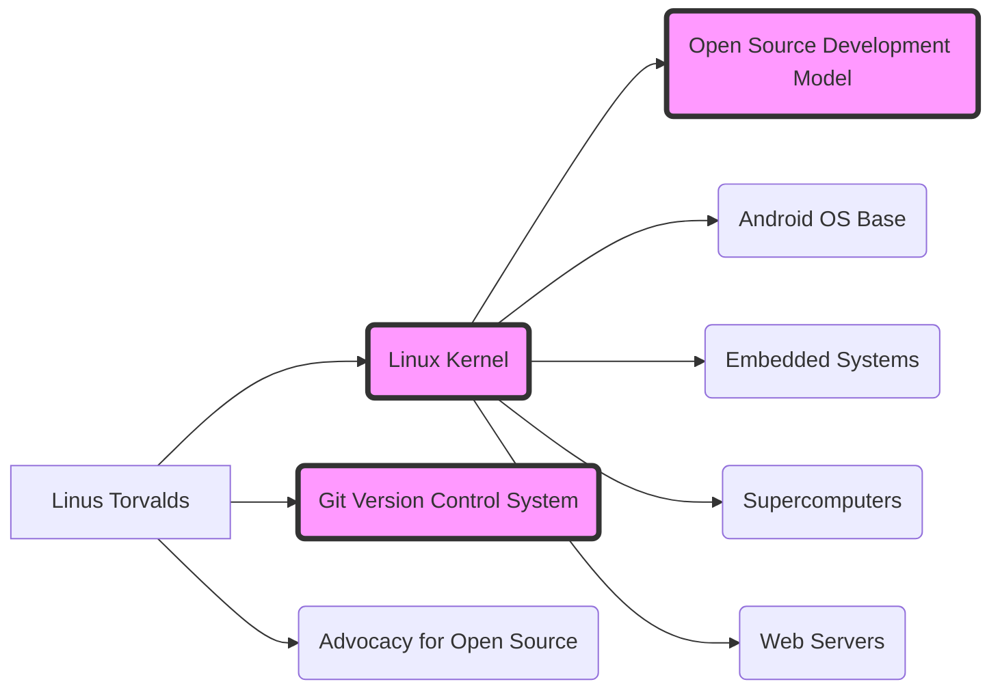

# Pioneers of Practice

<!--
- Now let's take a look at some of the people who have made significant contributions in their field
  by putting their and others ideas into practice and building things that have had a lasting impact
  on us.
- Speaking of having more women in tech...
-->

---
layout: image-left
image: /assets/people/grace-hopper.jpg
---

# Grace Hopper

> AKA "Amazing Grace" AKA "Grandma COBOL"

<!--
- I'm sure you are already familiar with her.
- Let's learn a bit about her.
-->

---

She was:

<v-click>

<v-drag pos="23,124,315,_">
A Computer Scientist

</v-drag>

</v-click>

<v-click>
<v-drag pos="367,74,201,_">
A United States Navy Rear Admiral

</v-drag>
</v-click>

<v-click>
<v-drag pos="595,39,295,_">
A Pioneer of Programming

</v-drag>
</v-click>

<v-click>
<v-drag pos="78,455,315,_">
And she retired twice...
</v-drag>
</v-click>

<v-click>
<v-drag pos="606,261,280,_">
Effortlessly Funny!

</v-drag>
</v-click>

<!--
- She was a computer scientist who worked on the Harvard Mark I computer and invented the first
  compiler for a programming language.
- She was a United States Navy Rear Admiral and because when her great grandfather was a rear
  admiral, she wanted to be one too.
- She was a pioneer of programming languages. She created COBOL, and the first compiler for a
  programming language. She strongly believed in being able to write programs in English.
- She was called back to duty twice after retiring from the Navy.
-->

---

> Letterman: What interested you to go into the navy?
>
> Hopper: Well, World War 2 to begin with...

<v-drag pos="550,284,327,_">
    
</v-drag>


> Letterman: How did you know so much about the computers back then?
>
> Hopper: I didn't, it was the first one!


<v-drag pos="112,284,327,_">
    
</v-drag>


> Hopper: When an admiral asks you why it takes damn long to send a message via satellite? You point
>
> out to him that between here and the satellite there are a very large number of nanoseconds.

[Source Video](https://www.youtube.com/watch?v=oE2uls6iIEU)

<!--
- She used to carry some wires with her to explain a nanosecond. And that's what she does on
  Letterman as well. And she says when an admiral asks you why it takes damn long to send a message
  you tell them that between here and the satellite there are a very large number of nanoseconds.
- We really enjoyed watching this video.
-->

---
layout: two-cols
---

# FLOW-MATIC

```
1. OUTPUT 'HELLO, WORLD' TO CONSOLE.
2. STOP.
```

::right::

# COBOL

```
IDENTIFICATION DIVISION.
PROGRAM-ID. HELLO-WORLD.
PROCEDURE DIVISION.
    DISPLAY 'HELLO, WORLD'.
    STOP RUN.
```

<!--
- FLOW-MATIC was the first English-like data processing language.
- COBOL was specifically created for business applications, with an emphasis on inputs and outputs.
- It uses English-like syntax to make it more readable and self-documenting.
- Created in 1959, COBOL has been in use for over 60 years.
- It has adapted to changing business needs and technological advancements over the decades.
- COBOL was designed to be portable across different computer systems, which was revolutionary at the time.
-->

---
clicks: 1
---

<div v-if="$slidev.nav.clicks === 0">



</div>

<div v-if="$slidev.nav.clicks === 1">

<v-drag pos="297,94,407,_">
An obviously, she found the first bug...

</v-drag>


</div>

<!--
- With COBOL, she also implemented the first compiler.
- She advocated for standardization of programming languages, and machine independence.
- She considers building the first compiler as her greatest achievement, other than teaching young
  people.
-->

---
layout: image-left
image: /assets/people/margaret-hamilton.jpeg
---

# Margaret Hamilton

<!--
- She is among the people who helped humans go to the moon and back, she developed robust error
  detection and prevention systems, **and gave us a job title.**
- She was the lead software engineer for the Apollo space program and she made important
  advancements in software engineering, in fact, she coined the term "software engineering".

-->

---



<v-drag pos="675,47,223,_">

</v-drag>

<!--
- She feared that there might be a problem in the software, the mission fails, and it gets traced
  back to her. She felt heavy responsibility.
- When she first started, they gave her a program which nobody could figure out or run. The person
  who wrote it took delight in writing his comments in Greek and Latin. And she was able to get it
  to work and print out answers in Greek and Latin.

1. Asynchronous Software Design: Hamilton developed software that could operate asynchronously,
   allowing different processes to run independently and in parallel.

2. Priority-Driven Task Execution: Every job in the software was assigned a unique priority,
   allowing the system to manage multiple tasks efficiently.

3. Error Detection and Recovery: Hamilton developed software to detect system errors and recover
   from them in real-time, which was crucial for the Apollo missions.

4. Man-in-the-Loop Interfaces: She created priority-display-interface-routines that allowed the
   software to communicate asynchronously in real-time with the astronauts, enabling human-computer
   interaction within a distributed system environment.

5. Robust Software Architecture: Hamilton's approach ensured that no software bugs were ever
   reported during any crewed Apollo missions, demonstrating the reliability of her software design.

6. Preventative Software Design: After incidents like the "Lauren bug," Hamilton advocated for and
   implemented preventative measures in the software to avoid potential user errors.

7. Systems Theory of Control: Hamilton led an empirical study of Apollo and later efforts, resulting
   in her systems theory of control, which informed her later work.

8. Software Engineering as a Discipline: Hamilton coined the term "software engineering" to
   distinguish it from hardware engineering and to give legitimacy to the field as a distinct
   engineering discipline.

These principles were groundbreaking at the time and laid the foundation for many aspects of modern
software engineering. Hamilton's work on the Apollo project demonstrated the critical importance of
software in complex systems and helped establish many of the practices that are still used in
software development today.

Citations:
[1] https://www.dpma.de/english/our_office/publications/ingeniouswomen/apollosfrauen/margarethamilton/index.html
[2] https://science.nasa.gov/people/margaret-hamilton/
[3] https://www.theguardian.com/technology/2019/jul/13/margaret-hamilton-computer-scientist-interview-software-apollo-missions-1969-moon-landing-nasa-women
[4] https://wehackthemoon.com/bios/margaret-hamilton
[5] https://en.wikipedia.org/wiki/Margaret_Hamilton_%28software_engineer%29
-->

---

# Dennis Ritchie, Ken Thomson, and Brian Kernighan

<v-drag pos="452,136,272,_">

</v-drag>

<v-drag pos="150,153,316,_">

</v-drag>

<!--
- Ken Thomson had an ability to think through a problem and write code that just works. They once
  received a computer while they were at bell labs. But the software on it was horrible. Brian
  Kernighan left for dinner, and by the time he came back Ken Thomson has written a disassembler
  for the device to see the assembly code so he can fix things.
  https://www.youtube.com/watch?v=fL2QwyxcJ5s
-->

---



<!--
Dennis Ritchie, Ken Thompson, and Brian Kernighan collectively made monumental contributions to the
field of computer science, particularly through their work at Bell Laboratories. Here are the key
details of their contributions:

### Dennis Ritchie

1. **C Programming Language**:
   - Ritchie created the C programming language, which has become one of the most widely used
     programming languages in the world. It has influenced many other languages, including C++, C#,
     and JavaScript.
   
2. **Unix Operating System**:
   - Alongside Ken Thompson, Ritchie co-created the Unix operating system. Unix has been
     foundational in the development of many modern operating systems, including Linux and BSD.

3. **B Programming Language**:
   - Ritchie also contributed to the development of the B programming language, which was a
     precursor to C.

4. **Plan 9 and Inferno Operating Systems**:
   - Ritchie was involved in the development of the Plan 9 and Inferno operating systems, which
     aimed to improve upon Unix.

### Ken Thompson

1. **Unix Operating System**:
   - Thompson was the primary architect of the Unix operating system. His work laid the groundwork
     for many features that are standard in modern operating systems.

2. **B Programming Language**:
   - Thompson created the B programming language, which was later developed into C by Ritchie.

3. **Regular Expressions**:
   - Thompson introduced regular expressions into text processing tools, which have become a
     fundamental aspect of many programming languages and tools.

4. **Plan 9 Operating System**:
   - Thompson also worked on the Plan 9 operating system, which sought to extend and improve Unix
     concepts.

### Brian Kernighan

1. **Unix Operating System**:
   - Kernighan contributed to the development of Unix, particularly in the areas of documentation
     and utilities.

2. **C Programming Language**:
   - Kernighan co-authored "The C Programming Language" book with Dennis Ritchie, which is
     considered the definitive guide to C and has been instrumental in teaching the language to
     generations of programmers.

3. **AWK Programming Language**:
   - Kernighan co-created the AWK programming language, a powerful text-processing language used in
     Unix and Unix-like systems.

4. **Software Tools**:
   - Kernighan co-authored the book "Software Tools," which introduced many programmers to the
     principles of software engineering and Unix programming.

### Collective Contributions

1. **Unix Philosophy**:
   - The trio's work on Unix introduced the Unix philosophy, which emphasizes simplicity,
     modularity, and reusability in software design.

2. **Influence on Modern Computing**:
   - Their collective work has had a profound impact on modern computing. Unix and C are
     foundational technologies that underpin much of today's software infrastructure, including
     operating systems, development tools, and programming languages.

3. **Educational Impact**:
   - Their books and papers have educated countless programmers and computer scientists, spreading
     their innovative ideas and practices throughout the industry.

Citations:
[1] https://techjourney.it-jobs.de/en/it-heroes/dennis-ritchie/
[2] https://en.wikipedia.org/wiki/Dennis_Ritchie
[3] https://proftomcrick.com/2011/11/27/dennis-m-ritchie-1941-2011/
[4] https://www.cringely.com/2011/10/18/remembering-dennis-ritchie/
[5] https://www.cemetech.net/forum/viewtopic.php?start=0&t=6891
-->

---
layout: image-left
image: /assets/people/bjarne-stroustrup.webp
---

# Bjarne Stroustrup

<!--
- And the person we have to thank for C++ and the existence of this conference!
-->

---



<!--
- He had influences on software design with his papers on programming and C++.
-->

---
layout: image-left
image: /assets/people/richard-stallman.jpg
---

# Richard Stallman

<!--
- He started the GNU project and the Free Software Foundation. He probably popularized open source
  contributions and the idea of free software.
-->

---
clicks: 1
---



<div v-if="$slidev.nav.clicks === 1">
<v-drag pos="697,108,272,_">

</v-drag>
</div>

<!--
- He is not the only person who contributed to these, but he is the person who started the free
  software foundation which later received many contributions from others.
-->

---
layout: image-left
image: /assets/people/linus-torvalds.jpg
---

# Linus Torvalds

<!--
- Let's talk about the person whose work essentially powers most of the things we use today from
  smartphones, supercomputers, smartwatches, embedded systems and probably things I don't even know
  exists...
-->

---



<!--
- Rare surname: There are only about 30 people in the world with the surname Torvalds, and they're
  all relatives. His grandfather changed the spelling from Torvald to Torvalds.
- Family life: His wife is a six-time Finnish national karate champion.
-->

---
layout: quote
---

> In my quest for a better patch, this made sense to me.
> I know now this was not OK and I am truly sorry. - Linus Torvalds

[Source](https://lore.kernel.org/lkml/CA+55aFy+Hv9O5citAawS+mVZO+ywCKd9NQ2wxUmGsz9ZJzqgJQ@mail.gmail.com/)

<!--
- We also know him for his flippant attitude and crude comments. But, that doesn't seem to be the
  case any more. His attitude in recent videos are much calmer.
- In order for us to make better use of all these that they created, we need a better infrastructure.
-->
