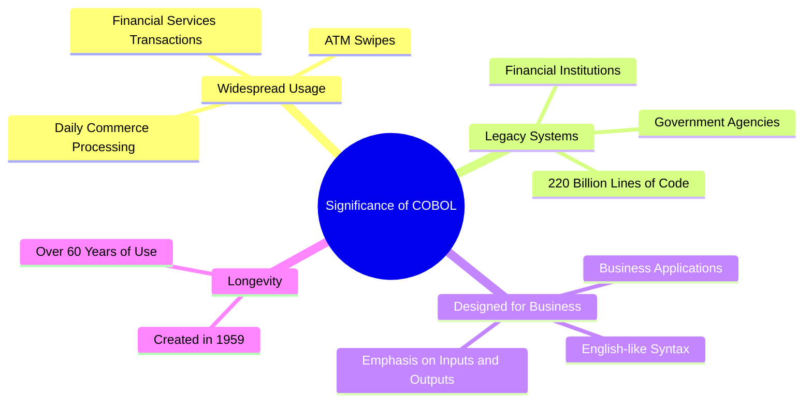

# Pioneers of Practice

---
layout: image-left
image: /assets/people/grace-hopper.jpg
---

# Grace Hopper

> AKA "Amazing Grace" AKA "Grandma COBOL"

<!--
- Grace Hopper was a computer scientist and United States Navy rear admiral. She was one of the
  first programmers of the Harvard Mark I computer in 1944 and invented the first compiler for a
  computer programming language. She popularized the idea of machine-independent programming
  languages, which led to the development of COBOL, an early high-level programming language still
  in use today.
-->

---

She was:

<v-click>

<v-drag pos="23,124,315,_">
A Computer Scientist

</v-drag>

</v-click>

<v-click>
<v-drag pos="367,74,201,_">
A United States Navy Rear Admiral

</v-drag>
</v-click>

<v-click>
<v-drag pos="595,39,295,_">
A Pioneer of Programming

</v-drag>
</v-click>

<v-click>
<v-drag pos="606,261,280,_">
Effortlessly Funny!

</v-drag>
</v-click>

<v-click>
<v-drag pos="78,455,315,_">
And she retired twice...
</v-drag>
</v-click>

<!--
- She was called back to duty twice after retiring from the Navy.
-->

---

> Letterman: What interested you to go into the navy?
>
> Hopper: Well, World War 2 to begin with...

<v-drag pos="550,284,327,_">
    
</v-drag>


> Letterman: How did you know so much about the computers back then?
>
> Hopper: I didn't, it was the first one!


<v-drag pos="112,284,327,_">
    
</v-drag>


> Hopper: When an admiral asks you why it takes damn long to send a message via satellite? You point
>
> out to him that between here and the satellite there are a very large number of nanoseconds.

[Source Video](https://www.youtube.com/watch?v=oE2uls6iIEU)

<!--
- She was a professor of mathematics at Vassar College. You can see from the Letterman video that
  she was great at explaining complex ideas in a simple way.
-->

---
layout: two-cols
---

# FLOW-MATIC

```
1. OUTPUT 'HELLO, WORLD' TO CONSOLE.
2. STOP.
```

::right::

# COBOL

```
IDENTIFICATION DIVISION.
PROGRAM-ID. HELLO-WORLD.
PROCEDURE DIVISION.
    DISPLAY 'HELLO, WORLD'.
    STOP RUN.
```

<!--
- FLOW-MATIC was the first English-like data processing language.
- COBOL was specifically created for business applications, with an emphasis on inputs and outputs.
- It uses English-like syntax to make it more readable and self-documenting.
- Created in 1959, COBOL has been in use for over 60 years.
- It has adapted to changing business needs and technological advancements over the decades.
- COBOL was designed to be portable across different computer systems, which was revolutionary at the time.
-->

---
clicks: 2
---

<div v-if="$slidev.nav.clicks === 0">



</div>

<div v-if="$slidev.nav.clicks === 1">

<v-drag pos="297,94,407,_">
An obviously, she found the first bug...

</v-drag>


</div>

<!--
- With COBOL, she also implemented the first compiler.
- She advocated for standardization of programming languages, and machine independence.
- She considers building the first compiler as her greatest achievement, other than teaching young
  people.
-->

---
layout: image-left
image: /assets/people/margaret-hamilton.jpeg
---

# Margaret Hamilton

<!--

- She was the lead software engineer for the Apollo space program and she made important
  advancements in software engineering, in fact, she coined the term "software engineering".

-->
