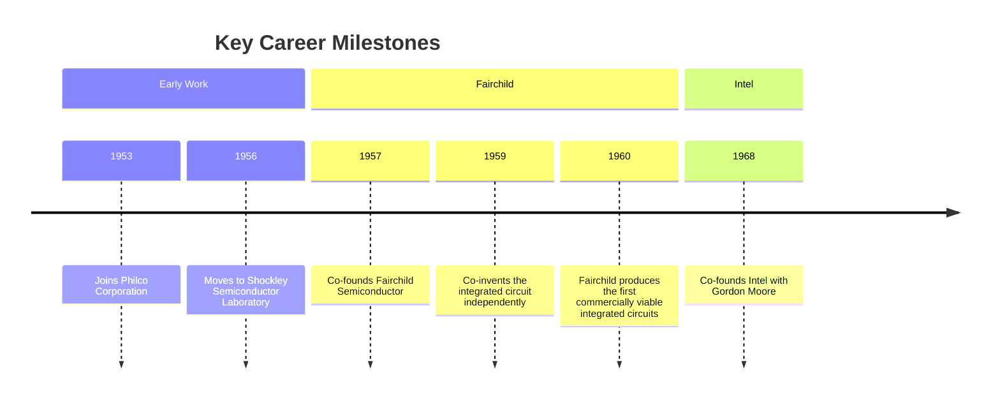
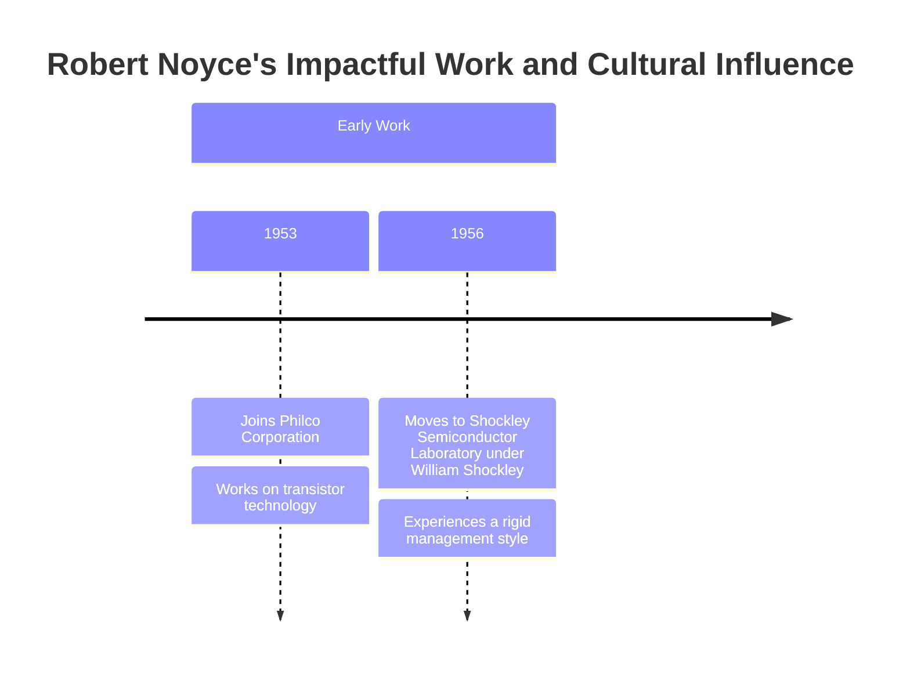
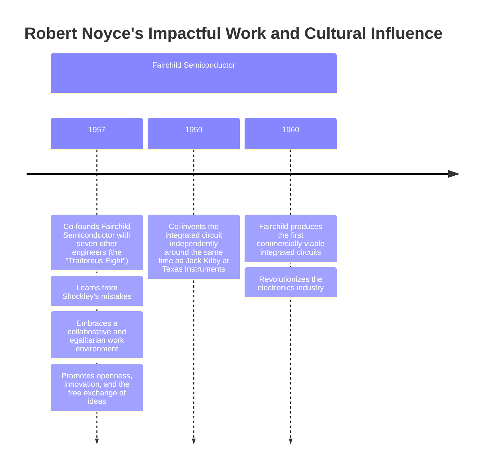
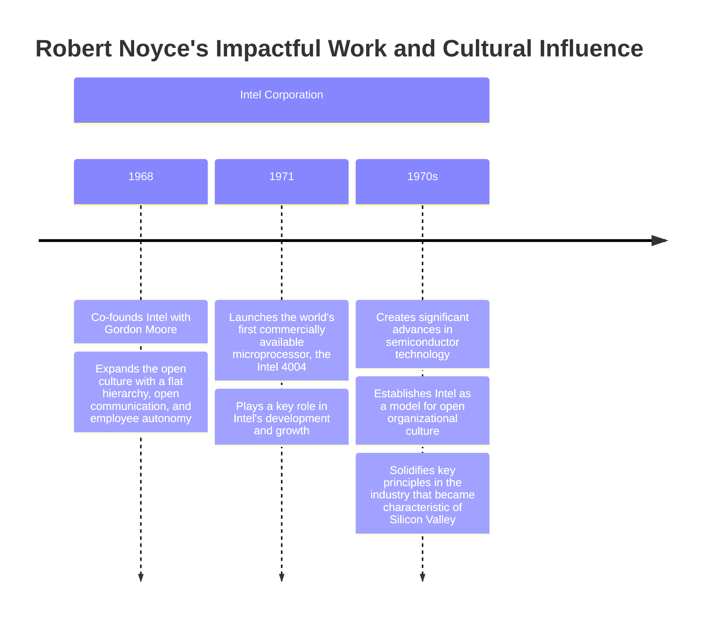
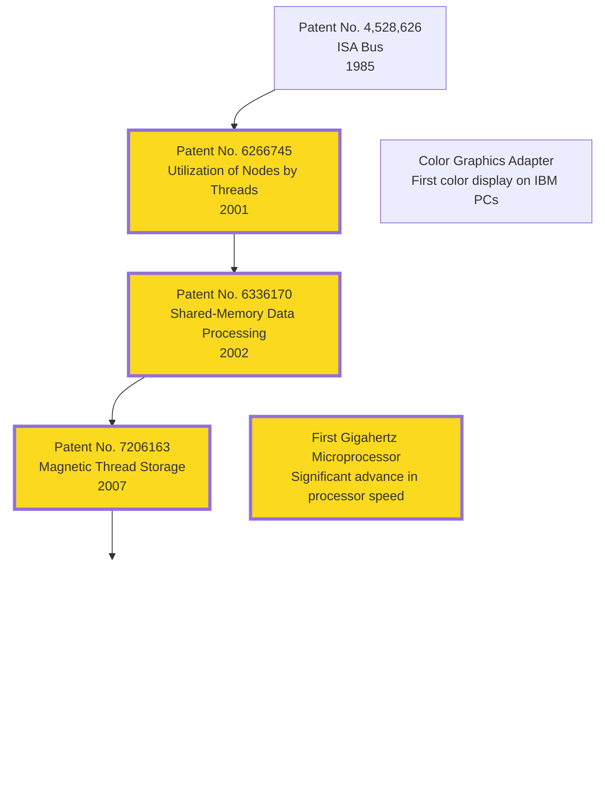
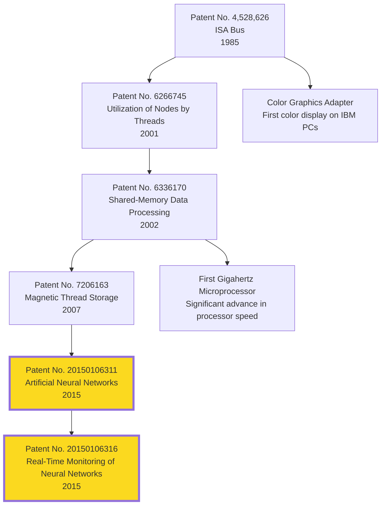
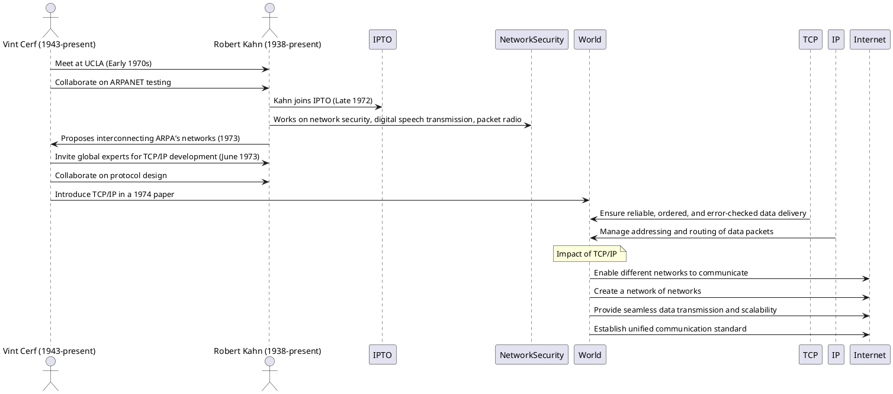
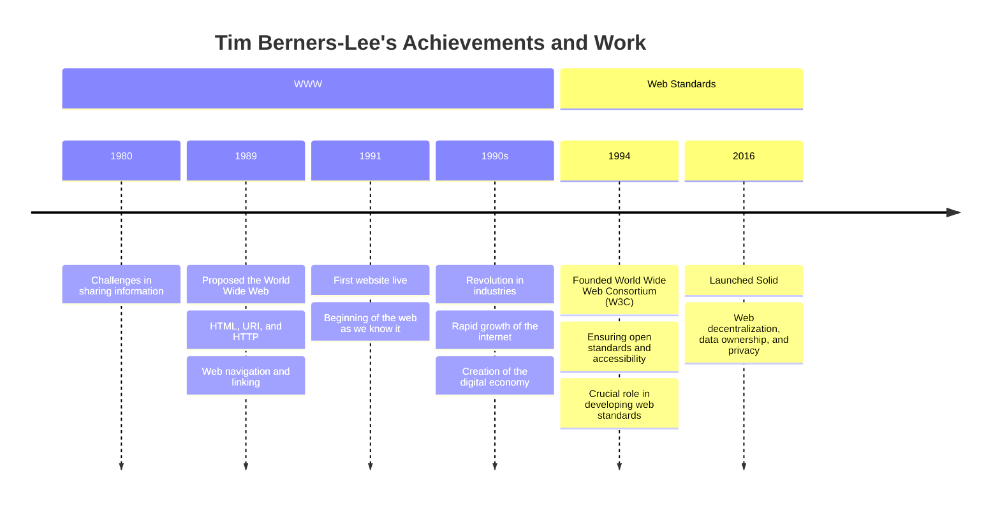

# Building the Infrastructure

Developing the infrastructure that supports modern computing and connectivity, transforming theoretical advancements into practical systems.

---

## Robert Noyce

**"Mayor of Silicon Valley"**

---
layout: center
---

# Noyce's Early Work

---

# Fairchild and the First Integrated Circuit

---

# Intel and the Future

---

## Mark Dean

**Co-creator of the IBM personal computer (1981)**

## Key Contributions

- **Pioneering Innovations**: Co-inventor of the ISA Bus, foundational to the personal computer.
- **Multiple Patents**: Holds 44 U.S. patents, reflecting a prolific and impactful career.
- **Diverse Contributions**: From computer architecture to artificial intelligence, his work spans multiple critical areas in technology.
- **Educational Impact**: Professor Emeritus at the University of Tennessee, shaping the next generation of engineers.

---

# Co-invention of the ISA Bus

<!-- 
In 1985, Mark Dean co-invented the ISA Bus, with Patent No. 4,528,626. This innovation was groundbreaking because it allowed different peripherals like keyboards, disk drives, and printers to connect seamlessly to computers. This development made it possible for PCs to become more modular and user-friendly, facilitating the widespread adoption of personal computers.

Beyond these patents, Dean played a crucial role in developing the Color Graphics Adapter, which brought color displays to IBM PCs. The relationship between the ISA bus and the CGA is pivotal: the ISA bus provided the necessary infrastructure that allowed peripheral devices, like the CGA, to connect and function effectively. This synergy exemplified how Dean's innovations worked together to enhance the IBM PC’s capabilities.
 -->

---

# Efficiency of Distribution Computing Systems

<!-- 
Dean didn't stop there. In 2001, he received Patent No. 6266745 for a method that improved the efficiency of distributed computing systems by determining the utilization of nodes by executed threads. This innovation enhanced the performance of complex computing tasks across multiple processors, which is critical for modern data centers and cloud computing.

The following year, in 2002, he was granted Patent No. 6336170, which focused on determining the utilization of shared memory within distributed processing systems. This work further contributed to making distributed computing more efficient and reliable.

This led to another monumental achievement was his work on the first gigahertz microprocessor, which marked a significant leap in processing speed. This innovation paved the way for faster and more powerful computers, influencing everything from personal computing to enterprise servers.

This in turn influenced his work on the first gigahertz microprocessor, which marked a significant leap in processing speed. This innovation paved the way for faster and more powerful computers, influencing everything from personal computing to enterprise servers.

In 2007, his innovative approach to data storage led to Patent No. 7206163 for a magnetic thread storage device. This invention improved data handling capabilities, making storage systems more efficient and robust.
 -->

---

<!-- 
Mark Dean’s contributions to artificial intelligence are also noteworthy. In 2015, he was awarded two patents related to neural networks. Patent No. 20150106311 focused on constructing and reusing components of artificial neural networks, while Patent No. 20150106316 provided methods for real-time monitoring of these networks. These patents are significant in advancing the field of AI, enabling more efficient and adaptive neural network models.
 -->

---

## Impact on Computing

- **Widespread Influence**: Innovations have shaped modern computing, making technology more accessible and powerful.
- **Educational Contributions**: Mentored and taught the next generation of engineers, ensuring the continuation of technological advancement.
- **Recognition**: His work has been acknowledged with numerous awards and honors, cementing his legacy in the field of computer science.

---
layout: image-left
image: /assets/people/cerf-kahn.jpg
---

## Vint Cerf & Robert Kahn

** Fathers of the Internet**

- Co-design of the TCP/IP protocols (1973)
- Enabled different networks to communicate, creating the "internet"
- Simplified data transmission and scalability

<!-- 
- 'fathers of the Internet.' 
- Their development of the Transmission Control Protocol (TCP) and the Internet Protocol (IP) was pivotal in creating a global communication network that we now know as the Internet.

- The TCP/IP protocols are essential b/c they ensure that data is reliably transmitted across networks. 
- TCP manages the breakdown and reassembly of data packets, 
- while IP handles the addressing and routing of these packets to their correct destinations"

- This enabled different networks to interconnect, creating a 'network of networks.' 
- Provided the scalability and flexibility needed for the rapid expansion of the Internet.

- Note: Cerf was inspired by Robert Noyce’s innovations and culture of innovation, went on to co-design TCP/IP protocols with Rohbert Kahn
 -->

---

<!-- 
- In the early 1970s, the concept of interconnected computer networks was in its infancy
- Cerf and Kahn met in the early 1970s
  - Kahn, who was working on ARPANET, envisioned an open-architecture network
  - He collaborated with Cerf, who was an expert in networking protocols, to bring this vision to life.
- Challenge: The existing networks were heterogeneous and could not easily communicate with one another
  - There was a need for interconnectivity between diverse computer systems
- To address these challenges, Cerf and Kahn developed TCP/IP
  - Enabled different networks to communicate effectively
  - Provided the scalability and flexibility necessary for the Internet’s growth
 -->

---

# Why TCP/IP Alone Wasn't Enough

- TCP/IP Fundamentals
  - Reliable data transfer and addressing
- Missing Elements
  - User-friendly access
  - Information organization
  - Interoperability

<v-click>
    <v-drag pos="700,250,261,_,12">
        
    </v-drag>
</v-click>

<!-- 

1. User-friendly access
   - Early Internet users faced the challenge of using CLIs
   - Graphical web browsers played a critical role in making the Internet accessible to a broader audience
2. Information Organization
   - The concept of hypertext, which allows linking between different pieces of information, became essential. 
   - HTML provided a way to structure content
   - URLs made it possible to locate and access specific resources on the web  
3. Interoperability
   - Different systems and technologies could not work together seamlessly
 -  A cohesive and unified Internet experience 
 -->
---
layout: image-right
image: /assets/people/berners-lee.webp
---

## Tim Berners-Lee

**Inventor the World Wide Web (1989)**

<!-- 
"With the Internet's infrastructure in place, Tim Berners-Lee envisioned a universal information space. In 1989, he invented the World Wide Web, which leveraged the existing network protocols to create a system for accessing and linking documents globally."
 -->
---

<v-click>
    <v-drag pos="735,152,225,_">
    
    </v-drag>
</v-click>

<!--
- The Problem at CERN
  - Challenges in sharing information among scientists
  - Different computers and software systems
  - Need for a universal system to share information
1. Created browser-editor rather (WorldWideWeb)
2. HTML, HTTP, and URLs, 
 - The concept of hypertext, which allows linking between different pieces of information, became essential. 
 - HTML provided a way to structure content
 - URLs made it possible to locate and access specific resources on the web  
3. W3C
  - Different systems and technologies could not work together seamlessly
  -  A cohesive and unified Internet experience
-->

---

# Global Impact

- Revolutionized communication, business, education, entertainment
- Rapid growth of the internet
- Creation of the digital economy

<v-drag>
    
</v-drag>

---

# Current and Future Work

- Advocates for a free and open web
- Current project: Solid (Social Linked Web) - decentralizing the web
- Vision for a universal and open platform

<v-drag pos="146,295,192,710">
    
</v-drag>

<v-click>
    <v-drag pos="399,238,495,541">
        
    </v-drag>
</v-click>

<!--
- The Problem
  - Centralized platforms control user data
  - Privacy concerns and data misuse
  - Limited interoperability between services

- Proposed solution
  - Aims to reshape the way web applications work by giving users more control over their personal data. 
  - Instead of storing data in centralized servers owned by companies, Solid allows users to store their data in personal online data stores (Pods) that they control. 
  - This means users can decide who accesses their data and for what purposes.

- Solid's Vision: Decentralization, interoperability, user empowerment. Open Source.
-->
