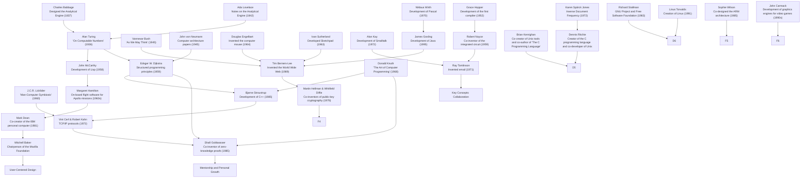

# Act 4

## Page 1 - Quinn

```mermaid
graph TD
    %% Act 1: The Spark of Innovation
    A1["Charles Babbage<br>Designed the Analytical Engine (1837)"]
    A2["Ada Lovelace<br>Notes on the Analytical Engine (1842)"]
    A3["Alan Turing<br>'On Computable Numbers' (1936)"]
    A4["Vannevar Bush<br>'As We May Think' (1945)"]
    A5["John von Neumann<br>Computer architecture papers (1945)"]
    A6["J.C.R. Licklider<br>'Man-Computer Symbiosis' (1960)"]
    A7["Douglas Engelbart<br>Invented the computer mouse (1964)"]
    A8["Ivan Sutherland<br>Developed Sketchpad (1963)"]

    A1 --> A3
    A2 --> A3
    A3 --> B1
    A3 --> B2
    A4 --> D4
    A5 --> B2
    A6 --> D3
    A7 --> D4
    A8 --> D4

    %% Act 2: The Theoretical Foundations
    B1["John McCarthy<br>Development of Lisp (1958)"]
    B2["Edsger W. Dijkstra<br>Structured programming principles (1959)"]
    B3["Donald Knuth<br>'The Art of Computer Programming' (1968)"]
    B4["Niklaus Wirth<br>Development of Pascal (1970)"]
    B5["Alan Kay<br>Development of Smalltalk (1972)"]
    B6["Karen Spärck Jones<br>Inverse Document Frequency (1972)"]

    B1 --> C2
    B2 --> C3
    B2 --> E3
    B3 --> C3
    B3 --> E3
    B4 --> C4
    B5 --> E1
    B6 --> C5

    %% Act 3: The Pioneers of Practice
    C1["Grace Hopper<br>Development of the first compiler (1952)"]
    C2["Margaret Hamilton<br>On-board flight software for Apollo missions (1960s)"]
    C3["Bjarne Stroustrup<br>Development of C++ (1985)"]
    C4["James Gosling<br>Development of Java (1995)"]
    C5["Dennis Ritchie<br>Creator of the C programming language and co-developer of Unix"]
    C6["Brian Kernighan<br>Co-creator of Unix tools and co-author of 'The C Programming Language'"]
    C7["Richard Stallman<br>GNU Project and Free Software Foundation (1983)"]
    C8["Linus Torvalds<br>Creation of Linux (1991)"]

    C1 --> D1
    C2 --> D2
    C3 --> D3
    C4 --> D4
    C5 --> D5
    C6 --> D5
    C7 --> D6
    C8 --> D6

    %% Act 4: Building the Infrastructure
    D1["Robert Noyce<br>Co-inventor of the integrated circuit (1959)"]
    D2["Mark Dean<br>Co-creator of the IBM personal computer (1981)"]
    D3["Vint Cerf & Robert Kahn<br>TCP/IP protocols (1973)"]
    D4["Tim Berners-Lee<br>Invented the World Wide Web (1989)"]

    D1 --> E1
    D2 --> E2
    D3 --> E3
    D4 --> E4

    %% Act 5: The Impact on Society
    E1["Ray Tomlinson<br>Invented email (1971)"]
    E2["Mitchell Baker<br>Chairperson of the Mozilla Foundation"]
    E3["Shafi Goldwasser<br>Co-inventor of zero-knowledge proofs (1985)"]
    E4["Martin Hellman & Whitfield Diffie<br>Co-inventors of public-key cryptography (1976)"]
    E5["Sophie Wilson<br>Co-designed the ARM architecture (1985)"]
    E6["John Carmack<br>Development of graphics engines for video games (1990s)"]

    E1 --> F1
    E2 --> F2
    E3 --> F3
    E4 --> F4
    E5 --> F5
    E6 --> F6

    %% Act 6: Beyond Machines and Code
    F1["Key Concepts: Collaboration"]
    F2["User-Centered Design"]
    F3["Mentorship and Personal Growth"]
```

---

## Page 2 - Quinn

Here's my part

---

## Page 3 - Quinn

Here's my part
