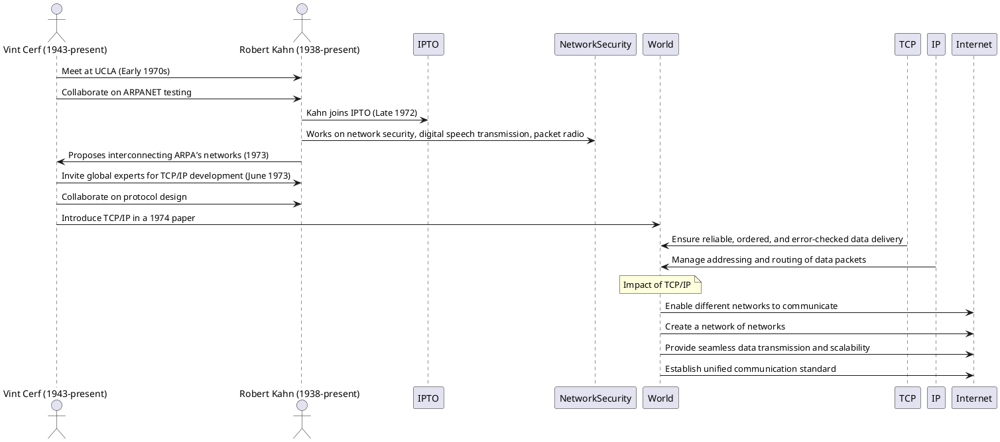

# Act 4: Building the Infrastructure
Developing the infrastructure that supports modern computing and connectivity, transforming theoretical advancements into practical systems.

---

## Robert Noyce (1927-1990)
**"Mayor of Silicon Valley"**

- **Integrated Circuit:**
  - Revolutionized electronics with smaller, more powerful, and reliable devices
  - Paved the way for modern computers, smartphones, and other electronic devices

- **Silicon Valley Work Culture:**
  - Introduced a casual, innovative work atmosphere at Fairchild and Intel
  - Fostered autonomy and responsibility, learning from Shockley’s mistakes

---

## Impact and Influence

- **Growth of the Semiconductor Industry:**
  - Enabled exponential growth of computing power
  - Transformed everyday technology and supported modern software applications

---

## Mark Dean (1957-present)
**Co-creator of the IBM personal computer (1981)**

---

## Key Contributions

- **ISA Bus:**
  - Allowed different computer parts to connect and communicate
  - Enabled easier component upgrades and interoperability

- **Color Monitor:**
  - Instrumental in developing the first color computer monitor
  - Made computers more user-friendly and visually appealing

- **Microprocessor Upgrades:**
  - Improved microprocessors for faster, more efficient computers
  - Enhanced performance for complex programs

---

## Impact and Influence

- **IBM PC Standard:**
  - Set the standard for personal computers
  - Fostered a competitive market for hardware and software

- **Influence:**
  - Influenced design of subsequent generations of PCs and peripherals

---

## Vint Cerf (1943-present) & Robert Kahn (1938-present)

**Co-design of the TCP/IP protocols (1973)**

---

# Vint Cerf & Robert Kahn: Development of TCP/IP

---

## Key Contributions

- **TCP/IP Protocols:**
  - Foundation of the Internet’s architecture
  - Ensured reliable, ordered, and error-checked data delivery (TCP)
  - Managed addressing and routing of data packets (IP)

- **Network Compatibility:**
  - Enabled different networks to communicate, creating the "internet"
  - Simplified data transmission and scalability

---

## Impact and Influence

- **Modern Internet:**
  - Laid the groundwork for global communication and information sharing
  - Influenced network design and cybersecurity

- **Influence:**
  - Cerf was inspired by Robert Noyce’s innovations and culture of innovation

---

## Tim Berners-Lee (1955-present)

**Inventor the World Wide Web (1989)**

## Key Contributions

- **World Wide Web:**
  - Developed HTML, HTTP, and URLs
  - Created the foundation for accessing and sharing information globally

- **Web Technologies:**
  - Transformed communication, commerce, education, and entertainment
  - Enabled countless web-based applications and services

---

## Impact and Influence

- **Global Platform:**
  - Made the internet accessible to the general public
  - Drove the growth of the digital economy and social interaction

- **Influence:**
  - Inspired by Vannevar Bush’s vision of hypertext and Douglas Engelbart’s work on interactive computing

---