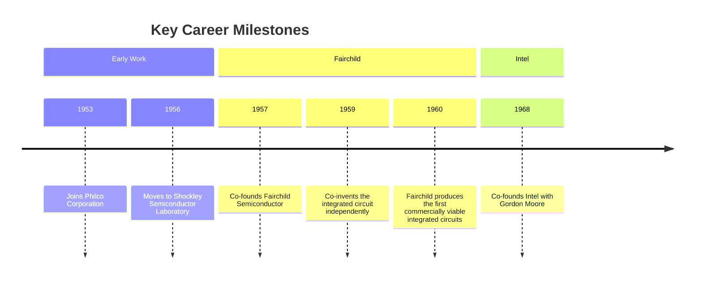
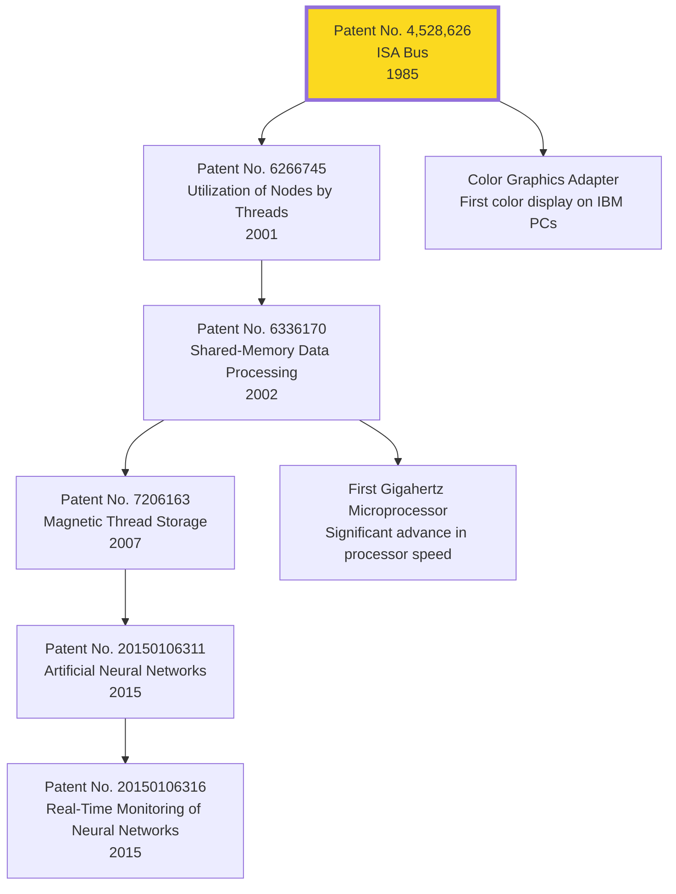
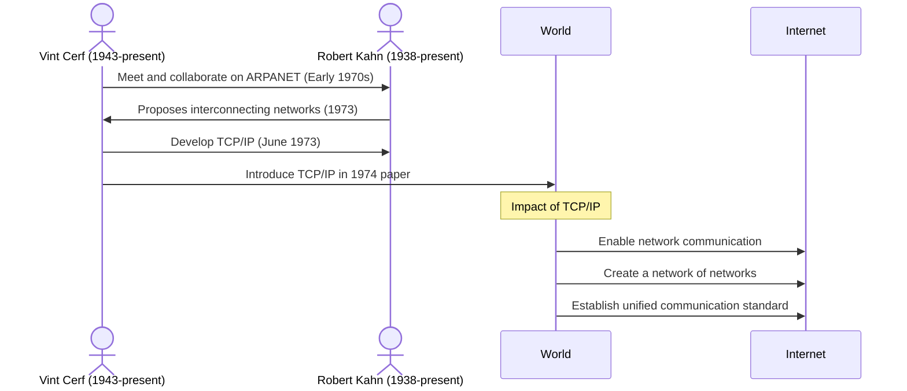
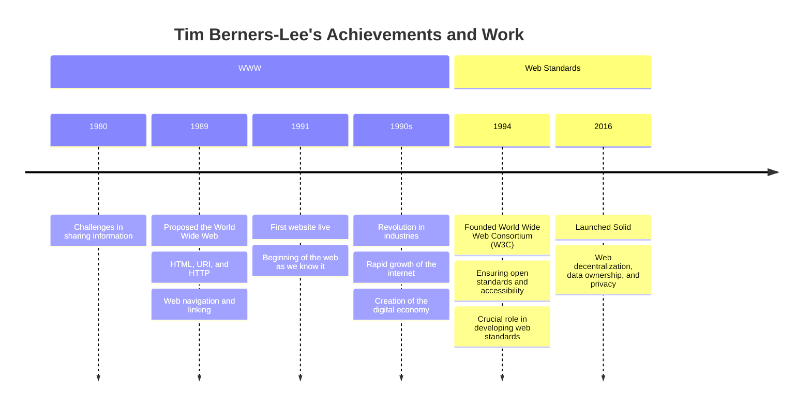

# Building the Infrastructure

<!-- Developing the infrastructure that supports modern computing and connectivity, transforming theoretical advancements into practical systems. -->
---
layout: image-left
image: /assets/people/noyce.png
---

## Robert Noyce

**"Mayor of Silicon Valley"**

---

---
layout: image-right
image: /assets/people/mark-dean.webp
---

## Mark Dean

**Co-creator of the IBM personal computer (1981)**

---

## Mark Dean

- **Pioneering Innovations**: Co-inventor of the ISA Bus, foundational to the personal computer.
- **Multiple Patents**: Holds 44 U.S. patents, reflecting a prolific and impactful career.
- **Diverse Contributions**: From computer architecture to artificial intelligence, his work spans multiple critical areas in technology.
- **Educational Impact**: Professor Emeritus at the University of Tennessee, shaping the next generation of engineers.

---

# Dean's Key Contributions

<v-drag pos="303,114,395,395">

</v-drag>

<!--
- In 1985, Mark Dean co-invented the ISA Bus, which transformed personal computing by allowing seamless connection of peripherals, making PCs more modular and user-friendly. This innovation was crucial in the widespread adoption of personal computers.
- Dean also developed the Color Graphics Adapter (CGA), which brought color displays to IBM PCs, showcasing the power of integrated innovations.
- In 2001, he improved distributed computing efficiency, optimizing performance across multiple processors, which is key for modern data centers and cloud computing.
- Dean's work on the first gigahertz microprocessor marked a significant leap in processing speed, influencing everything from personal computing to enterprise servers.
- Mark Dean's visionary contributions have significantly advanced personal and distributed computing, shaping the future of technology
-->

---

## Vint Cerf & Robert Kahn

**Fathers of the Internet**

- Co-design of the TCP/IP protocols (1973)
- Enabled different networks to communicate, creating the "internet"
- Simplified data transmission and scalability

<v-drag pos="480,226,500,_">
    
</v-drag>

<!--
- 'fathers of the Internet.' 
- Their development of the Transmission Control Protocol (TCP) and the Internet Protocol (IP) was pivotal in creating a global communication network that we now know as the Internet.

- The TCP/IP protocols are essential b/c they ensure that data is reliably transmitted across networks. 
- TCP manages the breakdown and reassembly of data packets, 
- while IP handles the addressing and routing of these packets to their correct destinations"

- This enabled different networks to interconnect, creating a 'network of networks.' 
- Provided the scalability and flexibility needed for the rapid expansion of the Internet.

- Note: Cerf was inspired by Robert Noyce’s innovations and culture of innovation, went on to co-design TCP/IP protocols with Rohbert Kahn
-->

---

<!-- 
- In the early 1970s, the concept of interconnected computer networks was in its infancy
- Cerf and Kahn met in the early 1970s
  - Kahn, who was working on ARPANET, envisioned an open-architecture network
  - He collaborated with Cerf, who was an expert in networking protocols, to bring this vision to life.
- Challenge: The existing networks were heterogeneous and could not easily communicate with one another
  - There was a need for interconnectivity between diverse computer systems
- To address these challenges, Cerf and Kahn developed TCP/IP
  - Enabled different networks to communicate effectively
  - Provided the scalability and flexibility necessary for the Internet’s growth
 -->

---

# Why TCP/IP Alone Wasn't Enough

- TCP/IP Fundamentals
  - Reliable data transfer and addressing
- Missing Elements
  - User-friendly access
  - Information organization
  - Interoperability

<!-- 

1. User-friendly access
   - Early Internet users faced the challenge of using CLIs
   - Graphical web browsers played a critical role in making the Internet accessible to a broader audience
2. Information Organization
   - The concept of hypertext, which allows linking between different pieces of information, became essential. 
   - HTML provided a way to structure content
   - URLs made it possible to locate and access specific resources on the web  
3. Interoperability
   - Different systems and technologies could not work together seamlessly
 -  A cohesive and unified Internet experience 
 -->

---
layout: image-right
image: /assets/people/berners-lee.webp
---

## Tim Berners-Lee

**Inventor the World Wide Web (1989)**

<!-- 
"With the Internet's infrastructure in place, Tim Berners-Lee envisioned a universal information space. In 1989, he invented the World Wide Web, which leveraged the existing network protocols to create a system for accessing and linking documents globally."
 -->
---

<v-click>
<v-drag pos="735,152,225,_">

</v-drag>
</v-click>

<!--
- The Problem at CERN
  - Challenges in sharing information among scientists
  - Different computers and software systems
  - Need for a universal system to share information
1. Created browser-editor rather (WorldWideWeb)
2. HTML, HTTP, and URLs, 
 - The concept of hypertext, which allows linking between different pieces of information, became essential. 
 - HTML provided a way to structure content
 - URLs made it possible to locate and access specific resources on the web  
3. W3C
  - Different systems and technologies could not work together seamlessly
  -  A cohesive and unified Internet experience
-->

---

# Global Impact

- Revolutionized communication, business, education, entertainment
- Rapid growth of the internet
- Creation of the digital economy

<v-drag>
    
</v-drag>

---

# Current and Future Work

- Advocates for a free and open web
- Current project: Solid (Social Linked Web) - decentralizing the web
- Vision for a universal and open platform

<v-drag pos="45,257,298,253">
    
</v-drag>

<v-click>
    <v-drag pos="399,238,495,541">
        
    </v-drag>
</v-click>

<!--
- The Problem
  - Centralized platforms control user data
  - Privacy concerns and data misuse
  - Limited interoperability between services

- Proposed solution
  - Aims to reshape the way web applications work by giving users more control over their personal data. 
  - Instead of storing data in centralized servers owned by companies, Solid allows users to store their data in personal online data stores (Pods) that they control. 
  - This means users can decide who accesses their data and for what purposes.

- Solid's Vision: Decentralization, interoperability, user empowerment. Open Source.
-->
