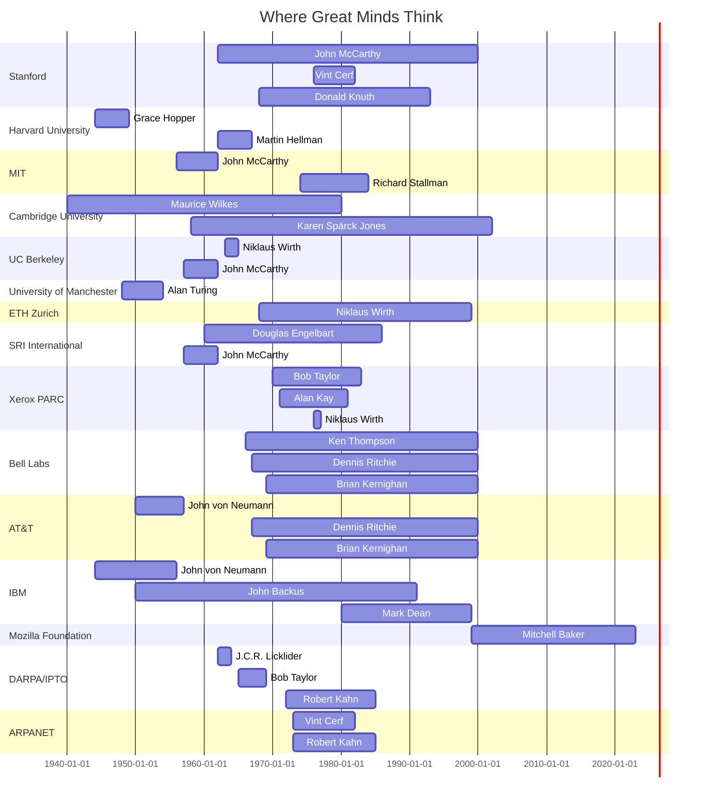

# Beyond Machines and Code

---
layout: iframe
url: https://ouestware.gitlab.io/retina/1.0.0-beta.1/#/graph/?url=https%3A%2F%2Fraw.githubusercontent.com%2FFurkanzmc%2Fcppnorth-2024-shoulders-we-stand-on%2Fmaster%2Fpublic%2Fassets%2Fgraph.gexf&c=a&s=r&sa=r&ca=a
class: my-custom-class
---

---
layout: section
---

- A story of people, not just machines and code

<!--
- We are grateful for the opportunity to be here today, thank you for the organizers of CppNorth for
  creating an environment for all of us to be here to be inspired by one another.
-->

---
layout: section
---

# Thank You!

- Slides at https://github.com/Furkanzmc/cppnorth-2024-shoulders-we-stand-on

<v-drag pos="403,362,167,_">
    
</v-drag>

<!--
- If you noticed any wrong information in our talk, please let us know or create a PR. Unlike Donald
  Knuth, we won't be sending you money but a heartfelt thank you.
-->
