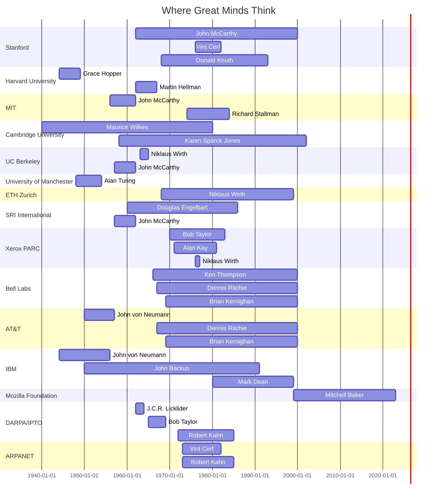

# Act 6: Beyond Machines and Code

**Gantt Chart of Overlaps at Institutions**



---

```mermaid
gantt
    dateFormat  YYYY
    title Turing Aware Winners

    section Turing Award Winners
    Maurice Wilkes          :wil_award, 1967, 1967
    John McCarthy           :mcc_award, 1971, 1971
    Donald Knuth            :knu_award, 1974, 1974
    John Backus             :bac_award, 1977, 1977
    Ken Thompson            :tho_award, 1983, 1983
    Dennis Ritchie          :rit_award, 1983, 1983
    Niklaus Wirth           :wir_award, 1984, 1984
    Douglas Engelbart       :eng_award, 1997, 1997
    Alan Kay                :kay_award, 2003, 2003
    Vint Cerf               :cer_award, 2004, 2004
    Robert Kahn             :kah_award, 2004, 2004
    Martin Hellman          :hel_award, 2015, 2015

---
