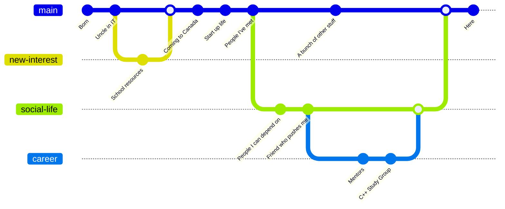
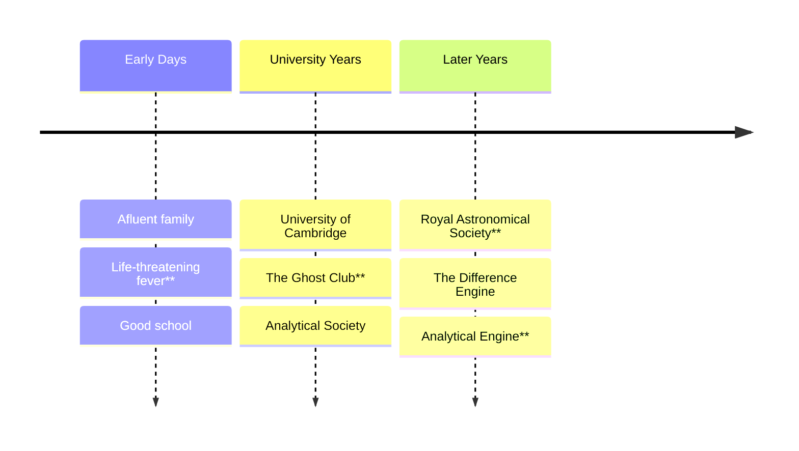

Would you just take, along with me, 10 seconds to think of the people who have helped you become who
you are, those who cared about you and wanted what was best for you in life.

- Fred Rogers

---
dragPos:
  square: 247,129,476,287
---

    

<v-click>

</v-click>

<!--
- We have to pick a starting point.
- Different choices would different versions of me.
-->

---
dragPos:
  square: 356,27,167,_,-8
---

<v-drag pos="801,91,167,_,-8">
    
</v-drag>

<v-drag pos="38,342,167,_,-8">
    
</v-drag>

<v-drag pos="562,5,261,_,-15">
    
</v-drag>

<v-drag pos="582,210,261,_,12">
    
</v-drag>

<v-drag pos="43,1,261,_,-15">
    
</v-drag>

<v-drag pos="223,287,261,_,-15">
    
</v-drag>

---
layout: image
image: /assets/placeholder-graph.png
---

<!--
- Imagine this was your dependency graph.
- But this is how advancements in human knowledge works. One person depending on another, one giant
  standing on the shoulder of another.
- Jonathan Blows talk [Preventing the Collapse of
  Civilization](https://www.youtube.com/watch?v=ZSRHeXYDLko) gives similar examples. He talks about
  how we need to create a culture of teaching each other and keeping knowledge alive to keep
  progressing the technology. Recommended watch.
- If anybody there didn't have the influence or the life they did, we could have ended up in a
  different place.
- Let's listen to Mr Rogers, and do him one better, and instead of taking 10 seconds, take the rest
  of the talk to go through these influences, discover what they did for us, and exercise our minds
  about how things could have turned out if that person ended up in a different path.
-->

---
layout: image-left
image: /assets/people/charles-babbage.jpg
---

# Charles Babbage

<!--
- Every journey has a beginning. The beginning for this one is endless, but we'll have to choose
  somewhere. So this is where we begin.
-->

---

<!--
- He was quite a chap!
- Keen interest in mathematics. A number driven person.
- Known as the father of computers.
- His father was a banker and when he died, he left a considerable inheritance for him. During this
  university years, he relied on his father's support.
- Had a Life-threatening fever, what would have happened if he died?...
- Went to good schools, had access to books and tutors. Pivotal moment!
- During university, came in contact with other mathematicians and influential people.
- He joined [The Ghost Club](https://www.ghostclub.org.uk/), which is still active today! What would
  have happened if he got too into it and didn't pursue science?
- In 1812, the French government calculated these tables in a different way. Their mathematicians
  distributed the work to 80 human computers who only knew what work they were doing and subtraction
  and addition. For the first time, mass production was applied to mathematics and Babbage thought
  this work could be taken over by machines entirely.
- Difference engine was meant for solving polynomial equations. He created this to help with
  mathematical tables for the nautical almanac.
- This first difference engine would have been composed of around 25,000 parts, weighed fifteen
  short tons (13,600 kg), and would have been 8 ft (2.4 m) tall. **If a moth flew into this, it
  would have just died. Imagine having "bug free" apps!**
- It was never built because the machinist responsible for building the machine refused to do it
  unless he was prepaid. The machinist who was building it Joseph Clement. He was one of the
  greatest at the time, and the tools he built were high quality.
  He demanded too much money and they didn't finish the project.
- Difference Engine inspired the novel... [The Difference Engine](https://en.wikipedia.org/wiki/The_Difference_Engine)
-
-->
