> Would you just take, along with me, 10 seconds to think of the people who have helped you become
> who you are, those who cared about you and wanted what was best for you in life.
> 
> - Fred Rogers

---
dragPos:
  square: 247,129,476,287
---

    

<v-click>

</v-click>

<!--
- We have to pick a starting point.
- Different choices would different versions of me.
-->

---
dragPos:
  square: 356,27,167,_,-8
---

<v-drag pos="801,91,167,_,-8">
    
</v-drag>

<v-drag pos="38,342,167,_,-8">
    
</v-drag>

<v-drag pos="562,5,261,_,-15">
    
</v-drag>

<v-drag pos="700,250,261,_,12">
    
</v-drag>

<v-drag pos="43,1,261,_,-15">
    
</v-drag>

<v-drag pos="223,287,261,_,-15">
    
</v-drag>

<v-drag pos="469,236,261,_,-13">
    
</v-drag>

---
layout: image
image: /assets/placeholder-graph.png
---

<!--
- Imagine this was your dependency graph.
- But this is how advancements in human knowledge works. One person depending on another, one giant
  standing on the shoulder of another.
- Jonathan Blows talk [Preventing the Collapse of
  Civilization](https://www.youtube.com/watch?v=ZSRHeXYDLko) gives similar examples. He talks about
  how we need to create a culture of teaching each other and keeping knowledge alive to keep
  progressing the technology. Recommended watch.
- If anybody there didn't have the influence or the life they did, we could have ended up in a
  different place.
- Let's listen to Mr Rogers, and do him one better, and instead of taking 10 seconds, take the rest
  of the talk to go through these influences, discover what they did for us, and exercise our minds
  about how things could have turned out if that person ended up in a different path.
-->

---
layout: image-left
image: /assets/people/charles-babbage.jpg
---

# Charles Babbage

<!--
- Every journey has a beginning. The beginning for this one is endless, but we'll have to choose
  somewhere. So this is where we begin.
-->

---
layout: center
clicks: 2
dragPos:
  square: 686,55,268,408,11
---

<!--
## Intro

- He was quite a chap!
- Keen interest in mathematics. A number driven person.
- Known as the father of computers.
- His father was a banker and when he died, he left a considerable inheritance for him. During this
  university years, he relied on his father's support.
- Had a Life-threatening fever, what would have happened if he died?...
- Went to good schools, had access to books and tutors. Pivotal moment!
-->

---
clicks: 3
---

<v-drag pos="601,54,334,_,-6">
    
</v-drag>

<v-drag pos="601,54,300,_,-6">
    
</v-drag>

<!--
- During university, came in contact with other mathematicians and influential people.
- He joined [The Ghost Club](https://www.ghostclub.org.uk/), which is still active today! What would
  have happened if he got too into it and didn't pursue science?
- In 1812, the French government calculated these tables in a different way. Their mathematicians
  distributed the work to 80 human computers who only knew what work they were doing and subtraction
  and addition. For the first time, mass production was applied to mathematics and Babbage thought
  this work could be taken over by machines entirely.
-->

---
clicks: 3
---

<v-drag pos="237,72,544,_,6">
    
</v-drag>

<v-drag pos="106,-15,813,_,-6">
    
</v-drag>

<!--
## Difference Engine

- Difference engine was meant for solving polynomial equations. He created this to help with
  mathematical tables for the nautical almanac.
- This first difference engine would have been composed of around 25,000 parts, weighed fifteen
  short tons (13,600 kg), and would have been 8 ft (2.4 m) tall. **If a moth flew into this, it
  would have just died. Imagine having "bug free" apps!**
- It was never built because the machinist responsible for building the machine refused to do it
  unless he was prepaid. The machinist who was building it Joseph Clement. He was one of the
  greatest at the time, and the tools he built were high quality.
  He demanded too much money and they didn't finish the project.
- Difference Engine inspired the novel... [The Difference Engine](https://en.wikipedia.org/wiki/The_Difference_Engine)

## Analytical Engine

- Before the construction of the Difference Engine began, he started working on Analytical Engine.
- Difference Engine was meant for a mechanized computation. But Analytical Engine could handle any
  computation, making it a general purpose computer.
- It was programmed using punch cards. It allowed for sequential control, looping, and branching.
- Despite the importance of his work, the analytical engine was unknown to the builders of the
  electromechanical and electronic computing machines in 1930s and 1940s. J. Presper Eckert and John
  W. Mauchly similarly were not aware of the details of Babbage's analytical engine work prior to
  the completion of their design for the first electronic general-purpose computer, the ENIAC.
- Vannevar Bush's paper Instrumental Analysis (1936) included several references to Babbage's work.
  In the same year he started the Rapid Arithmetical Machine project to investigate the problems of
  constructing an electronic digital computer.
-->

---
layout: image-left
image: /assets/people/lady-ada-lovelace.png
---

# Lady Ada Lovelace

<!--
- Next up, Lady Ada Lovelace. She was the first computer programmer. But I learned something that
  makes her even more impressive than that...
-->

---
layout: center
clicks: 2
dragPos:
  square: 684,186,255,266,11
---

 -1">

## ~~Lady~~ Diva Ada Lovelace

<!--
## Intro

- Lady Ada Lovelace was the daughter of the famous poet Lord Byron, although she never had a
  relationship with him due to her parents' separation when she was just a month old.
- Her mother, Lady Byron, was a skilled mathematician and encouraged Ada's interest in mathematics
  and logic as a way to steer her away from her father's artistic temperament.
-->

---
clicks: 1
---

```mermaid
graph LR
    Lovelace -- 🕊️🎶♥️🦌🌎 --> Babbage
    Babbage -- 01001101 01100001 01110100 01101000 --> Lovelace
```

> Supposing, for instance, that the fundamental relations of pitched sounds in the science of
> harmony and of musical composition were susceptible of such expression and adaptations, the engine
> might compose elaborate and scientific pieces of music of any degree of complexity or extent.

<!--
- Charles Babbage considered the Analytical Engine to be a merely a calculation machine. But Ada
  Lovelace saw a potential for representing natural objects with numbers.
-->

---
layout: image-left
image: /assets/people/alan-turing.jpg
---

# Alan Turing

<!--
- Let's fast word to Alan Turing. He was a mathematician, logician, and computer scientist who
  played a pivotal role in the development of theoretical computer science and artificial
  intelligence.
-->

---
layout: center
clicks: 2
dragPos:
  square: 686,55,268,408,11
---

<!--
## Intro

- He had great interest in math and science from an early age.
- In public school, his great skills were not appreciated because the school placed more emphasis on
  classics.
- Developed a friendship with Christopher Morcom, who shared his interest in science and
  mathematics. Sadly, he died early from TB that he got from drinking contaminated milk.
- Turing coped with this grief by working even harder. What would have happened if Turing was the
  one who died?
-->

---
clicks: 3
---

<!--
- During his time at Cambridge, he studied under the mathematician Alonzo Church.
- He developed the concept of the Turing Machine, a fundamental model of computation that underpins
  much of computer science theory.
> "von Neumann ... firmly emphasised to me, and to others I am sure, that the fundamental conception
> is owing to Turing—insofar as not anticipated by Babbage, Lovelace and others." Letter by Stanley
> Frankel to Brian Randell, 1972, quoted in Jack Copeland (2004) The Essential Turing, p. 22.
-->

---
clicks: 3
---

<v-drag pos="601,54,300,_,-6">
    
</v-drag>

<!--
## Bletchley Park and Enigma

- During World War II, Turing worked at Bletchley Park, the UK's codebreaking center.
- He played a pivotal role in cracking the German Enigma code, significantly contributing to the
  Allied victory.
- His work laid the groundwork for modern computing and artificial intelligence.
- Turing's contributions extended beyond codebreaking; he proposed the concept of artificial
  intelligence and the famous Turing Test to evaluate a machine's ability to exhibit intelligent
  behavior equivalent to that of a human.
> I have such a stressful job that the only way I can get it out of my mind is by running hard; it's
> the only way I can get some release.
- He was Walton Athletic Club's best runner, a fact discovered when he passed the group while
  running alone.
-->

---
layout: image-left
image: /assets/people/vannevar-bush.jpg
---

# Vannevar Bush

<!--
- He did more than science and influenced a lot of the policies surrounding science.
-->

---
clicks: 2
---

<v-drag-arrow two-way pos="618,288,-263,23" />

<v-drag pos="605,132,300,_,-6">
    
</v-drag>

<!--
- Being in the military role probably made him think of what would happen after the war.
- In his article he describes memex, and an imaginary account of probably the world's first wiki
  rabbit hole.
- In As We May Think, he talks about how the spreading of scientific knowledge is an important task.
  He says in the past, Mendel's research on laws of genetics was lost for generations because it
  didn't make it into the hands of people who could expand on it.
- Ted Nelson was inspired by his ideas and in a paper where he coined the term  "hypertext" he
  referenced Bush a lot. He then created Hypertext Editing System along with Andries van Dam
- It seems that he didn't show that much of an interest in digital computing.
  https://www.encyclopedia.com/science/encyclopedias-almanacs-transcripts-and-maps/vannevar-bush
-->

---
layout: image-left
image: /assets/people/john-von-neumann.webp
---

# John von Neumann

> Most mathematicians prove what they can, von Neumann proves what he wants

<!--
- Next up is another genious who also lived around the same time as Turing and Bush.
- He contributed to computer science, game theory, quantum mechanics, celluar automata, and
  mathematics.
- He was also pretty social and liked to tell jokes in multiple languages.
-->

---
layout: center
clicks: 4
---

 -1">

<v-drag pos="605,132,300,_,-6">
    
</v-drag>

<v-drag pos="605,132,300,_,-6">
    
</v-drag>

<v-drag pos="142,285,300,_,-7">
    
</v-drag>

<!--
- This is the paper that introduced the concept of stored-program computers which later was known as
  von Neumann architecture. It was 101 pages.
- He was among the first people to talk about the time complexity of algorithms.
- He was the first person to also create a mathematical foundations for Quantum Mechanics, in his
  book called... "Mathematical Foundations of Quantum Mechanics"
- He invented the merge sort algorithm because there was a need to efficiently sort data on
  computers during World War II.
- He formalized game theory which gave us a fantastic movie called "A Beautiful Mind".
- Game theory helped us understand how people make decisions in competitive situations and how
  decisions affect outcomes.
-->

---
layout: image-left
image: /assets/people/j-c-r-licklider.webp
---

# Joseph Carl Robnett Licklider

> ... most of the significant advances in computer technology—including the work that my group did at
> Xerox PARC—were simply extrapolations of Lick's vision. They were not really new visions of their
> own. So he was really the father of it all" - Robert Taylor

---
clicks: 6
---

 -1">

 -1">

 -1">

<v-drag pos="460,10,55,_,-6">
    
</v-drag>

<v-drag pos="394,6,77,_,-6">
    
</v-drag>

 -1">

<v-drag pos="685,141,62,_,15">
    
</v-drag>

<v-drag pos="695,184,77,_,-6">
    
</v-drag>

 -1">

<v-drag pos="148,61,62,_,15">
    
</v-drag>

<v-drag pos="201,36,77,_,-6">
    
</v-drag>

 -1">

<v-drag pos="38,364,261,_,15">
    
</v-drag>

<v-drag pos="34,171,45,_,-6">
    
</v-drag>

 -1">

<v-drag pos="431,295,67,_,15">
    
</v-drag>

<!--
- Ken Thompson, who co-created Unix, was a researcher on the Multics project.
- He believed that computers or AI should enhance human intelligence, not replace it.
- He helped fund projects that contributed to GUIs, the mouse, and the internet. His contributions
  were mostly in form of ideas and funding.
-->

---
layout: image-left
image: /assets/people/douglas-engelbart.jpg
---

# Douglas Engelbart

<!--
- Douglas Engelbart is among my favorites to talk about. He and his team not only invented the
  mouse, but essentially DEMOED everything that we use in modern computing today.

- He called the device a mouse because the tail came out from behind. His group called the cursor a
  bug, but that didn't catch on.
-->

---
clicks: 8
---

> What did he do?...

 0">

<v-drag pos="387,14,445,_,15">
    
</v-drag>

 1">

<v-drag pos="105,188,403,_,-19">
    
</v-drag>

 2">

<v-drag pos="475,244,451,_,11">
    
</v-drag>

 3">

<v-drag pos="191,143,403,_,-19">
    
</v-drag>

